# 变电站巡检仿真系统 UML 图集

> 最终交付版 | 生成日期：2026-06-27
> 语法：Mermaid，可在 GitHub 上直接渲染

---

## 目录

## 1. 用例图

> 3 层 10 张，涵盖顶层总览、6 个业务域分解、3 个角色视角。已拆分为上下文视角（参与者→用例）与内部视角（用例间关系+外部系统交互），每节两张图。
> 因 Mermaid 渲染限制，include/extend 关系使用标签文字（`include`/`扩展`）替代 UML 标准构造型标记。

[返回目录](#目录)

---

### 1.1 系统顶层用例图

> 图 A：展示各类用户与系统用例的关联；图 B：展示用例与外部黑板/消息总线的交互。

**图 A -- 上下文视角：参与者与用例关联**

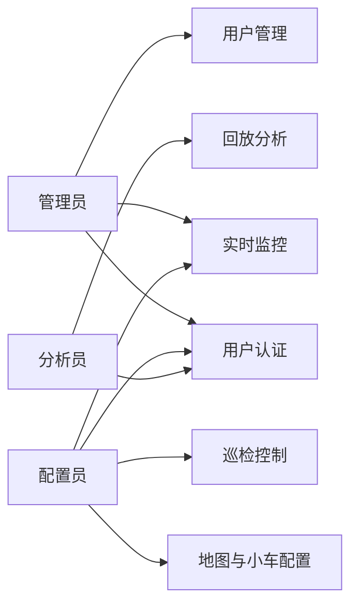

**图 B -- 内部视角：用例与外部系统交互**

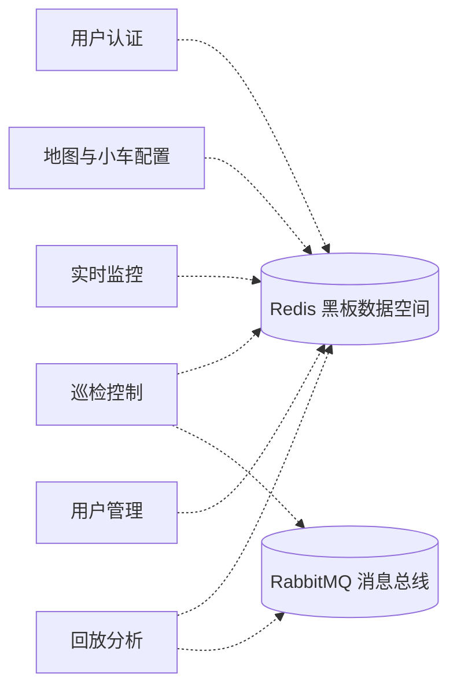

---

### 1.2 用户认证与登录域

| 用例 | 类型 | 说明 |
|------|------|------|
| 登录 | 主用例 | 输入用户名和密码，验证后按角色跳转对应界面 |
| 验证凭据 | include | 查询 Redis 中的用户信息，比对密码是否正确 |
| 会话管理 | include | 登录成功后创建会话，记录当前角色 |
| 退出 | 独立 | 二次确认弹窗，发送停止指令，关闭窗口 |

**图 A -- 上下文视角：全部用户可执行的操作**

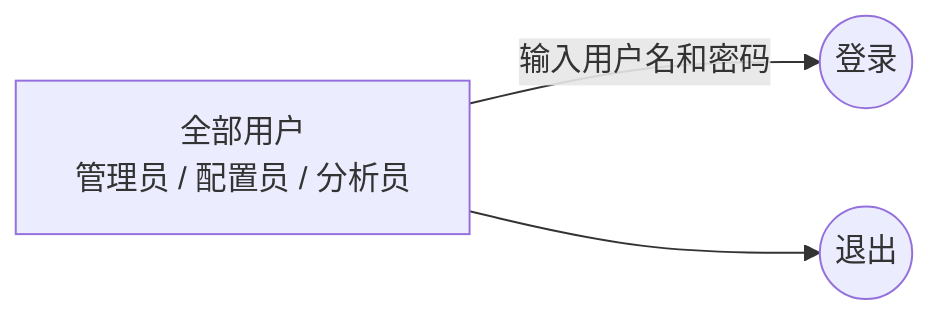

**图 B -- 内部视角：登录用例的扩展关系与外部交互**

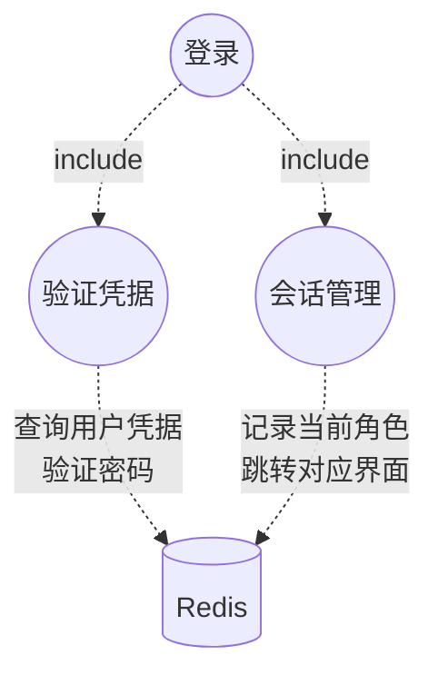

---

### 1.3 用户管理域

| 用例 | 类型 | 说明 |
|------|------|------|
| 查看用户列表 | 主用例 | 获取全部用户信息，以表格形式展示 |
| 创建用户 | 主用例 | 输入用户名、密码、角色，加密后保存 |
| 编辑用户信息 | 主用例 | 选中用户，修改密码和角色并更新 |
| 删除用户 | 主用例 | 选中用户，移除该用户的全部信息 |

**图 A -- 上下文视角：管理员可执行的操作**

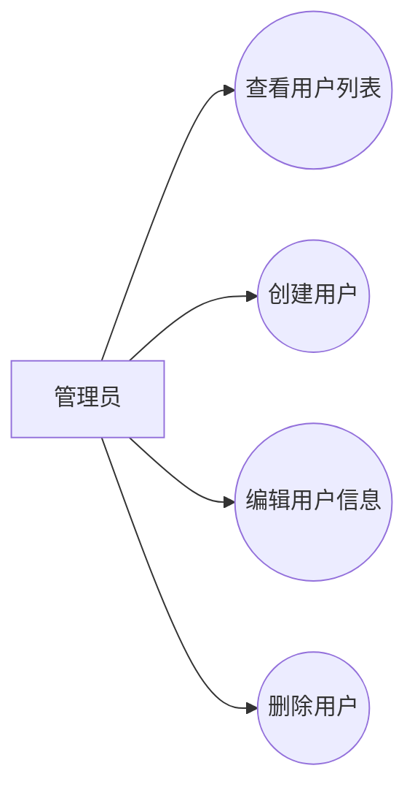

**图 B -- 内部视角：用例与数据存储的交互**

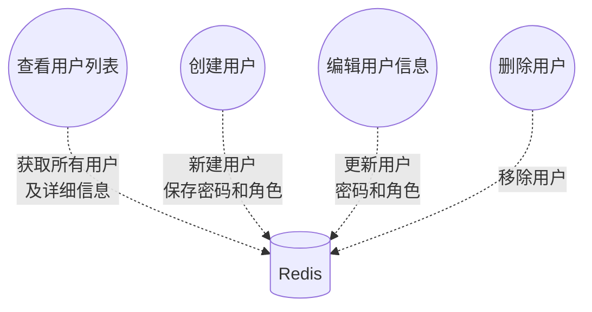

---

### 1.4 地图与小车配置域

| 用例 | 类型 | 说明 |
|------|------|------|
| 设置地图尺寸 | 主用例 | 默认 20x20 / 自定义 1-100，存储地图宽高 |
| 放置障碍物 | 主用例 | 手动点击网格或随机批量生成，标记障碍位置 |
| 移除障碍物 | 主用例 | 重置操作清除全部障碍物 |
| 放置小车 | 主用例 | 手动点击或随机批量放置，自动避开障碍物和其他小车 |
| 移除小车 | 主用例 | 重置操作清除全部小车 |
| 选择路径算法 | 主用例 | A* / 双向A* / Dijkstra 三选一 |
| 保存配置 | 主用例 | 所有配置实时存储，无需显式保存 |

**图 A -- 上下文视角：配置员可执行的操作**

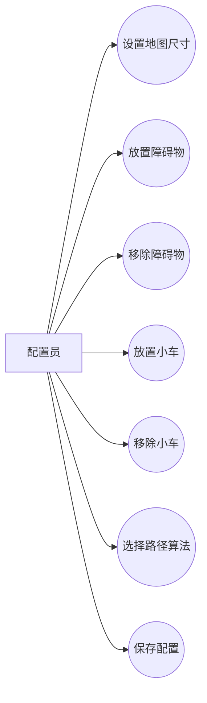

**图 B -- 内部视角：用例与数据存储的交互**

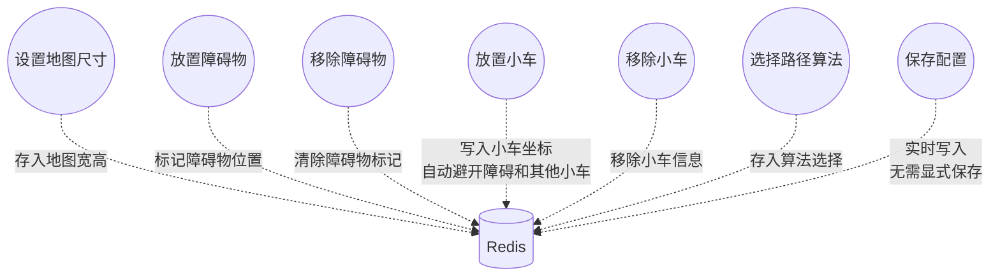

---

### 1.5 巡检控制域

| 用例 | 类型 | 说明 |
|------|------|------|
| 启动巡检 | 主用例 | 发送"启动"信号给调度器和录制器 |
| 清理运行时数据 | include | 启动前清除上次残留的地图、小车和路径数据 |
| 停止巡检 | 主用例 | 发送"停止"信号给调度器和录制器 |
| 重置 | 扩展 | 扩展"停止巡检"，额外清空地图和小车数据。重置操作同时执行清理逻辑（通过文字说明描述，不以 extend 指向 include 子用例） |

> 修复记录 (V1-2)：删除了 `reset -.->|扩展| cleanup` 箭头。在标准 UML 中，extend 关系只能从扩展用例指向独立基础用例，不能指向被 include 的子用例。

**图 A -- 上下文视角：配置员可执行的操作及用例间关系**

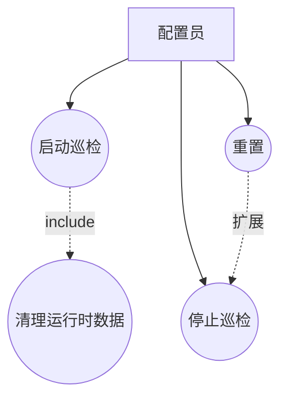

**图 B -- 内部视角：用例与外部系统的交互**

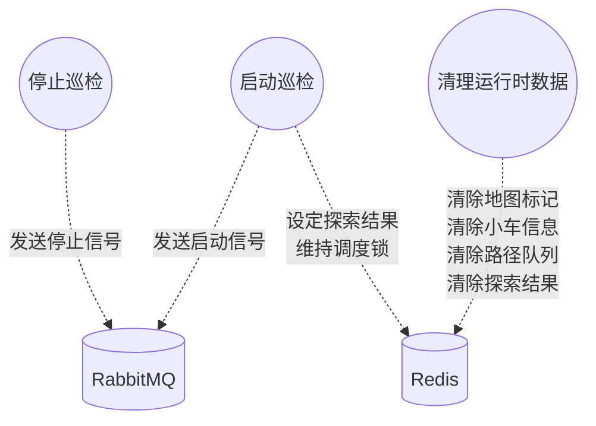

---

### 1.6 实时监控域

| 用例 | 类型 | 说明 |
|------|------|------|
| 查看运行状态 | 主用例 | 状态面板每 2 秒轮询 Redis，获取调度器在线状态、导航器数量、小车数量、探索进度 |
| 查看实时探索地图 | 主用例 | 地图面板每 200 毫秒从 Redis 批量拉取探索位图和障碍物位图并渲染 |

**图 A -- 上下文视角：可执行监控操作的角色**

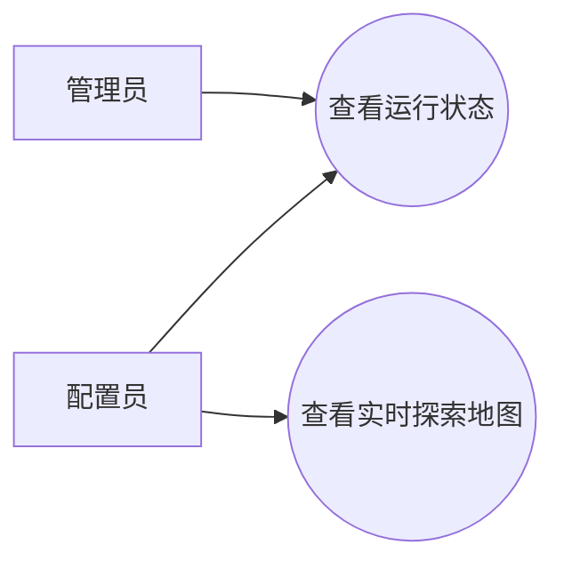

**图 B -- 内部视角：监控用例与数据源的交互**

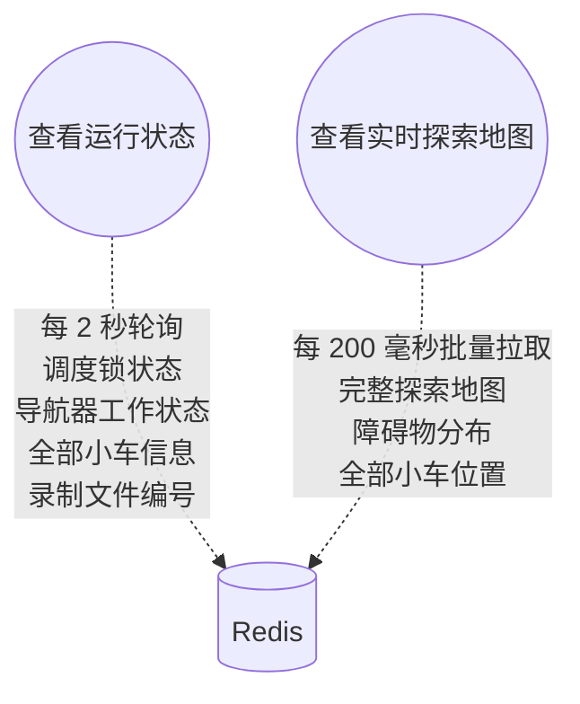

---

### 1.7 回放分析域

| 用例 | 类型 | 说明 |
|------|------|------|
| 浏览录制记录列表 | 主用例 | 扫描录制记录并读取元数据 |
| 选择记录并加载初始帧 | 主用例 | 还原第 0 帧并渲染首帧画面 |
| 播放回放 | 主用例 | 发送播放信号 |
| 暂停回放 | 主用例 | 发送暂停信号 |
| 继续回放 | 主用例 | 发送继续信号 |
| 调整回放速度 | 主用例 | 0.5x / 1.0x / 2.0x 倍速切换 |
| 拖拽进度条跳转帧 | 主用例 | 还原目标帧 → 刷新画面 |
| 重置回放 | 主用例 | 停止播放 + 清空缓存 |

**图 A -- 上下文视角：分析员可执行的操作及用例间依赖**

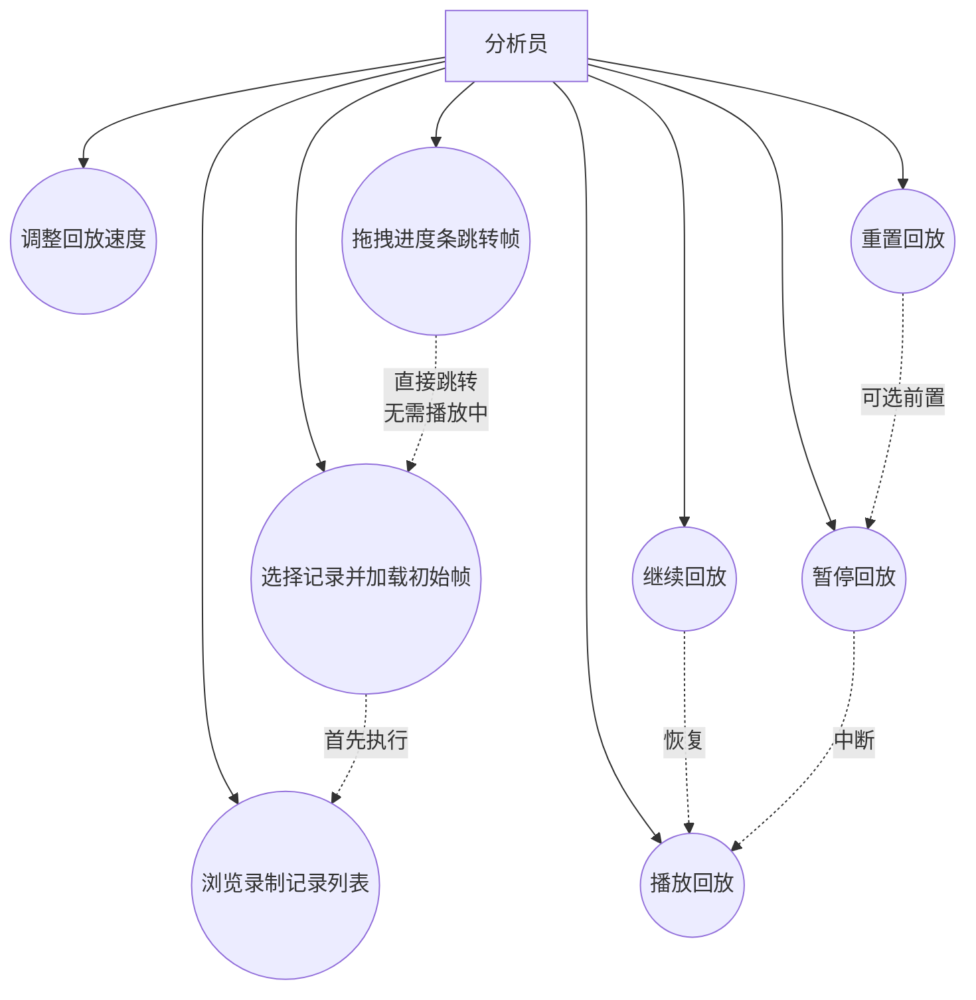

**图 B -- 内部视角：用例与外部系统的交互**

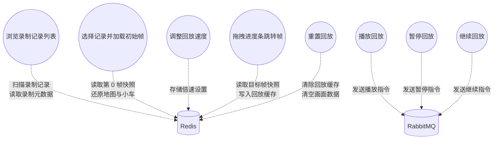

---

### 1.8 管理员视角

**图 A -- 上下文视角：管理员可访问的全部用例**

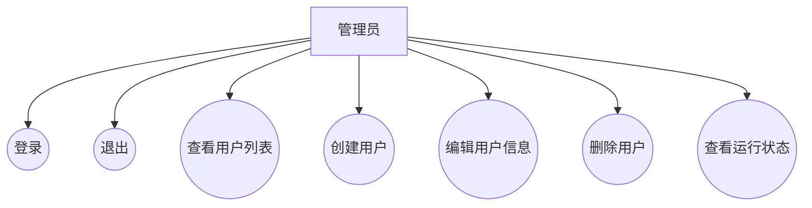

**图 B -- 内部视角：用例间关系与外部交互**

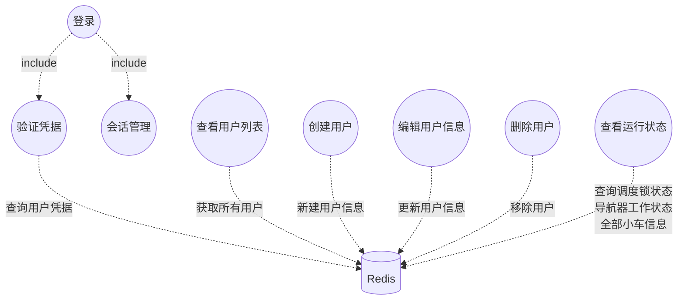

---

### 1.9 配置员视角

> 修复记录 (V1-2续)：重置不再 extend cleanup，改为仅 extend stop。

**图 A -- 上下文视角：配置员可访问的全部用例及关系**

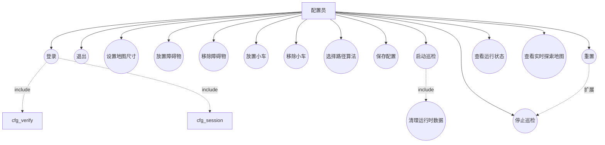

**图 B -- 内部视角：用例间关系与外部交互细节**

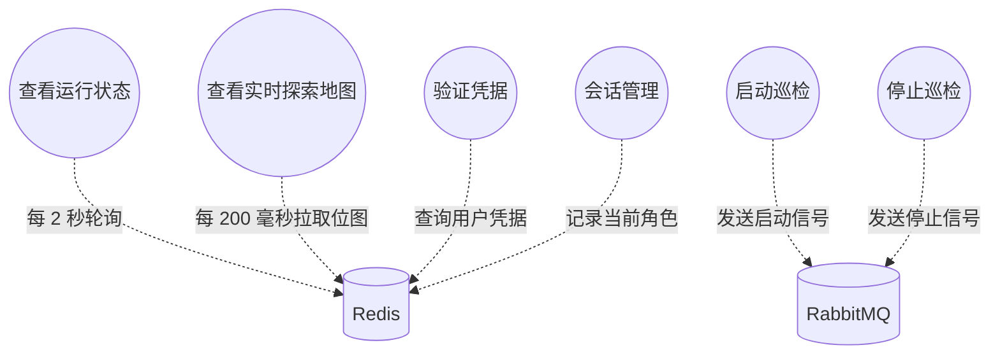

---

### 1.10 分析员视角

**图 A -- 上下文视角：分析员可访问的全部用例及关系**

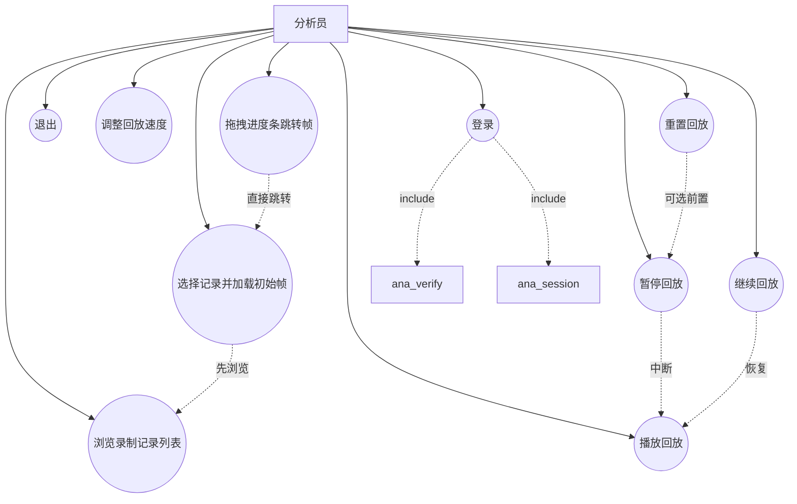

**图 B -- 内部视角：用例间关系与外部交互细节**

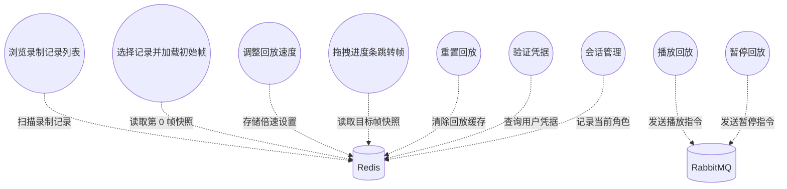

---

## 2. 外部交互顺序图 (External Sequence Diagram)

> 用户触发的外部交互顺序图，最细粒度。参与者：用户、前端界面（Swing GUI）、黑板（Redis）、消息总线（RabbitMQ）、调度器、路径规划引擎、小车、录制器。
> 所有消息文字已替换为业务自然语言描述。

[返回目录](#目录)

### 2.1 登录认证

#### 2.1.1 登录-主流程

```mermaid
sequenceDiagram
    actor 用户
    participant 前端界面
    participant 黑板

    用户->>前端界面: 输入用户名、密码，点击"登录"
    前端界面->>前端界面: 检查用户名和密码非空
    前端界面->>前端界面: SHA-256 加密密码
    前端界面->>黑板: 查询用户凭据信息
    黑板-->>前端界面: {password, role}
    前端界面->>前端界面: 比对加密密码是否一致
    前端界面->>前端界面: 根据 role 判断跳转目标
    alt 角色为「配置员」
        前端界面->>前端界面: 打开配置员主界面
    else 角色为「分析员」
        前端界面->>前端界面: 打开分析员界面
    else 角色为「管理员」
        前端界面->>前端界面: 打开管理员界面
    end
    前端界面->>前端界面: 关闭登录窗口
```

#### 2.1.2 登录-凭据错误异常流

```mermaid
sequenceDiagram
    actor 用户
    participant 前端界面
    participant 黑板

    用户->>前端界面: 输入用户名、密码，点击"登录"
    前端界面->>前端界面: SHA-256 加密密码
    前端界面->>黑板: 查询用户凭据信息
    黑板-->>前端界面: {password, role}
    前端界面->>前端界面: 比对加密密码 → 不匹配
    前端界面->>用户: 弹出错误提示："用户名或密码错误"
    Note over 前端界面: 登录界面保持打开，等待重新输入
```

#### 2.1.3 登录-黑板连接失败异常流

```mermaid
sequenceDiagram
    actor 用户
    participant 前端界面
    participant 黑板

    用户->>前端界面: 输入用户名、密码，点击"登录"
    前端界面->>前端界面: SHA-256 加密密码
    前端界面->>黑板: 查询用户凭据信息
    黑板--x前端界面: 连接超时 / 连接拒绝
    前端界面->>前端界面: 捕获异常，尝试重新连接
    前端界面->>黑板: 重新连接
    黑板--x前端界面: 再次失败
    前端界面->>用户: 弹出错误提示："数据库连接失败，请检查 Redis 服务"
    Note over 前端界面: 登录校验未通过，登录失败
```

---

### 2.2 用户管理

#### 2.2.1 创建用户-主流程

```mermaid
sequenceDiagram
    actor 管理员
    participant 前端界面
    participant 黑板

    管理员->>前端界面: 填写用户名、密码，选择角色，点击"添加"
    前端界面->>前端界面: 检查用户名和密码非空
    前端界面->>前端界面: 创建用户模型（构造时自动SHA-256加密密码）
    前端界面->>黑板: 保存用户加密密码
    前端界面->>黑板: 保存用户角色
    前端界面->>黑板: 获取全部用户列表
    黑板-->>前端界面: [Users:admin, Users:config, Users:analyst, Users:{newUser}]
    loop 遍历每个 key
        前端界面->>黑板: 读取用户完整信息
        黑板-->>前端界面: {password, role}
    end
    前端界面->>前端界面: 刷新用户列表表格
    管理员->>前端界面: 看到新用户出现在列表中
```

#### 2.2.2 编辑用户-主流程

```mermaid
sequenceDiagram
    actor 管理员
    participant 前端界面
    participant 黑板

    管理员->>前端界面: 在表格中选中一行用户
    前端界面->>前端界面: 自动填充用户名和角色到输入框
    管理员->>前端界面: 修改角色（可选改密码），点击"修改"
    前端界面->>前端界面: 检查是否选中了用户
    opt 填写了新密码
        前端界面->>前端界面: SHA-256 加密新密码
        前端界面->>黑板: 保存用户新密码
    end
    前端界面->>黑板: 保存用户新角色
    前端界面->>黑板: 获取全部用户列表
    黑板-->>前端界面: [Users:admin, Users:config, ...]
    loop 遍历每个 key
        前端界面->>黑板: 读取用户完整信息
        黑板-->>前端界面: {password, role}
    end
    前端界面->>前端界面: 刷新用户列表表格
    管理员->>前端界面: 看到修改后的角色/密码已生效
```

#### 2.2.3 删除用户-主流程

```mermaid
sequenceDiagram
    actor 管理员
    participant 前端界面
    participant 黑板

    管理员->>前端界面: 在表格中选中一行用户，点击"删除"
    前端界面->>前端界面: 获取选中用户的 username
    前端界面->>黑板: 删除用户账号
    黑板-->>前端界面: 删除成功
    前端界面->>黑板: 获取全部用户列表
    黑板-->>前端界面: [Users:admin, Users:config, ...]
    loop 遍历每个 key
        前端界面->>黑板: 读取用户完整信息
        黑板-->>前端界面: {password, role}
    end
    前端界面->>前端界面: 刷新用户列表表格
    管理员->>前端界面: 确认目标用户已从列表中消失
```

#### 2.2.4 删除用户-未选中用户异常流

```mermaid
sequenceDiagram
    actor 管理员
    participant 前端界面

    管理员->>前端界面: 未选中任何用户，点击"删除"
    前端界面->>前端界面: 获取选中用户结果为空
    前端界面->>管理员: 弹出错误提示："请选择一个用户"
    Note over 前端界面: 不执行任何黑板操作
```

---

### 2.3 地图与小车配置

#### 2.3.1 设置地图尺寸-主流程

```mermaid
sequenceDiagram
    actor 配置员
    participant 前端界面
    participant 黑板

    配置员->>前端界面: 选择"自定义地图"，输入边长 N（1-100）
    前端界面->>前端界面: 验证输入：N > 0 且 N <= 100
    前端界面->>前端界面: 创建新的地图数据模型
    前端界面->>黑板: 保存地图宽度设置
    前端界面->>黑板: 保存地图高度设置
    前端界面->>黑板: 读取障碍物分布数据
    黑板-->>前端界面: 障碍物位图数据
    前端界面->>前端界面: 解析本地障碍物缓存
    前端界面->>前端界面: 计算格子大小和总面积
    前端界面->>前端界面: 重建地图网格面板
```

#### 2.3.2 放置障碍物-主流程

```mermaid
sequenceDiagram
    actor 配置员
    participant 前端界面
    participant 黑板

    配置员->>前端界面: 点击"放置障碍物"开关
    前端界面->>前端界面: 取消"放置小车"开关（互斥）
    配置员->>前端界面: 在地图网格上点击格子 (x, y)
    前端界面->>前端界面: 检查该格是否已有障碍物（本地缓存）
    前端界面->>前端界面: 检查该格是否已有小车（读取探索地图）
    alt 该格无障碍物且无小车
        前端界面->>前端界面: 检查障碍物数量是否超过上限（20%面积）
        前端界面->>黑板: 在地图上标记障碍物
        前端界面->>前端界面: 本地障碍物集合添加该位置
        前端界面->>前端界面: 障碍物计数加一
        前端界面->>前端界面: 刷新网格画面
    end
```

#### 2.3.3 放置障碍物-位置冲突/超限异常流

```mermaid
sequenceDiagram
    actor 配置员
    participant 前端界面
    participant 黑板

    配置员->>前端界面: 在地图网格上点击格子 (x, y)

    alt 该格已有小车
        前端界面->>前端界面: 检测到小车占用
        Note over 前端界面: 静默忽略，不写入黑板
    else 该格已有障碍物
        前端界面->>前端界面: 检测到已有障碍物
        Note over 前端界面: 静默忽略，不写入黑板
    else 超出最大障碍物数量（20% 面积）
        前端界面->>前端界面: 障碍物计数已达上限
        前端界面->>配置员: 弹出警告："已达到最大障碍物数量！"
        前端界面->>前端界面: 自动关闭"放置障碍物"开关
    end
```

#### 2.3.4 放置小车-主流程

```mermaid
sequenceDiagram
    actor 配置员
    participant 前端界面
    participant 黑板

    配置员->>前端界面: 点击"放置小车"开关
    前端界面->>前端界面: 取消"放置障碍物"开关（互斥）
    配置员->>前端界面: 在地图网格上点击格子 (x, y)
    前端界面->>黑板: 查询格点是否为障碍物
    黑板-->>前端界面: 非障碍物
    loop 扫描所有已有小车
        前端界面->>黑板: 获取所有小车信息
        前端界面->>黑板: 查询小车横坐标
        前端界面->>黑板: 查询小车纵坐标
    end
    前端界面->>前端界面: 确认 (x, y) 无其他小车
    前端界面->>前端界面: 检查小车数量是否超过总格数
    前端界面->>前端界面: 小车计数加一
    前端界面->>黑板: 在地图上标记小车位置为「已探索」
    前端界面->>黑板: 创建小车并设置初始位置
    前端界面->>前端界面: 刷新网格画面
```

#### 2.3.5 选择路径算法-主流程

```mermaid
sequenceDiagram
    actor 配置员
    participant 前端界面
    participant 黑板

    配置员->>前端界面: 点击算法单选按钮
    alt 选择 A*
        前端界面->>黑板: 保存路径算法选择为「A*」
    else 选择 双向 A*
        前端界面->>黑板: 保存路径算法选择为「双向A*」
    else 选择 Dijkstra
        前端界面->>黑板: 保存路径算法选择为「Dijkstra」
    end
    Note over 前端界面,黑板: 500ms UI 同步定时器检测到算法变化后同步到其他客户端
```

#### 2.3.6 重置（移除小车/障碍物）-主流程

```mermaid
sequenceDiagram
    actor 配置员
    participant 前端界面
    participant 黑板
    participant MQ as 消息总线

    配置员->>前端界面: 点击"重置"按钮
    前端界面->>MQ: 发送「停止巡检」信号
    前端界面->>MQ: 发送「停止录像」信号
    前端界面->>前端界面: 停止前端计时器
    前端界面->>黑板: 清除巡检开始时间
    前端界面->>黑板: 清除探索地图数据
    前端界面->>黑板: 清除障碍物数据
    前端界面->>黑板: 清除导航器状态
    loop 扫描并删除所有小车信息
        前端界面->>黑板: 获取并删除所有小车数据
    end
    loop 扫描并删除所有行进路线
        前端界面->>黑板: 获取并删除所有任务队列
    end
    前端界面->>前端界面: 重建默认 20×20 地图，算法回退为 A*
    前端界面->>前端界面: 刷新网格画面
```

---

### 2.4 巡检控制

#### 2.4.1 启动巡检-主流程

```mermaid
sequenceDiagram
    actor 配置员
    participant 前端界面
    participant 黑板
    participant MQ as 消息总线
    participant Ctrl as 调度器
    participant Rec as 录制器

    Note over Ctrl: 调度器进程启动时已获取指挥锁<br/>（分布式锁：controller:lock，每 10 秒续约）

    配置员->>前端界面: 点击"开始巡检"按钮
    前端界面->>前端界面: 启动巡检完成监控定时器（1 秒间隔）
    前端界面->>前端界面: 启动前端计时器
    前端界面->>黑板: 记录巡检开始时间
    前端界面->>MQ: 发送「开始巡检」信号
    Note over MQ,Ctrl: 消息路由到 controller.start 队列
    前端界面->>MQ: 发送「开始录像」信号
    Note over MQ,Rec: 消息路由到 save.start 队列
    MQ->>Ctrl: 消费消息 → 收到开始指令
    Ctrl->>黑板: 读取探索地图和障碍物数据 → 检查是否已探索完成
    Ctrl->>Ctrl: 如果已完成 → 重置探索运行，重置小车状态 + 初始点亮
    Ctrl->>Ctrl: 设置运行标志为活跃，启动节拍循环线程
    MQ->>Rec: 消费消息 → 收到开始指令
    Rec->>黑板: 生成新的录制编号
    Rec->>黑板: 设置当前录制文件号
    Rec->>黑板: 初始化起始帧为 0
    Rec->>黑板: 初始化最后帧为 0
    Rec->>黑板: 初始化播放帧号为 -1
    Rec->>黑板: 记录录制开始时间
    Rec->>黑板: 清除上次录制的残留帧
    Rec->>Rec: 启动录制线程，每 500ms 拍摄一帧
    前端界面->>前端界面: 设置巡检已开始 + 刷新画面
```

#### 2.4.2 启动巡检-调度器不在线异常流

```mermaid
sequenceDiagram
    actor 配置员
    participant 前端界面
    participant MQ as 消息总线

    配置员->>前端界面: 点击"开始巡检"按钮
    前端界面->>MQ: 发送「开始巡检」信号
    Note over MQ: 消息进入 controller.start 队列
    Note over MQ: 无消费者订阅 controller.start 队列（调度器未启动）
    Note over MQ: 消息在队列中堆积，调度器不会收到
    前端界面->>前端界面: 计时器已启动，但小车不会移动
    Note over 配置员: 用户体验：点击后无反应，状态面板显示调度器离线
```

---

### 2.5 实时监控

#### 2.5.1 查看运行状态-主流程

```mermaid
sequenceDiagram
    participant 前端界面
    participant 黑板

    Note over 前端界面: 状态面板定时器每 2 秒自动刷新

    前端界面->>黑板: 查询调度器是否在线
    黑板-->>前端界面: 在线 或 离线
    前端界面->>前端界面: 调度器状态：在线 / 离线

    前端界面->>黑板: 查询各导航器是否空闲
    黑板-->>前端界面: {nav_1:working=..., nav_2:working=..., ...}
    前端界面->>前端界面: 统计忙碌/空闲数量，显示各引擎运行状态

    前端界面->>黑板: 获取所有小车信息
    黑板-->>前端界面: 小车列表
    前端界面->>前端界面: 显示小车数量

    前端界面->>黑板: 查询录制状态
    黑板-->>前端界面: {file_num, order_view, ...}
    前端界面->>前端界面: 判断是否正在录制 → 录制中 / 空闲

    前端界面->>黑板: 读取地图尺寸
    黑板-->>前端界面: {width, height}
    前端界面->>黑板: 读取探索地图数据
    前端界面->>黑板: 读取障碍物分布数据
    前端界面->>前端界面: 本地计算：已探索格子数 / (总面积 - 障碍物数)
    前端界面->>前端界面: 显示探索百分比
```

#### 2.5.2 查看实时探索地图-主流程

```mermaid
sequenceDiagram
    participant 前端界面 as 前端界面（地图视图定时器 200ms）
    participant 黑板

    Note over 前端界面: 地图视图内部定时器每 200ms 自动刷新

    前端界面->>黑板: 读取地图尺寸
    黑板-->>前端界面: {width, height}
    前端界面->>前端界面: 检查尺寸是否变化（从黑板同步尺寸）

    前端界面->>黑板: 读取探索地图数据
    黑板-->>前端界面: 探索位图原始字节
    前端界面->>前端界面: 本地逐格解析位图，标记已探索/未探索

    前端界面->>黑板: 读取障碍物分布数据
    黑板-->>前端界面: 障碍物位图原始字节
    前端界面->>前端界面: 本地逐格解析位图，标记障碍物

    loop 扫描所有小车
        前端界面->>黑板: 获取所有小车信息
    end
    loop 遍历每辆小车
        前端界面->>黑板: 读取小车全部信息
        黑板-->>前端界面: {x, y, endx, endy, state, direction}
    end
    前端界面->>前端界面: 逐格绘制：障碍物（灰）、已探索（绿）、小车（彩色箭头）
    前端界面->>前端界面: 刷新画面
```

---

### 2.6 回放分析

#### 2.6.1 浏览记录列表-主流程

```mermaid
sequenceDiagram
    actor 分析员
    participant 前端界面
    participant 黑板

    分析员->>前端界面: 打开回放界面 / 点击"刷新记录"
    前端界面->>黑板: 查询录制状态
    黑板-->>前端界面: {file_num, order_file_num, last_view, created_at_1, created_at_2, ...}
    前端界面->>前端界面: 解析所有 created_at_N 字段，提取文件编号
    loop 遍历每个文件编号 N
        前端界面->>黑板: 获取录像全部帧
        黑板-->>前端界面: [Record:N:0, Record:N:1, ...]
        前端界面->>前端界面: 统计帧数 → 获取 last_view
    end
    前端界面->>黑板: 查询录制时间
    黑板-->>前端界面: {timestamp}
    前端界面->>前端界面: 格式化时间戳为 "MM-dd HH:mm"
    前端界面->>前端界面: 下拉框填充记录列表
```

#### 2.6.2 选择记录加载初始帧-主流程

```mermaid
sequenceDiagram
    actor 分析员
    participant 前端界面
    participant 黑板

    分析员->>前端界面: 从记录下拉框中选中一条记录
    前端界面->>前端界面: 获取当前选中的录像文件编号
    前端界面->>黑板: 设置回放文件编号
    前端界面->>黑板: 获取录像全部帧
    黑板-->>前端界面: [Record:N:0, Record:N:1, ...]
    前端界面->>前端界面: 统计最大帧号 → last_view
    前端界面->>黑板: 设置回放总帧数

    前端界面->>黑板: 读取录像第一帧
    黑板-->>前端界面: {snapshot: JSON}
    前端界面->>前端界面: 解析快照 JSON → 提取地图宽高、探索地图、障碍物、小车数据

    前端界面->>黑板: 设置回放地图宽度
    前端界面->>黑板: 设置回放地图高度
    前端界面->>黑板: 设置回放探索地图
    前端界面->>黑板: 设置回放障碍物地图

    loop 扫描并清理旧的回放小车数据
        前端界面->>黑板: 获取并删除所有旧回放小车
    end
    loop 遍历快照中的小车
        前端界面->>黑板: 写入回放小车数据
    end

    前端界面->>黑板: 更新当前播放帧号为 0

    前端界面->>黑板: 读取回放探索地图
    黑板-->>前端界面: 探索位图
    前端界面->>黑板: 读取回放障碍物地图
    黑板-->>前端界面: 障碍物位图
    前端界面->>黑板: 读取回放小车数据
    黑板-->>前端界面: 小车数据
    前端界面->>前端界面: 渲染初始帧画面（地图 + 障碍物 + 小车起始位置）
    前端界面->>前端界面: 刷新进度条滑块范围
```

#### 2.6.3 播放回放-主流程

```mermaid
sequenceDiagram
    actor 分析员
    participant 前端界面
    participant MQ as 消息总线
    participant 黑板
    participant Rec as 录制器

    分析员->>前端界面: 选中记录后，点击"播放"按钮
    前端界面->>前端界面: 重置暂停标记，暂停按钮文字设为"暂停"
    前端界面->>黑板: 设置回放状态为「播放中」
    前端界面->>MQ: 发送「开始回放」信号
    Note over MQ,Rec: 消息路由到 save.start 队列

    MQ->>Rec: 消费消息 → 收到回放指令
    Rec->>Rec: 停止旧回放（安全措施）
    Rec->>黑板: 重置播放帧号
    Rec->>Rec: 设置回放标志为活跃，启动回放循环线程

    loop 回放循环（逐帧）
        Rec->>黑板: 查询回放文件编号
        Rec->>黑板: 查询回放总帧数
        Rec->>黑板: 查询当前播放帧号
        Rec->>Rec: 下一帧 = 当前帧 + 1
        Rec->>黑板: 读取指定帧快照
        黑板-->>Rec: {snapshot: JSON}
        Rec->>Rec: 解析快照数据
        Rec->>黑板: 设置回放地图宽度
        Rec->>黑板: 设置回放地图高度
        Rec->>黑板: 设置回放探索地图
        Rec->>黑板: 设置回放障碍物地图
        loop 清理旧回放小车 + 写入当前帧小车数据
            Rec->>黑板: 删除旧小车并写入新小车数据
        end
        Rec->>黑板: 更新当前播放帧号
    end

    Note over 前端界面: 前端界面侧回放地图视图定时器（200ms）循环读取回放探索地图渲染画面
```

#### 2.6.4 暂停/继续回放-主流程

```mermaid
sequenceDiagram
    actor 分析员
    participant 前端界面
    participant MQ as 消息总线
    participant 黑板
    participant Rec as 录制器

    分析员->>前端界面: 在播放中点击"暂停"按钮
    前端界面->>前端界面: 当前未暂停，触发暂停
    前端界面->>MQ: 发送「停止回放」信号
    Note over MQ,Rec: 仅停止回放，不影响录制
    前端界面->>黑板: 设置回放状态为「已暂停」
    前端界面->>前端界面: 按钮文字改为"继续"
    前端界面->>前端界面: 设置暂停标记

    MQ->>Rec: 消费消息 → 收到停止回放指令
    Rec->>Rec: 停止回放循环
    Rec->>Rec: 中断回放线程
    Note over Rec: 回放线程退出循环，停止更新回放数据
    Note over 前端界面: 定时器仍在读取回放数据，画面停在当前帧

    Note over 分析员: --- 用户点击"继续" ---

    分析员->>前端界面: 在暂停状态下点击"继续"按钮
    前端界面->>前端界面: 当前已暂停，触发继续
    前端界面->>MQ: 发送「开始回放」信号
    前端界面->>黑板: 设置回放状态为「播放中」
    前端界面->>前端界面: 按钮文字改为"暂停"
    前端界面->>前端界面: 清除暂停标记

    MQ->>Rec: 消费消息 → 收到回放指令
    Rec->>Rec: 停止旧回放
    Rec->>黑板: 重置播放帧号
    Rec->>Rec: 设置回放标志为活跃，启动回放循环
    Note over Rec: 从上次播放帧的下一帧继续恢复
```

#### 2.6.5 调整回放速度-主流程

```mermaid
sequenceDiagram
    actor 分析员
    participant 前端界面
    participant 黑板
    participant Rec as 录制器

    alt 选择 0.5 倍速
        分析员->>前端界面: 点击"0.5x"按钮
        前端界面->>黑板: 调整回放速度为「半速」
    else 选择 1.0 倍速（默认）
        分析员->>前端界面: 点击"1.0x"按钮
        前端界面->>黑板: 调整回放速度为「正常」
    else 选择 2.0 倍速
        分析员->>前端界面: 点击"2.0x"按钮
        前端界面->>黑板: 调整回放速度为「倍速」
    end

    前端界面->>前端界面: 更新前端回放定时器间隔

    Note over Rec: 下一帧播放时读取播放速度
    Rec->>黑板: 查询回放速度
    黑板-->>Rec: {speedValue}
    Rec->>Rec: 计算延迟 = max(100毫秒, 500毫秒 ÷ 速度)
    Note over Rec: 半速 → 延迟 1000ms；正常 → 延迟 500ms；倍速 → 延迟 250ms
```

#### 2.6.6 拖拽进度条跳转帧-主流程

```mermaid
sequenceDiagram
    actor 分析员
    participant 前端界面
    participant 黑板

    分析员->>前端界面: 拖动进度条滑块到目标帧号 F
    前端界面->>前端界面: 检测到用户松开滑块，获取稳定后的目标值
    前端界面->>前端界面: 获取当前选中的录像文件编号
    alt 文件编号有效
        前端界面->>黑板: 读取指定帧数据
        黑板-->>前端界面: {snapshot: JSON}
        前端界面->>前端界面: 解析快照JSON → 提取地图宽高、探索地图、障碍物、小车数据
        前端界面->>黑板: 设置回放地图宽度
        前端界面->>黑板: 设置回放地图高度
        前端界面->>黑板: 设置回放探索地图
        前端界面->>黑板: 设置回放障碍物地图
        loop 清理旧回放小车 + 写入当前帧小车数据
            前端界面->>黑板: 删除旧小车并写入新小车数据
        end
        前端界面->>黑板: 更新当前播放帧号
        前端界面->>前端界面: 从回放数据同步画面并刷新
    end
```

#### 2.6.7 重置回放-主流程

```mermaid
sequenceDiagram
    actor 分析员
    participant 前端界面
    participant MQ as 消息总线
    participant 黑板
    participant Rec as 录制器

    分析员->>前端界面: 点击"重置"按钮
    前端界面->>前端界面: 重置暂停标记，暂停按钮文字恢复"暂停"
    前端界面->>MQ: 发送「停止回放」信号
    Note over MQ,Rec: 仅停止回放
    前端界面->>黑板: 清除回放状态
    前端界面->>前端界面: 按钮暂时禁用（防重复点击）

    MQ->>Rec: 消费消息 → 收到停止回放指令
    Rec->>Rec: 停止回放循环，回放标志置为停止

    Note over 前端界面: 延迟 300ms 等待录制器完全停止

    前端界面->>黑板: 清除回放探索地图
    前端界面->>黑板: 清除回放障碍物地图
    前端界面->>黑板: 清除回放地图宽度
    前端界面->>黑板: 清除回放地图高度
    loop 扫描并删除所有回放小车数据
        前端界面->>黑板: 获取并删除所有回放小车
    end
    前端界面->>黑板: 清除回放元数据
    前端界面->>前端界面: 清空渲染缓存
    前端界面->>前端界面: 清除记录选择
    前端界面->>前端界面: 进度条滑块归零
    前端界面->>前端界面: 退出回放模式
    前端界面->>前端界面: 重新启用按钮
    Note over 分析员: 画面已清空，可重新选择其他录像
```

---

### 2.7 退出系统

#### 2.7.1 退出系统-主流程

```mermaid
sequenceDiagram
    actor 用户
    participant 前端界面
    participant MQ as 消息总线
    participant 黑板

    用户->>前端界面: 点击菜单"设置" → "退出"
    前端界面->>用户: 弹出确认对话框："确定要退出系统吗？"（是/否）
    用户->>前端界面: 点击"是"

    alt 当前为分析员界面
        前端界面->>MQ: 发送「停止回放」信号
        Note over MQ: 仅停止回放，不影响配置员的录制
    else 当前为配置员/管理员界面
        前端界面->>MQ: 发送「停止巡检」信号
        Note over MQ: 通知调度器停止节拍循环
        前端界面->>MQ: 发送「停止录像」信号
        Note over MQ: 通知录制器停止录制/回放
    end

    Note over 黑板: 调度器收到停止信号 → 停止工作 → 释放指挥锁
    前端界面->>前端界面: 关闭主窗口
    前端界面->>前端界面: 终止应用程序
```

---

## 3. 内部交互顺序图 (Internal Sequence Diagram)

> 基于源码精确绘制。所有消息文字已替换为业务自然语言描述。25 张图（24 张正图 + 1 张附录图）。

[返回目录](#目录)

### 3.1 调度器

#### 3.1.1 调度器启动并获得唯一指挥权

```mermaid
sequenceDiagram
    participant Main as 调度器主程序
    participant 黑板
    participant Scheduler as 定时续约器
    participant Agent as 调度器
    participant 消息总线

    Main->>Main: 生成全局唯一实例标识
    Main->>黑板: 尝试获取调度指挥锁
    alt 锁定成功
        Note over Main: 获取锁成功
        Main->>Scheduler: 启动定时续约线程（守护线程，每10秒续约一次）
        loop 每10秒续约
            Scheduler->>黑板: 续约指挥锁（仅当本实例持有时续约30秒）
            黑板-->>Scheduler: 续约成功 或 续约失败（锁已过期/被抢占）
        end
    else 锁定失败（已有实例运行）
        Note over Main: 获取锁失败——确保整个系统只有一个调度器在运行
        Main->>Main: 终止进程
    end

    Main->>Agent: 创建调度器实例
    Main->>消息总线: 订阅 controller.start 队列
    Note over Main,消息总线: 等待用户指令

    消息总线-->>Main: 收到「开始巡检」指令
    Main->>Agent: 启动调度循环
    Agent->>黑板: 检查是否所有可到达区域均已探索
    alt 上次探索已完成
        Agent->>黑板: 重置探索状态<br/>清除探索地图，清除导航器状态<br/>将所有小车状态设为空闲，点亮各车初始3×3视野
    end
    Agent->>消息总线: 创建节拍广播通道
    Agent->>消息总线: 声明拓扑结构
    Agent->>Agent: 设置运行标志为活跃
    Agent->>Agent: 创建节拍循环线程并启动
    Note over Agent: 调度器进入节拍循环
```

#### 3.1.2 调度器查找空闲小车

```mermaid
sequenceDiagram
    participant Agent as 调度器
    participant 黑板

    Agent->>Agent: 开始一轮节拍决策，节拍编号递增
    Agent->>黑板: 获取所有小车信息
    黑板-->>Agent: 已排序的小车编号列表
    alt 无小车
        Note over Agent: 无小车，跳过本轮节拍
        Agent-->>Agent: 退出本轮
    end

    Agent->>黑板: 读取地图尺寸、障碍物分布数据、探索地图数据
    黑板-->>Agent: width, height, 障碍物数据, 探索数据

    Note over Agent: 预加载数据用于后续探索完成检测和探索率计算

    Agent->>黑板: 批量查询：所有小车状态 + 各车行进路线长度
    黑板-->>Agent: 批量查询结果 → 所有状态和路线长度

    loop 遍历每辆小车（处理批量查询结果）
        Agent->>Agent: 解析小车状态码，获取路线长度
        alt 小车空闲且无未完成路线
            Note over Agent: 该小车空闲，标记可分配
        end
    end
    Note over Agent: 统计空闲车数、已分配车数
```

#### 3.1.3 调度器下发路径规划任务

```mermaid
sequenceDiagram
    participant Agent as 调度器
    participant 黑板
    participant 消息总线
    participant Nav as 路径规划引擎

    Agent->>Agent: 下发路径规划任务
    Agent->>黑板: 读取小车当前位置
    黑板-->>Agent: Point(x, y)
    alt 无位置
        Note over Agent: 无位置，跳过
        Agent-->>Agent: 退出
    end

    Agent->>Agent: 寻找空闲的路径规划引擎
    Agent->>黑板: 查询各导航器是否空闲
    黑板-->>Agent: ["false", "true", "false", ...]
    Agent->>Agent: 遍历找到第一个空闲的引擎 → 引擎编号
    alt 无空闲引擎
        Note over Agent: 无空闲路径规划引擎，跳过
        Agent-->>Agent: 退出
    end

    Agent->>Agent: 创建路径规划任务（含小车编号和起点坐标）
    Agent->>Agent: 将任务序列化为消息
    Agent->>消息总线: 下发路径规划任务
    消息总线-->>Nav: 路由到指定引擎的任务队列

    Agent->>黑板: 更新小车状态为「等待分配」
    Note over Agent: 状态: 空闲 → 等待分配
```

#### 3.1.4 调度器广播移动指令

```mermaid
sequenceDiagram
    participant Agent as 调度器
    participant 消息总线 as 消息总线（小车广播 Fanout）
    participant Car1 as 小车(1)
    participant Car2 as 小车(2)
    participant CarN as 小车(N)

    Note over Agent: 遍历完所有小车后发出广播

    Agent->>消息总线: 广播「执行一步」指令
    Note over 消息总线: Fanout 交换器——<br/>所有绑定队列均收到消息

    消息总线-->>Car1: 投递到 car.no1 队列
    消息总线-->>Car2: 投递到 car.no2 队列
    消息总线-->>CarN: 投递到 car.no{N} 队列

    Note over Car1,CarN: 各小车并行响应节拍信号

    Agent->>Agent: 记录日志：车数/探索率/空闲数/分配数/耗时
```

#### 3.1.5 调度器判断探索是否完成

```mermaid
sequenceDiagram
    participant Agent as 调度器
    participant 黑板
    participant BB as 黑板工具
    participant 消息总线

    Note over Agent: 本轮已预加载小车、地图尺寸、障碍物、探索数据

    Agent->>BB: 检查是否所有可到达区域均已探索
    BB->>BB: 从所有小车位置出发搜索可到达区域：<br/>沿四方向扩展，遇障碍跳过 → 收集可达区域集合
    alt 无可达区域
        BB->>BB: 探索率是否达到100%？
    else 存在可达区域
        loop 遍历可达区内每个格点
            BB->>BB: 检查探索地图对应位是否为已探索
            alt 任一可达格未探索
                BB-->>Agent: 返回「未完成」
            end
        end
        BB-->>Agent: 返回「全部已探索」
    end

    Agent->>Agent: 执行完成收尾流程
    Agent->>Agent: 设置运行标志为停止
    Agent->>黑板: 检查是否存在被障碍包围无法到达的格子
    alt 存在不可达空闲格
        Agent->>黑板: 记录探索结论为「部分可达」
    else 全部可达
        Agent->>黑板: 记录探索结论为「全部完成」
    end
    Agent->>消息总线: 发送「停止录像」信号
    Note over 消息总线: 录制器收到后停止录制
```

#### 3.1.6 调度器节拍循环完整周期

```mermaid
sequenceDiagram
    participant Agent as 调度器（节拍循环线程）
    participant 黑板
    participant 消息总线

    loop 调度器处于活跃状态
        Agent->>Agent: 记录本轮节拍开始时间

        Agent->>Agent: 执行一轮完整节拍决策
        Note over Agent: 1. 获取所有小车信息<br/>2. 预加载地图尺寸/障碍物/探索数据<br/>3. 检查是否探索完成<br/>4. 批量查询小车状态和路线长度<br/>5. 为闲置小车分配路径规划任务<br/>6. 广播「执行一步」指令

        alt 本轮被中断
            Agent->>Agent: 恢复线程中断标记
            Agent->>Agent: 设置运行标志为停止
        else 本轮正常完成
            Agent->>Agent: 计算本轮已用时间（毫秒）
            Agent->>Agent: 计算本轮剩余等待 = max(0, 节拍间隔 - 已用时间)
            alt 本轮节拍超时
                Note over Agent: 记录日志：节拍超时
            end
            Agent->>Agent: 休眠等待剩余时间
            alt 休眠被中断
                Agent->>Agent: 设置运行标志为停止
            end
        end
        Agent->>Agent: 节拍编号在本轮开头递增
    end
    Note over Agent: 运行标志变为停止时退出循环<br/>调度器停止
```

---

### 3.2 路径规划引擎

#### 3.2.1 路径规划引擎接收任务并构建地图模型

```mermaid
sequenceDiagram
    participant 消息总线
    participant Worker as 路径规划引擎
    participant 黑板
    participant Service as 导航服务

    消息总线-->>Worker: 消费消息 → 收到任务队列消息
    Worker->>Worker: 解析消息内容为文本
    Worker->>黑板: 标记导航器为「工作中」
    Worker->>Worker: 解析任务信息 → 获取小车编号、起点坐标
    Worker->>Service: 处理路径规划请求

    Service->>黑板: 读取地图宽度、读取地图高度
    黑板-->>Service: width, height
    Service->>Service: 加载地图数据并构建内部模型
    Service->>黑板: 读取障碍物分布数据、读取探索地图数据
    黑板-->>Service: 障碍物数据, 探索数据
    Service->>Service: 遍历全部格子<br/>逐字节解析位图 → 得到障碍物和已探索标记数组
    Service->>Service: 构建网格地图模型（含宽度、高度、障碍物、已探索信息）
    Note over Service: 地图模型已加载，开始规划
```

#### 3.2.2 路径规划引擎选择最近未探索目标

```mermaid
sequenceDiagram
    participant Service as 导航服务
    participant Selector as 目标选择器
    participant GridMap as 网格地图

    Service->>Service: 确定小车起点坐标
    Service->>Service: 在地图模型中标记其他小车为障碍物
    Note over Service: 批量查询其他小车位置<br/>在网格地图中将其他车位置标记为障碍<br/>防止路径穿过其他小车

    Service->>Selector: 从当前位置寻找最近未探索位置
    Selector->>Selector: 初始化搜索队列和已访问集合
    Selector->>Selector: 起点入队并标记已访问

    loop 广度优先逐层搜索
        Selector->>Selector: 取出队首格点
        Selector->>GridMap: 该格是否为障碍？是否已探索？
        alt 非障碍且未探索
            Selector-->>Service: 返回该格（最近未探索位置）
        else 已探索或是障碍
            Selector->>GridMap: 获取四方向相邻格
            loop 遍历邻格
                alt 该邻格未访问过
                    Selector->>Selector: 加入搜索队列
                end
            end
        end
    end
    alt 搜索完所有可达格均未找到
        Selector-->>Service: 返回起点（无可探索目标，原地停留）
    end
```

#### 3.2.3 路径规划引擎计算最优路线

```mermaid
sequenceDiagram
    participant Service as 导航服务
    participant 黑板
    participant Finder as 路径搜索器（A*/双向A*/Dijkstra）
    participant GridMap as 网格地图

    Service->>黑板: 查询当前路径算法设置
    黑板-->>Service: "0" / "1" / "2"
    Service->>Service: 解析算法配置值
    Service->>Service: 根据配置创建对应的搜索器

    alt 算法为 A*
        Service->>Finder: 创建 A* 搜索器
    else 算法为 双向A*
        Service->>Finder: 创建双向 A* 搜索器
    else 算法为 Dijkstra
        Service->>Finder: 创建 Dijkstra 搜索器
    end

    Service->>Finder: 计算从起点到目标的最优路线
    Note over Finder,GridMap: 搜索过程：<br/>- A*: 八方向，曼哈顿距离启发<br/>- 双向A*: 起点+目标同时搜索，合并路径<br/>- Dijkstra: 全局最短路径

    loop 搜索循环
        Finder->>GridMap: 获取相邻格 / 查询移动代价
        alt 双向A*
            Finder->>Finder: 正向搜索一步
            Finder->>Finder: 合并正反向已搜索区域得到完整路径
        end
    end

    Finder-->>Service: 路径坐标列表（或空列表表示无路）
```

#### 3.2.4 路径规划引擎下发路线给小车

```mermaid
sequenceDiagram
    participant Service as 导航服务
    participant 黑板

    Service->>黑板: 清除旧的行进路线
    Note over 黑板: 清除旧路径

    Service->>Service: 将路径坐标点逐一转为文本格式

    Service->>黑板: 将坐标点逐一加入行进路线
    Note over 黑板: 一次批量写入全部路径点

    Service->>黑板: 记录小车目标终点
    Note over 黑板: 记录小车目标终点

    Service->>黑板: 写入规划耗时数据供前端展示
    Note over 黑板: 写入规划耗时，供前端展示

    Service->>Service: 记录日志：已规划 N步，算法 X，搜索耗时 Yms，总耗时 Zms
    Note over Service: 小车状态仍为「等待分配」<br/>等待下次广播移动指令触发移动
```

#### 3.2.5 路径规划引擎规划失败处理

```mermaid
sequenceDiagram
    participant Service as 导航服务
    participant Finder as 路径搜索器
    participant 黑板

    Service->>Finder: 计算从起点到目标的最优路线
    Finder-->>Service: 路径坐标列表 = 空（无路可走）

    alt 路径为空
        Service->>黑板: 清除旧的行进路线
        Note over 黑板: 清空队列（以防有残留）

        Service->>黑板: 更新小车状态为「空闲」
        Note over Service: 状态: 等待分配 → 空闲

        Service->>Service: 记录警告日志：无法规划路径<br/>起点 → 终点，使用算法 {algorithm}

        Note over Service,黑板: 路径规划引擎处理完成<br/>标记导航器为「空闲」<br/>（在引擎的收尾步骤中执行）
        Note over Service: 该小车下一节拍被调度器重新分配
    end
```

---

### 3.3 小车

#### 3.3.1 小车接收移动指令并检查自身状态

```mermaid
sequenceDiagram
    participant 消息总线
    participant Car as 小车
    participant 黑板

    消息总线-->>Car: 消费消息 → 收到「执行一步」指令
    Car->>Car: 响应节拍信号
    Car->>黑板: 检查小车是否存在
    黑板-->>Car: true / false
    alt 小车不存在
        Note over Car: 跳过本轮
        Car-->>Car: 退出
    end

    Car->>黑板: 查询小车当前状态
    黑板-->>Car: "0" / "1" / "2" / "3"

    alt 状态为「空闲」或「受阻」
        Note over Car: 无需移动，跳过。<br/>注：当前代码中受阻为防御性检查，<br/>受阻/碰撞场景直接设为空闲
        Car-->>Car: 退出
    else 状态为「等待分配」或「行驶中」
        Note over Car: 继续执行移动逻辑
    end
```

#### 3.3.2 小车执行一步移动

```mermaid
sequenceDiagram
    participant Car as 小车
    participant 黑板

    Note over Car: 状态为等待分配或行驶中<br/>继续执行

    Car->>黑板: 查看行进队列的下一步目标格
    黑板-->>Car: "x,y"（下一步坐标）
    alt 路线为空
        alt 状态为行驶中
            Car->>黑板: 更新小车状态为「空闲」
            Note over Car: 路线已走完：路径已空
        end
        Car-->>Car: 退出
    end

    Car->>黑板: 读取小车当前位置
    黑板-->>Car: 当前坐标
    alt 当前位置为空
        Car->>黑板: 更新小车状态为「空闲」
        Car-->>Car: 退出
    end

    Car->>Car: 解析下一步坐标
    alt 下一步即当前位置
        Car->>黑板: 清除旧的行进路线
        Car->>黑板: 更新小车状态为「空闲」
        Note over Car: 下一步就是当前位置，清除路径
        Car-->>Car: 退出
    end

    Car->>黑板: 读取地图尺寸
    Car->>Car: 检查当前格与目标格是否相邻（曼哈顿距离为1）
    Car->>黑板: 查询格点是否为障碍物
    alt 不邻接或是障碍物
        Note over Car: 见 3.3.4 受阻处理
    end

    Note over Car: 验证通过，原子抢占目标格

    Car->>黑板: 尝试锁定目标格
    alt 锁定成功
        Note over Car: 见下方移动执行
    else 锁定失败（已被其他小车抢占）
        Note over Car: 见 3.3.3 碰撞避免
    end

    Note over Car: 抢占成功，执行移动

    Car->>Car: 计算移动方向（依据当前位置和目标格）
    Car->>黑板: 更新小车状态为「行驶中」
    Car->>黑板: 更新小车位置与朝向
    Car->>黑板: 释放目标格锁
    Note over 黑板: 释放抢占锁

    Car->>黑板: 点亮周围九格视野（含视线阻挡检测，墙后盲区不点亮）
    Note over Car: 见 3.3.6 视野点亮详情

    Car->>黑板: 查询剩余行进路线长度
    黑板-->>Car: 剩余步数

    alt 路线已走完
        Car->>黑板: 更新小车状态为「空闲」
        Note over Car: 路线已走完：到达终点<br/>状态: 行驶中 → 空闲
    else 还有剩余步骤
        Car->>黑板: 更新小车状态为「行驶中」
        Note over Car: 保持行驶中，等待下个节拍
    end

    Car->>Car: 记录移动日志：当前位置 → 下一步<br/>含各步骤微秒级耗时明细
```

#### 3.3.3 小车避让其他车辆

```mermaid
sequenceDiagram
    participant Car as 小车
    participant 黑板

    Note over Car: 已验证邻接且非障碍<br/>已消费下一步坐标

    Car->>黑板: 尝试锁定目标格
    黑板-->>Car: 锁定失败（该格已被其他小车锁定）

    Note over Car: 抢占失败——主动避让

    Car->>黑板: 清除旧的行进路线
    Note over 黑板: 清除剩余路径，放弃本次任务

    Car->>黑板: 更新小车状态为「空闲」
    Note over Car: 状态: 行驶中 → 空闲<br/>目标格已被占用，主动避让

    Car->>Car: 记录警告日志：避让——<br/>目标格已被其他小车占用

    Note over Car: 等待下个节拍被调度器重新分配
```

#### 3.3.4 小车遇到障碍物停止

```mermaid
sequenceDiagram
    participant Car as 小车
    participant 黑板

    Note over Car: 已消费下一步坐标<br/>当前位置已知

    Car->>Car: 当前格与目标格相邻吗？
    Car->>黑板: 查询格点是否为障碍物

    alt 非邻接格
        Car->>Car: 标记路径异常
    else 是障碍物
        Car->>Car: 标记障碍受阻
    end

    Note over Car: 受阻——放弃本次路径

    Car->>黑板: 清除旧的行进路线
    Note over 黑板: 清除剩余路径

    Car->>黑板: 更新小车状态为「空闲」
    Note over Car: 状态 → 空闲<br/>前方无法通行，放弃当前路线

    Car->>Car: 记录警告日志：受阻停止<br/>相邻检测、障碍物检测结果 → 路径已清除

    Note over Car: 等待下个节拍被调度器重新分配
```

#### 3.3.5 小车到达终点回到空闲

```mermaid
sequenceDiagram
    participant Car as 小车
    participant 黑板

    Note over Car: 已正常执行移动（抢占成功+视野点亮）

    Car->>黑板: 查询剩余行进路线长度
    黑板-->>Car: 剩余步数 = 0

    Note over Car: 路径已走完——行进路线已走完

    alt 路线已走完
        Car->>黑板: 更新小车状态为「空闲」
        Note over Car: 状态: 行驶中 → 空闲
        Car->>Car: 记录日志：到达目的地——<br/>路径已完成
    end

    Note over Car: 下个节拍：调度器扫描到<br/>状态为空闲、路线为空 → 重新分配新目标
```

#### 3.3.6 小车点亮周围视野（含视线阻挡检测）

> 注意：对角格点亮条件需对照视线检测脚本源码确认。图示为 OR 逻辑（至少一侧非障碍则点亮对角），若源码实际采用 AND 逻辑（两侧均非障碍才点亮）则以源码为准。

```mermaid
sequenceDiagram
    participant Car as 小车
    participant 黑板

    Note over Car: 已更新小车位置到新坐标

    Car->>黑板: 执行视野点亮脚本<br/>参数：探索地图、障碍物地图<br/>地图宽高、小车新坐标

    Note over 黑板: 脚本在黑板服务端执行：

    rect rgb(248, 248, 255)
        Note over 黑板: -- 点亮中心+四正方向<br/>点亮当前位置及其上下左右四邻
        Note over 黑板: -- 对角格：需两侧正交至少一者非障碍<br/>左上: 若上方或左侧非障碍则点亮<br/>右上: 若上方或右侧非障碍则点亮<br/>左下: 若下方或左侧非障碍则点亮<br/>右下: 若下方或右侧非障碍则点亮
        Note over 黑板: 点亮函数：在地图范围内且非障碍 → 在地图上标记为「已探索」
    end
    黑板-->>Car: 执行成功

    Note over Car: 一次脚本调用替代原多次<br/>逐格读写往返
```

---

### 3.4 小车管理器自动发现

#### 3.4.1 小车管理器自动发现新车

```mermaid
sequenceDiagram
    participant Manager as 小车管理器（管理线程）
    participant 黑板
    participant Agent as 小车
    participant Cars as 小车容器
    participant 消息总线

    loop 运行时每1秒扫描
        Manager->>黑板: 遍历全部可能的小车编号
        loop 逐个编号检查
            Manager->>黑板: 检查小车是否存在
            黑板-->>Manager: true / false
            alt 存在且未在容器中注册
                Note over Manager: 发现新车
                Manager->>Agent: 创建小车实例
                Manager->>Agent: 创建小车线程
                Manager->>Agent: 设置为非守护线程
                Manager->>Cars: 注册到小车容器
                Manager->>Agent: 启动小车线程
                Note over Agent: 小车启动持续运行
                Agent->>消息总线: 创建连接通道
                Agent->>消息总线: 声明拓扑结构
                Agent->>消息总线: 订阅对应编号的队列
                Note over Agent: 开始监听移动广播
            end
        end
        Manager->>Manager: 记录日志：发现新车数，活跃总数
        Manager->>Manager: 休眠一秒
        alt 休眠被中断
            Manager->>Manager: 恢复中断标记 → 设置运行标志为停止
        end
    end

    Note over Manager: 运行标志为停止时退出循环<br/>小车管理器停止
```

---

### 3.5 录制器录制与回放

#### 3.5.1 录制器开始录像

```mermaid
sequenceDiagram
    participant 消息总线
    participant Main as 录制器主程序
    participant Service as 录制器
    participant 黑板
    participant Thread as 录制线程

    消息总线-->>Main: 消费消息 → 收到「开始录像」指令
    Main->>Service: 开始录制

    alt 已在录制中
        Note over Service: 已在录制中，忽略重复指令
        Service-->>Main: 退出
    end

    Service->>黑板: 生成新的录制编号
    黑板-->>Service: 文件编号（自增后的编号）

    Service->>黑板: 设置当前录制文件号
    Service->>黑板: 初始化起始帧为 0
    Service->>黑板: 初始化最后帧为 0
    Service->>黑板: 初始化播放帧号为 -1
    Service->>黑板: 记录录制开始时间

    Service->>黑板: 清除该文件号的旧帧
    Note over 黑板: 清理该文件号的旧帧

    Service->>Service: 设置录制标志为活跃
    Service->>Thread: 创建录制线程
    Service->>Thread: 启动录制线程
    Note over Thread: 录制线程开始运行
```

#### 3.5.2 录制器抓取并保存画面

```mermaid
sequenceDiagram
    participant Thread as 录制线程（录制循环线程）
    participant Service as 录制器
    participant 黑板

    loop 录制进行中
        Thread->>Thread: 记录抓取开始时间

        Thread->>Service: 抓取当前完整画面
        Service->>黑板: 读取地图宽度、读取地图高度
        Service->>黑板: 读取探索地图数据
        黑板-->>Service: 探索地图数据
        Service->>Service: 将探索地图数据编码为文本
        Service->>黑板: 读取障碍物分布数据
        黑板-->>Service: 障碍物数据
        Service->>Service: 将障碍物数据编码为文本
        Service->>黑板: 获取所有小车信息
        黑板-->>Service: 小车编号列表
        loop 遍历每个小车编号
            Service->>黑板: 读取小车全部信息
            黑板-->>Service: {x, y, endx, endy, state, direction}
            Service->>Service: 创建小车快照记录
        end
        Service-->>Thread: 帧快照{宽度, 高度,<br/>探索地图文本, 障碍物文本, 小车列表}

        Thread->>Thread: 将快照序列化为文本
        Thread->>黑板: 保存当前帧快照

        Thread->>黑板: 更新最后一帧编号
        Note over 黑板: 更新最后一帧编号

        Thread->>Thread: 帧号加一

        Thread->>Thread: 休眠 500 毫秒
        Note over Thread: 录制间隔 500ms
        alt 休眠被中断
            Thread->>Thread: 恢复中断标记 → 录制标志设为停止
        end
    end
```

#### 3.5.3 录制器停止录像

```mermaid
sequenceDiagram
    participant 消息总线
    participant Main as 录制器主程序
    participant Service as 录制器
    participant 黑板
    participant Thread as 录制线程

    消息总线-->>Main: 消费消息 → 收到「停止录像」指令
    Main->>Service: 停止录制

    Service->>Service: 设置录制标志为停止

    alt 录制线程存在
        Service->>Thread: 中断录制线程
        Note over Thread: 唤醒录制线程（若在休眠）
    end

    Note over Thread: 录制循环检测录制标志为停止 → 退出循环

    Thread->>Thread: 记录日志：已保存 N 帧

    Service->>Service: 记录日志：录制器已停止
```

#### 3.5.4 录制器开始回放

> 说明：回放总帧数在回放启动前由前端界面在选择录像时设置（参见 2.6.2），录制器直接读取即可。

```mermaid
sequenceDiagram
    participant 消息总线
    participant Main as 录制器主程序
    participant Service as 录制器
    participant 黑板
    participant Thread as 回放线程

    消息总线-->>Main: 消费消息 → 收到「开始回放」指令
    Main->>Service: 开始回放

    Service->>Service: 先停止旧回放（安全措施）
    alt 已在回放中
        Note over Service: 已在回放中，忽略重复指令
        Service-->>Main: 退出
    end

    Service->>黑板: 重置播放帧号
    Note over 黑板: 重置回放当前帧（独立字段，不影响录制）

    Service->>Service: 设置回放标志为活跃
    Service->>Thread: 创建回放线程
    Service->>Thread: 启动回放线程
    Note over Thread: 回放线程开始运行。
    Note over 黑板: 回放总帧数由前端界面先行设置
```

#### 3.5.5 录制器逐帧还原画面

> 修复记录 (V3)：回放启动处添加说明——回放总帧数字段由前端界面在选择记录时设置。添加倍速设置的读取步骤。

```mermaid
sequenceDiagram
    participant Thread as 回放线程（回放循环线程）
    participant 黑板

    loop 回放进行中
        Thread->>黑板: 查询回放文件编号
        黑板-->>Thread: 文件编号
        alt 文件编号为空
            Thread->>黑板: 查询当前录制文件号
        end

        Note over Thread: 回放总帧数由前端界面在<br/>选择记录时设置
        Thread->>黑板: 查询回放总帧数
        黑板-->>Thread: 总帧数
        alt 总帧数无效
            Note over Thread: 无帧数据，停止回放
            Thread->>Thread: 设置回放标志为停止
        end

        Thread->>黑板: 查询回放速度
        黑板-->>Thread: 速度值

        Thread->>黑板: 查询当前播放帧号
        黑板-->>Thread: 当前帧（-1 表示未开始）
        Thread->>Thread: 下一帧 = 当前帧 + 1

        alt 已播完所有帧
            Note over Thread: 自动停止
            Thread->>Thread: 设置回放标志为停止
        end

        Thread->>黑板: 读取指定帧快照
        黑板-->>Thread: "{JSON}"

        alt 帧不存在
            Note over Thread: 帧不存在，跳过
        else 帧存在
            Thread->>Thread: 解析帧快照数据
            Thread->>黑板: 设置回放地图宽度
            Thread->>黑板: 设置回放地图高度
            Thread->>黑板: 设置回放探索地图
            Thread->>黑板: 设置回放障碍物地图
            Thread->>黑板: 清除上一帧小车数据
            Note over 黑板: 清除上一帧小车数据
            loop 遍历快照中的小车
                Thread->>黑板: 写入回放小车数据
            end
        end

        alt 回放已被中断（中间状态检查）
            Note over Thread: 回放已被中断，丢弃本帧
        else
            Thread->>黑板: 更新当前播放帧号
            Note over 黑板: 更新回放进度
        end

        Thread->>Thread: 根据回放速度计算延迟<br/>延迟 = max(100毫秒, 500毫秒 ÷ 速度)
        Thread->>Thread: 休眠对应时长
        alt 休眠被中断
            Thread->>Thread: 恢复中断标记 → 回放标志设为停止
        end
    end
```

#### 3.5.6 录制器停止回放并清空画面

```mermaid
sequenceDiagram
    participant 消息总线
    participant Main as 录制器主程序
    participant Service as 录制器
    participant 黑板
    participant Thread as 回放线程

    消息总线-->>Main: 消费消息 → 收到「停止回放」指令

    Main->>Service: 停止回放
    Service->>Service: 设置回放标志为停止

    alt 回放线程存在
        Service->>Thread: 中断回放线程
        Note over Thread: 唤醒回放线程（若在休眠）
    end

    Note over Thread: 回放循环检测回放标志为停止 → 退出循环

    Note over Service: 回放停止但不清理回放数据<br/>前端可继续读取最后一帧画面

    opt 用户选择新录像（前端界面重新触发）
        Note over Main: 开始回放时内部先停止旧回放<br/>再重置播放帧号
    end
```

---

### 3.6 锁续约与释放

#### 3.6.1 调度器分布式锁续约与释放

```mermaid
sequenceDiagram
    participant Executor as 定时续约器（守护线程）
    participant 黑板
    participant Hook as 关闭钩子

    Note over Executor: 每 10 秒执行一次

    loop 定时执行（每10秒）
        Executor->>黑板: 续约指挥锁（仅当本实例持有时续约30秒）
        alt 黑板确认续约成功
            Note over Executor: 续约成功，有效期重置为 30s
        else 黑板返回续约失败
            Note over Executor: 锁已被抢占或过期，续约失败
            Executor->>Executor: 记录警告日志："续约失败"
        end
    end

    Note over Hook: JVM 关闭时触发

    Hook->>黑板: 释放调度指挥锁（仅当本实例持有时才删除）
    alt 黑板确认释放成功
        Note over Hook: 锁释放成功
    else 黑板返回释放失败
        Note over Hook: 锁已不存在（可能已过期或被抢占）
    end
    Hook->>Hook: 关闭定时续约器
    Hook->>Hook: 关闭调度器 → 停止调度循环
```

---

## 4. 状态图 (State Diagram)

> 7 个有状态对象，每对象主状态图 + 关键子状态展开图。
> 状态转移标签全部使用业务语义，不引用代码方法名或 Redis 命令。

[返回目录](#目录)

---

### 4.1 Car Agent（小车）

小车是巡检系统的移动执行单元，核心流程为：空闲等待任务 → 接收路径规划 → 逐节拍行驶 → 任务结束回到空闲。行驶过程中可能遇到碰撞避让或障碍受阻。

#### 主状态图

```mermaid
stateDiagram-v2
    direction LR

    [*] --> 空闲

    空闲 --> 等待分配 : 调度器分配了<br/>路径规划任务

    等待分配 --> 行驶中 : 路线就绪且收到<br/>节拍移动指令

    等待分配 --> 空闲 : 路径规划失败<br/>（无可到达目标）

    行驶中 --> 空闲 : 到达终点、碰撞避让、<br/>前方不可通行或受阻

    note left of 空闲
        无任务，等待调度器分配
    end note
```

#### RUNNING（行驶中）内部展开

```mermaid
stateDiagram-v2
    direction LR

    state 行驶中 {
        [*] --> 响应节拍

        响应节拍 --> 查看下一步 : 收到广播移动指令<br/>确认自身为行驶状态

        查看下一步 --> 检查是否可走 : 从路径队列中<br/>查看队首目标坐标

        检查是否可走 --> 抢占目标格 : 目标格与当前位置相邻<br/>且不是障碍物

        抢占目标格 --> 移动并点亮视野 : 成功锁定目标格<br/>取出队首坐标

        移动并点亮视野 --> 检查是否到终点 : 更新自身位置<br/>以新位置为中心<br/>点亮周围 3×3 视野

        检查是否到终点 --> 响应节拍 : 路线还有剩余步骤

        检查是否到终点 --> [*] : 已到达终点<br/>→ 回到空闲

        --

        抢占目标格 --> [*] : 锁定失败<br/>（目标格被其他车抢占）<br/>→ 避让，回到空闲

        检查是否可走 --> [*] : 不邻接或遇到障碍物<br/>→ 清除路径，回到空闲
    }

    note left of 行驶中
        每个节拍执行：
        取下一步坐标 → 锁定目标格
        → 移动 → 点亮视野
    end note
```

---

### 4.2 Controller（调度器）

调度器是整个系统的唯一节拍引擎，负责按固定节奏循环调度所有小车完成探索。

#### 主状态图

```mermaid
stateDiagram-v2
    direction LR

    [*] --> 未启动

    未启动 --> 获取指挥权 : 用户点击「开始巡检」

    获取指挥权 --> 调度中 : 获取分布式锁成功<br/>启动节拍循环

    获取指挥权 --> 未启动 : 获取锁失败<br/>（已有其他调度器在运行）

    调度中 --> 已停止 : 所有可达区域探索完毕<br/>标记探索结果并退出

    调度中 --> 已停止 : 用户手动停止<br/>释放锁并退出循环

    已停止 --> [*]

    note left of 获取指挥权
        锁键：controller:lock
        有效期 30 秒，持锁即指挥权
        仅持有者可续约和释放
    end note

    note right of 已停止
        释放分布式锁
        节拍循环安全退出
    end note
```

#### RUNNING（调度中）内部——节拍循环展开

```mermaid
stateDiagram-v2
    direction LR

    state 调度中 {
        [*] --> 扫描空闲小车

        扫描空闲小车 --> 分配导航任务 : 获取全部小车信息<br/>筛选状态为空闲的小车

        分配导航任务 --> 广播移动指令 : 对每辆空闲小车<br/>下发路径规划任务

        广播移动指令 --> 检查探索进度 : 向全体小车广播<br/>「移动一步」指令

        检查探索进度 --> 续约并等待 : 探索尚未完成<br/>续约分布式锁（重置为 30 秒）

        续约并等待 --> 扫描空闲小车 : 休眠一个节拍间隔

        --

        检查探索进度 --> [*] : 探索已完成<br/>标记探索结果<br/>→ 停止调度
    }

    note right of 调度中
        每轮节拍四步：
        扫描 → 分配 → 广播 → 检查
    end note
```

---

### 4.3 Navigator Worker（路径规划引擎）

路径规划引擎以 Worker 模式运行，多个 Worker 并行处理各自收到的规划任务，互不干扰。此处为简化二态图。

```mermaid
stateDiagram-v2
    direction LR

    [*] --> 空闲

    空闲 --> 工作中 : 收到路径规划任务消息<br/>（路由键匹配自身编号）

    工作中 --> 空闲 : 规划成功<br/>将路径写入小车任务队列<br/>标记小车终点坐标

    工作中 --> 空闲 : 规划失败<br/>（无可达的未探索格）<br/>将小车重置为空闲

    state 工作中 {
        [*] --> 构建地图模型
        构建地图模型 --> 搜索最近目标 : 读取地图尺寸<br/>根据障碍物构建阻挡矩阵
        搜索最近目标 --> 执行路径搜索 : 从小车当前位置出发<br/>搜索最近的未探索位置
        执行路径搜索 --> 生成路径队列 : 根据算法配置选择<br/>A* / 双向 A* / Dijkstra
        生成路径队列 --> [*] : 将路径坐标推入<br/>小车任务队列

        --

        搜索最近目标 --> [*] : 无可达未探索格
        执行路径搜索 --> [*] : 搜索无路
    }

    note left of 空闲
        持续监听任务队列
        每次只领取一个任务
    end note

    note right of 工作中
        同一 Worker 串行处理
        不同 Worker 并行处理
    end note
```

---

### 4.4 Recorder（录制／回放器）

录制器负责在巡检过程中逐帧记录探索状态，并支持事后回放。录制与回放互斥，不能同时进行。

#### 主状态图

```mermaid
stateDiagram-v2
    direction LR

    [*] --> 空闲

    空闲 --> 录制中 : 收到「开始录制」信号

    录制中 --> 空闲 : 收到「停止录制」信号

    录制中 --> 空闲 : 巡检任务结束<br/>录制完最后一帧后自动停止

    空闲 --> 回放中 : 收到「开始回放」信号

    回放中 --> 空闲 : 用户点击「重置」<br/>清除回放缓存

    回放中 --> 空闲 : 到达最后一帧<br/>自动停止

    note left of 空闲
        等待启动指令
        录制与回放互斥
    end note

    note left of 录制中
        每个节拍录制一帧
        文件编号自动递增
        快照按「文件号 : 帧号」存储
    end note
```

#### 录制中内部

```mermaid
stateDiagram-v2
    direction LR

    state 录制中 {
        [*] --> 等待节拍信号
        等待节拍信号 --> 采集当前快照 : 收到广播移动指令
        采集当前快照 --> 保存到黑板 : 采集探索地图<br/>采集全部小车位置与状态<br/>组装为帧快照
        保存到黑板 --> 递增帧号 : 写入 Redis 帧数据
        递增帧号 --> 等待节拍信号 : 帧号加一<br/>等待下一节拍
    }
```

#### 回放中内部

```mermaid
stateDiagram-v2
    direction LR

    state 回放中 {
        [*] --> 播放中

        播放中 --> 暂停中 : 用户点击「暂停」
        暂停中 --> 播放中 : 用户点击「继续」

        播放中 --> 调整速度 : 用户切换播放倍速

        调整速度 --> 播放中 : 0.5x / 1.0x / 2.0x<br/>定时器间隔重新计算

        state 播放中 {
            [*] --> 读取当前帧
            读取当前帧 --> 还原画面 : 读取指定文件当前帧号
            还原画面 --> 等待间隔 : 还原探索地图<br/>还原全部小车位置
            等待间隔 --> 递增帧号 : 根据倍速休眠<br/>对应时间间隔
            递增帧号 --> 读取当前帧 : 帧号加一
            递增帧号 --> [*] : 帧号超过最后一帧<br/>→ 播放结束
        }
    }

    note right of 暂停中
        定时器停止
        画面定格在当前帧
    end note
```

---

### 4.5 Inspection Task（巡检任务生命周期）

> 从用户点击「开始巡检」到探索完成的完整任务生命周期。

[返回目录](#目录)

#### 主状态图

```mermaid
stateDiagram-v2
    direction LR

    [*] --> 未开始

    未开始 --> 准备中 : 用户点击「开始巡检」

    准备中 --> 进行中 : 清理完成\n获取指挥权成功

    准备中 --> 未开始 : 获取指挥权失败\n（已有任务在运行）

    进行中 --> 已完成 : 所有可达区域已探索

    进行中 --> 部分不可达 : 存在被障碍物包围的\n不可达死角

    进行中 --> 异常停止 : 调度器锁过期\n或进程崩溃

    异常停止 --> 未开始 : 用户重新点击「开始巡检」\n清理残留后重启

    已完成 --> [*]
    部分不可达 --> [*]
    异常停止 --> [*]

    note right of 准备中
        步骤：
        1. 清理上次运行残留数据
        2. 调度器尝试获取指挥权
        （Redis 分布式锁）
    end note

    note left of 异常停止
        锁键：controller:lock
        正常每 10 秒续约一次
        锁过期后由 Redis 自动回收
    end note
```

---

#### 展开图：进行中内部

```mermaid
stateDiagram-v2
    direction LR

    state 进行中 {
        [*] --> 扫描空闲小车

        扫描空闲小车 --> 分配路径任务 : 调度器扫描所有小车\n找出空闲车辆
        分配路径任务 --> 小车移动 : 导航器规划路径\n写入任务队列
        小车移动 --> 更新视野 : 小车取出下一个路径点\n移动并更新位置
        更新视野 --> 录制帧 : 点亮周围 3×3 区域\n（含视线阻挡检测）
        录制帧 --> 检查完成度 : 录制器拍摄当前帧快照\n保存到 Redis
        检查完成度 --> 扫描空闲小车 : 探索未完成\n继续下一节拍
        检查完成度 --> [*] : 探索完成\n所有可达格均已覆盖
    }

    note right of 进行中
        每个节拍由调度器统一驱动：
        扫描空闲小车 → 分配路径任务
        → 小车移动 → 更新视野
        → 录制帧 → 检查完成度
        全程由 Controller 单实例
        通过 Redis 分布式锁保障
    end note
```

---

### 4.6 Playback Session（回放会话）

用户在回放界面选择一个录像记录后的完整播放会话。

#### 主状态图

```mermaid
stateDiagram-v2
    direction LR

    [*] --> 未开始

    未开始 --> 加载中 : 用户选择录像记录<br/>读取初始帧数据

    加载中 --> 播放中 : 初始帧加载成功<br/>还原地图和首帧画面

    加载中 --> 未开始 : 数据损坏或加载失败<br/>提示「录像数据异常」

    播放中 --> 已暂停 : 用户点击「暂停」

    已暂停 --> 播放中 : 用户点击「继续」

    播放中 --> 已结束 : 播放到最后一帧<br/>自动停止

    播放中 --> 未开始 : 用户点击「重置」<br/>清除画面和缓存

    已暂停 --> 未开始 : 用户点击「重置」

    已结束 --> 未开始 : 用户点击「重置」

    已结束 --> [*]

    note left of 加载中
        初始帧（第 0 帧）包含
        地图尺寸、障碍物、小车初始位置
    end note

    note left of 已暂停
        定时器停止走动
        画面定格在当前帧
    end note
```

#### 播放中内部展开

```mermaid
stateDiagram-v2
    direction LR

    state 播放中 {
        [*] --> 等待定时器

        等待定时器 --> 读取当前帧 : 定时器触发

        读取当前帧 --> 渲染画面 : 从 Redis 读取<br/>对应帧快照数据

        渲染画面 --> 更新进度条 : 还原探索地图和小车位置<br/>通知前端刷新画面

        更新进度条 --> 等待定时器 : 帧号加一<br/>等待下次触发

        更新进度条 --> [*] : 帧号超过总帧数<br/>→ 播放结束

        --

        state 调整速度 : 用户拖动速度选择器
        等待定时器 --> 调整速度 : 用户切换倍速
        调整速度 --> 等待定时器 : 0.5x → 间隔 2000ms<br/>1.0x → 间隔 1000ms<br/>2.0x → 间隔 500ms

        state 拖拽跳转 : 用户拖动进度滑块
        等待定时器 --> 拖拽跳转 : 滑块值变化
        拖拽跳转 --> 等待定时器 : 读取目标帧快照<br/>渲染目标帧画面<br/>更新当前帧号
    }

    note right of 播放中
        定时器驱动逐帧播放
        支持调速和拖拽跳转
    end note
```

---

### 4.7 Distributed Lock（分布式锁）

调度器通过 Redis 分布式锁确保同一时刻只有一个调度器在指挥巡检。锁具有自动过期和定时续约机制。

```mermaid
stateDiagram-v2
    direction LR

    [*] --> 未持有

    未持有 --> 持有中 : 抢占锁成功（SETNX）<br/>有效期设为 30 秒

    未持有 --> 未持有 : 抢占锁失败<br/>（锁已被其他实例持有）<br/>调度器退出

    持有中 --> 续约中 : 运行 10 秒后<br/>触发定时续约

    续约中 --> 持有中 : 续约成功<br/>有效期重置为 30 秒

    续约中 --> 未持有 : 续约失败<br/>（锁已消失或被抢占）<br/>调度器失去指挥权

    持有中 --> 已过期 : 进程崩溃或网络断开<br/>30 秒后自动过期<br/>Redis 自动删除锁

    已过期 --> 未持有 : 锁已消失<br/>其他实例可重新获取

    持有中 --> 未持有 : 调度器正常退出<br/>手动释放锁

    note right of 持有中
        锁值为实例唯一标识
        仅持有者可续约和释放
    end note

    note left of 续约中
        每 10 秒续约一次
        将有效期重置为 30 秒
        确保持续持有指挥权
    end note

    note right of 已过期
        Redis TTL 被动过期
        无需主动检测
        到期自动删除
    end note
```

---

## 5. DFD 数据流图 (Data Flow Diagram)

> 语法：Mermaid flowchart
> 编号规则：图 0 = 系统上下文，图 0 = 系统分解，图 N = 子系统总览，图 N.M = 加工展开
> 符号：`[名称]` 外部实体（方框） `([名称])` 处理过程（圆角框） `[(名称)]` 数据存储（圆柱体）

[返回目录](#目录)

### 5.1 图 0 系统上下文图

```mermaid
flowchart LR
    用户[用户]
    系统([变电站巡检仿真系统])
    RedisDB[(Redis 黑板)]
    MQ[(RabbitMQ 消息总线)]

    用户 -->|登录凭据、用户管理指令| 系统
    用户 -->|地图与小车配置数据| 系统
    用户 -->|巡检控制命令、回放控制命令| 系统
    系统 -->|登录结果、用户列表| 用户
    系统 -->|地图画面与运行状态| 用户
    系统 -->|回放画面| 用户
    系统 -->|读写共享数据| RedisDB
    RedisDB -->|返回查询结果| 系统
    系统 -->|发送消息| MQ
    MQ -->|投递消息| 系统
```

> 图 0 展示系统与外部实体（用户、Redis 黑板、RabbitMQ 消息总线）之间的数据流。系统被抽象为一个整体加工——接收用户各类操作指令，通过 Redis 黑板完成组件间数据共享，通过 RabbitMQ 消息总线完成组件间异步通信，最终向用户呈现可视化结果。

---

### 5.2 图 0 系统级数据流图

> 图 0 展开为七个一级加工（P1~P7）。本层仅展示各加工与外部实体（用户、消息总线）之间的核心数据流，以及加工之间的关键消息传递。**各加工与数据存储的详细交互请在下层 DFD（图 1~图 7）中查看。**
> 本图以展示加工间通信关系为主，不展开数据存储细节，从而保证图面清晰。

```mermaid
flowchart LR
    用户[用户]
    MQ[(RabbitMQ 消息总线)]

    P1([P1 用户认证与权限管理])
    P2([P2 地图与小车配置])
    P3([P3 巡检调度])
    P4([P4 路径规划])
    P5([P5 移动执行])
    P6([P6 录制与回放])
    P7([P7 实时监控与渲染])

    用户 -->|登录凭据、管理指令| P1
    P1 -->|登录结果、用户列表| 用户

    用户 -->|地图参数、障碍物、小车、算法| P2
    P2 -->|配置结果| 用户

    用户 -->|启动/停止巡检| P7
    用户 -->|播放/暂停/调速/重置| P7
    P7 -->|探索地图、小车状态、运行概况、回放画面| 用户

    P7 -->|启动指令| MQ
    P7 -->|录制/回放指令| MQ
    MQ -->|启动消息| P3
    MQ -->|录制消息| P6

    P3 -->|导航任务（含小车编号和坐标）| MQ
    P3 -->|移动指令广播| MQ
    P3 -->|停止消息| MQ

    MQ -->|导航任务| P4
    MQ -->|移动指令| P5
    MQ -->|录制/回放消息| P6

    P7 -->|读取探索地图| D1
    P7 -->|读取障碍物分布| D2
    P7 -->|读取小车信息| D3
    P7 -->|读取导航器状态| D5
    P7 -->|读取探索结果| D11
    P7 -->|读取回放画面| D12
    P7 -->|渲染画面、状态| 用户
```

> **数据存储汇总**：D1 探索地图 | D2 障碍物分布 | D3 小车状态信息 | D4 小车的行进路线 | D5 导航器工作状态 | D6 录制元数据 | D7 帧快照记录 | D8 调度器指挥锁 | D9 目标格抢占标记 | D10 路径算法配置 | D11 探索结果 | D12 回放画面缓存 | D13 用户账号信息 | D14 地图尺寸参数

---

### 5.3 用户认证与权限管理（第 1 层，展开 P1）

#### 5.3.1 图 1 用户认证与权限管理（总览）

> 展开父加工 P1。包含登录认证和用户管理两个独立加工，均与 D13（用户账号信息）交互。

```mermaid
flowchart LR
    用户[用户（配置员/管理员/分析员）]

    P1_1([P1.1 登录认证])
    P1_2([P1.2 用户管理])

    D13[(D13 用户账号信息)]

    用户 -->|用户名、密码| P1_1
    P1_1 -->|查询账号| D13
    D13 -->|账号与角色信息| P1_1
    P1_1 -->|登录结果、角色界面| 用户

    用户 -->|增删改指令| P1_2
    P1_2 -->|读取全部用户| D13
    D13 -->|用户列表| P1_2
    P1_2 -->|写入新建或修改| D13
    P1_2 -->|删除指定账号| D13
    P1_2 -->|操作结果| 用户
```

#### 5.3.2 图 1.1 用户登录认证

> 展开图 1 中 P1.1（登录认证）。

```mermaid
flowchart LR
    用户[用户]

    P1_1_1([验证输入格式])
    P1_1_2([查询账号信息])
    P1_1_3([比对密码])
    P1_1_4([识别角色权限])
    P1_1_5([跳转对应界面])

    D13[(D13 用户账号信息)]

    用户 -->|用户名、密码| P1_1_1
    P1_1_1 -->|校验通过的用户名与密码| P1_1_2
    P1_1_2 -->|按用户名查询| D13
    D13 -->|密码、角色字段| P1_1_2
    P1_1_2 -->|用户密码与存储哈希| P1_1_3
    P1_1_3 -->|匹配成功| P1_1_4
    P1_1_4 -->|管理员/配置员/分析员| P1_1_5
    P1_1_5 -->|跳转对应主界面| 用户
    P1_1_1 -->|格式不合法、提示| 用户
    P1_1_3 -->|密码不匹配、提示| 用户
```

#### 5.3.3 图 1.2 用户管理

> 展开图 1 中 P1.2（用户管理）。管理员可新增、修改、删除用户账号。

```mermaid
flowchart LR
    管理员[管理员]

    P1_2_1([接收管理指令])
    P1_2_2([加载现有用户列表])
    P1_2_3([校验操作合法性])
    P1_2_4([执行增删改])
    P1_2_5([刷新用户列表])

    D13[(D13 用户账号信息)]

    管理员 -->|新增/修改/删除指令| P1_2_1
    P1_2_1 -->|请求全部用户| P1_2_2
    P1_2_2 -->|读取全部账号| D13
    D13 -->|用户数据列表| P1_2_2
    P1_2_2 -->|待操作数据| P1_2_3
    P1_2_3 -->|合法：新建或更新| P1_2_4
    P1_2_3 -->|合法：删除| P1_2_4
    P1_2_4 -->|写入账号数据| D13
    P1_2_4 -->|删除账号| D13
    P1_2_4 -->|操作完成| P1_2_5
    P1_2_5 -->|重新读取全部用户| D13
    D13 -->|最新用户列表| P1_2_5
    P1_2_5 -->|刷新后列表| 管理员
    P1_2_3 -->|操作不合法、提示| 管理员
```

---

### 5.4 地图与小车配置（第 1 层，展开 P2）

#### 5.4.1 图 2 地图与小车配置（总览）

> 展开父加工 P2。包含地图参数设置、障碍物管理、小车管理三个加工，算法选择因逻辑简单，直接在总览中展示。

```mermaid
flowchart LR
    配置员[配置员]

    P2_1([P2.1 地图参数设置])
    P2_2([P2.2 障碍物管理])
    P2_3([P2.3 小车管理])
    P2_4([P2.4 算法选择])

    D1[(D1 探索地图)]
    D2[(D2 障碍物分布)]
    D3[(D3 小车状态信息)]
    D4[(D4 小车的行进路线)]
    D10[(D10 路径算法配置)]
    D14[(D14 地图尺寸参数)]

    配置员 -->|地图宽高| P2_1
    P2_1 -->|写入尺寸、重建位图| D1
    P2_1 -->|写入尺寸、重建位图| D2
    P2_1 -->|写入尺寸、重建位图| D14
    P2_1 -->|操作结果| 配置员

    配置员 -->|点击格子坐标| P2_2
    P2_2 -->|查询小车位置| D3
    P2_2 -->|读写障碍标记| D2
    P2_2 -->|刷新画面| 配置员

    配置员 -->|点击空闲格| P2_3
    P2_3 -->|查询障碍与冲突| D2
    P2_3 -->|查询已有小车| D3
    P2_3 -->|创建或移除小车| D3
    P2_3 -->|清除行进路线| D4
    P2_3 -->|刷新画面| 配置员

    配置员 -->|选择算法（A*/双向A*/Dijkstra）| P2_4
    P2_4 -->|保存选择| D10
    P2_4 -->|确认| 配置员
```

#### 5.4.2 图 2.1 地图参数设置

> 展开图 2 中 P2.1（地图参数设置）。配置员输入宽高后，系统校验并重建位图。

```mermaid
flowchart LR
    配置员[配置员]

    P2_1_1([接收宽高数值])
    P2_1_2([校验参数范围])
    P2_1_3([保存地图尺寸])
    P2_1_4([初始化地图位图])

    D1[(D1 探索地图)]
    D2[(D2 障碍物分布)]
    D14[(D14 地图尺寸参数)]

    配置员 -->|输入宽度、高度| P2_1_1
    P2_1_1 -->|数值| P2_1_2
    P2_1_2 -->|校验通过| P2_1_3
    P2_1_3 -->|保存宽度和高度| D14
    P2_1_3 -->|清除旧位图| P2_1_4
    P2_1_4 -->|初始化为全未探索| D1
    P2_1_4 -->|初始化为全无障碍| D2
    P2_1_4 -->|重建完成| 配置员
    P2_1_2 -->|校验不通过、提示| 配置员
```

#### 5.4.3 图 2.2 障碍物管理

> 展开图 2 中 P2.2（障碍物管理）。配置员在地图上点击格子来放置或撤销障碍物，系统检查是否会与小车位置冲突。

```mermaid
flowchart LR
    配置员[配置员]

    P2_2_1([识别点击操作])
    P2_2_2([检查小车占用])
    P2_2_3([放置障碍物])
    P2_2_4([撤销障碍物])

    D2[(D2 障碍物分布)]
    D3[(D3 小车状态信息)]

    配置员 -->|点击目标格子| P2_2_1
    P2_2_1 -->|放置指令| P2_2_2
    P2_2_2 -->|查询所有小车当前坐标| D3
    D3 -->|该格是否被小车占用| P2_2_2
    P2_2_2 -->|无占用| P2_2_3
    P2_2_3 -->|标记该格为障碍| D2
    P2_2_3 -->|刷新地图画面| 配置员
    P2_2_2 -->|已被占用、提示冲突| 配置员
    P2_2_1 -->|撤销指令| P2_2_4
    P2_2_4 -->|取消该格障碍标记| D2
    P2_2_4 -->|刷新地图画面| 配置员
```

#### 5.4.4 图 2.3 小车管理

> 展开图 2 中 P2.3（小车管理）。配置员在空闲格上放置或移除小车，系统自动检测障碍物和其他小车的冲突。

```mermaid
flowchart LR
    配置员[配置员]

    P2_3_1([识别点击操作])
    P2_3_2([检查障碍物冲突])
    P2_3_3([检查其他小车占用])
    P2_3_4([创建小车])
    P2_3_5([移除小车])

    D2[(D2 障碍物分布)]
    D3[(D3 小车状态信息)]
    D4[(D4 小车的行进路线)]

    配置员 -->|点击空闲格子| P2_3_1
    P2_3_1 -->|放置指令| P2_3_2
    P2_3_2 -->|查询该格是否为障碍| D2
    D2 -->|障碍标记| P2_3_2
    P2_3_2 -->|非障碍| P2_3_3
    P2_3_3 -->|查询所有小车当前位置| D3
    D3 -->|是否已有小车| P2_3_3
    P2_3_3 -->|无冲突| P2_3_4
    P2_3_4 -->|分配编号并记录坐标、方向、状态| D3
    P2_3_4 -->|刷新地图画面| 配置员
    P2_3_2 -->|是障碍、提示| 配置员
    P2_3_3 -->|已有小车、提示| 配置员
    P2_3_1 -->|移除指令| P2_3_5
    P2_3_5 -->|删除该小车信息| D3
    P2_3_5 -->|清除该小车行进路线| D4
    P2_3_5 -->|刷新地图画面| 配置员
```

---

### 5.5 巡检调度（第 1 层，展开 P3）

#### 5.5.1 图 3 巡检调度（总览）

> 展开父加工 P3。Controller 子系统按节拍循环执行三个加工：调度准备、任务分派与移动指挥、完成判断与收尾。

```mermaid
flowchart LR
    MQ[(RabbitMQ 消息总线)]

    P3_1([P3.1 调度准备])
    P3_2([P3.2 任务分派与移动指挥])
    P3_3([P3.3 完成判断与收尾])

    D1[(D1 探索地图)]
    D2[(D2 障碍物分布)]
    D3[(D3 小车状态信息)]
    D4[(D4 小车的行进路线)]
    D5[(D5 导航器工作状态)]
    D8[(D8 调度器指挥锁)]
    D11[(D11 探索结果)]

    MQ -->|巡检启动指令| P3_1
    P3_1 -->|获取指挥锁| D8
    P3_1 -->|扫描空闲小车| D3
    P3_1 -->|检查路径队列| D4
    P3_1 -->|空闲小车列表| P3_2

    P3_2 -->|查询空闲导航器| D5
    P3_2 -->|标记小车状态| D3
    P3_2 -->|发布路径规划任务| MQ
    P3_2 -->|广播移动指令| MQ

    P3_2 -->|本轮分发完成| P3_3
    P3_3 -->|读取探索地图| D1
    P3_3 -->|读取障碍物分布| D2
    P3_3 -->|读取小车位置| D3
    P3_3 -->|写入探索结论| D11
    P3_3 -->|未完成、继续下一轮| P3_1
    P3_3 -->|已完成、发送停止信号| MQ
```

#### 5.5.2 图 3.1 调度准备

> 展开图 3 中 P3.1（调度准备）。Controller 收到启动指令后获取全局指挥锁，扫描所有小车状态以收集空闲小车。

```mermaid
flowchart LR
    MQ[(RabbitMQ 消息总线)]

    P3_1_1([接收启动指令])
    P3_1_2([获取指挥锁])
    P3_1_3([扫描全部小车])
    P3_1_4([筛选空闲小车])

    D3[(D3 小车状态信息)]
    D4[(D4 小车的行进路线)]
    D8[(D8 调度器指挥锁)]

    MQ -->|巡检启动消息| P3_1_1
    P3_1_1 -->|尝试加锁| P3_1_2
    P3_1_2 -->|写入指挥锁（互斥）| D8
    D8 -->|加锁成功| P3_1_2
    P3_1_2 -->|已获取指挥权| P3_1_3
    P3_1_2 -->|加锁失败、已有指挥实例、退出| P3_1_2
    P3_1_3 -->|获取所有小车编号| D3
    D3 -->|全部小车列表| P3_1_3
    P3_1_3 -->|逐辆检查| P3_1_4
    P3_1_4 -->|查询小车状态| D3
    D3 -->|状态值（空闲/行进中等）| P3_1_4
    P3_1_4 -->|查询路径队列长度| D4
    D4 -->|队列长度| P3_1_4
    P3_1_4 -->|空闲小车列表| P3_1_4
```

#### 5.5.3 图 3.2 任务分派与移动指挥

> 展开图 3 中 P3.2（任务分派与移动指挥）。为每辆空闲小车创建路径规划任务，查找空闲导航器并下发；之后广播移动指令触发所有小车移动一步。

```mermaid
flowchart LR
    MQ[(RabbitMQ 消息总线)]

    P3_2_1([为每辆空闲小车创建任务])
    P3_2_2([查找空闲导航器])
    P3_2_3([下发路径规划任务])
    P3_2_4([广播移动指令])

    D3[(D3 小车状态信息)]
    D5[(D5 导航器工作状态)]

    P3_2_1 -->|空闲小车编号与当前位置| P3_2_2
    P3_2_2 -->|查询导航器是否空闲| D5
    D5 -->|空闲导航器编号| P3_2_2
    P3_2_2 -->|有空闲导航器| P3_2_3
    P3_2_3 -->|发送路径规划任务（含小车编号、坐标）| MQ
    P3_2_3 -->|标记小车为任务下发中| D3
    P3_2_2 -->|无空闲导航器、等待下一轮| P3_2_1
    P3_2_1 -->|本批任务全部下发| P3_2_4
    P3_2_4 -->|广播移动指令到所有小车| MQ
```

#### 5.5.4 图 3.3 完成判断与收尾

> 展开图 3 中 P3.3（完成判断与收尾）。每轮分发完成后，检查是否还有可达的未探索区域。若无可探索区域则记录结论并发出停止信号。

```mermaid
flowchart LR
    MQ[(RabbitMQ 消息总线)]

    P3_3_1([读取当前探索状态])
    P3_3_2([可达性分析])
    P3_3_3([判断探索是否完成])
    P3_3_4([记录探索结论])
    P3_3_5([发出停止信号])

    D1[(D1 探索地图)]
    D2[(D2 障碍物分布)]
    D3[(D3 小车状态信息)]
    D11[(D11 探索结果)]

    P3_3_1 -->|读取所有已探索区域| D1
    D1 -->|探索覆盖数据| P3_3_1
    P3_3_1 -->|读取所有障碍物| D2
    D2 -->|障碍物分布数据| P3_3_1
    P3_3_1 -->|读取各小车当前位置| D3
    D3 -->|小车坐标| P3_3_1
    P3_3_1 -->|地图、障碍物、小车位置| P3_3_2
    P3_3_2 -->|从小车位置出发，沿非障碍路径搜索| P3_3_3
    P3_3_3 -->|存在可达且未探索的格子| P3_3_2
    P3_3_3 -->|没有可达的未探索格子| P3_3_4
    P3_3_4 -->|"写入'全部完成'或'部分区域不可达'"| D11
    P3_3_4 -->|结论已记录| P3_3_5
    P3_3_5 -->|发送控制器停止消息| MQ
    P3_3_5 -->|发送小车停止广播| MQ
    P3_3_5 -->|发送录制停止消息| MQ
```

---

### 5.6 路径规划（第 1 层，展开 P4）

#### 5.6.1 图 4 路径规划（总览）

> 展开父加工 P4。Navigator 子系统先读取地图数据并选取目标位置，再计算最优路径下发给小车。

```mermaid
flowchart LR
    MQ[(RabbitMQ 消息总线)]

    P4_1([P4.1 地图建模与目标选取])
    P4_2([P4.2 路线计算与下发])

    D1[(D1 探索地图)]
    D2[(D2 障碍物分布)]
    D3[(D3 小车状态信息)]
    D4[(D4 小车的行进路线)]
    D5[(D5 导航器工作状态)]
    D10[(D10 路径算法配置)]

    MQ -->|路径规划任务| P4_1
    P4_1 -->|读取地图与障碍物| D1
    P4_1 -->|读取地图与障碍物| D2
    P4_1 -->|标记工作中| D5
    P4_1 -->|起点坐标与地图模型| P4_2

    P4_2 -->|读取算法配置| D10
    P4_2 -->|写入行进路线| D4
    P4_2 -->|更新小车目标位置与状态| D3
    P4_2 -->|标记工作结束| D5
```

#### 5.6.2 图 4.1 地图建模与目标选取

> 展开图 4 中 P4.1（地图建模与目标选取）。导航器收到任务后，读取地图与障碍物数据构建内部地图模型，然后通过广度优先搜索找到最近的未探索格子作为目标。

```mermaid
flowchart LR
    MQ[(RabbitMQ 消息总线)]

    P4_1_1([接收任务并标记工作中])
    P4_1_2([加载地图与障碍物数据])
    P4_1_3([构建内部地图模型])
    P4_1_4([寻找最近未探索位置])

    D1[(D1 探索地图)]
    D2[(D2 障碍物分布)]
    D5[(D5 导航器工作状态)]

    MQ -->|路径规划任务（小车编号、当前坐标）| P4_1_1
    P4_1_1 -->|更新为工作中| D5
    P4_1_1 -->|任务信息| P4_1_2
    P4_1_2 -->|读取全部探索地图数据| D1
    D1 -->|探索覆盖数据| P4_1_2
    P4_1_2 -->|读取全部障碍物数据| D2
    D2 -->|障碍物分布数据| P4_1_2
    P4_1_2 -->|两份数据| P4_1_3
    P4_1_3 -->|内部地图模型就绪| P4_1_4
    P4_1_4 -->|从小车位置出发，广度优先搜索未探索格| P4_1_4
    P4_1_4 -->|找到最近未探索位置| P4_1_4
```

#### 5.6.3 图 4.2 路线计算与下发

> 展开图 4 中 P4.2（路线计算与下发）。根据配置的算法计算最优行进路线，写入小车路径队列并更新状态；若无路可走则标记失败并释放资源。

```mermaid
flowchart LR
    P4_2_1([获取路径算法配置])
    P4_2_2([执行路径搜索])
    P4_2_3([写入行进路线])
    P4_2_4([更新小车目标与状态])
    P4_2_5([处理无法到达])

    D3[(D3 小车状态信息)]
    D4[(D4 小车的行进路线)]
    D5[(D5 导航器工作状态)]
    D10[(D10 路径算法配置)]

    P4_2_1 -->|读取当前算法配置| D10
    D10 -->|算法编号（A*/双向A*/Dijkstra）| P4_2_1
    P4_2_1 -->|选定算法| P4_2_2
    P4_2_2 -->|输入起点、目标点、地图模型| P4_2_2
    P4_2_2 -->|搜索成功、输出路径点列表| P4_2_3
    P4_2_2 -->|搜索失败、路径为空| P4_2_5
    P4_2_3 -->|清空旧路线、逐点写入新路线| D4
    P4_2_3 -->|写入完毕| P4_2_4
    P4_2_4 -->|设置终点坐标| D3
    P4_2_4 -->|标记小车为行进中| D3
    P4_2_4 -->|标记导航器空闲| D5
    P4_2_5 -->|标记小车为空闲| D3
    P4_2_5 -->|标记导航器空闲| D5
```

---

### 5.7 移动执行（第 1 层，展开 P5）

#### 5.7.1 图 5 移动执行（总览）

> 展开父加工 P5。Car 子系统收到移动指令后，尝试消费路径队列并移动，然后更新周围视野。

```mermaid
flowchart LR
    MQ[(RabbitMQ 消息总线)]

    P5_1([P5.1 指令响应与移动])
    P5_2([P5.2 视野更新])

    D1[(D1 探索地图)]
    D2[(D2 障碍物分布)]
    D3[(D3 小车状态信息)]
    D4[(D4 小车的行进路线)]
    D9[(D9 目标格抢占标记)]

    MQ -->|移动指令广播| P5_1
    P5_1 -->|读取下一个目标位置| D4
    P5_1 -->|查询障碍物| D2
    P5_1 -->|抢占目标格| D9
    P5_1 -->|消费路径点| D4
    P5_1 -->|更新位置与方向| D3
    P5_1 -->|移动后位置| P5_2
    P5_2 -->|查询障碍物（对角视线检测）| D2
    P5_2 -->|标记已探索格子| D1
    P5_2 -->|更新步数统计| D3
```

#### 5.7.2 图 5.1 指令响应与移动

> 展开图 5 中 P5.1（指令响应与移动）。小车收到节拍广播后，查看路径队列的下一步位置，尝试原子抢占目标格，成功后执行移动。若抢占失败（另一辆车已占）则让路重置；若目标不可达则受阻重置。

```mermaid
flowchart LR
    P5_1_1([接收移动指令])
    P5_1_2([查看下一个目标位置])
    P5_1_3([尝试抢占目标格])
    P5_1_4([执行移动并更新位置])
    P5_1_5([处理抢占失败：清空路线让路])
    P5_1_6([处理目标受阻：清空路线重置])

    D2[(D2 障碍物分布)]
    D3[(D3 小车状态信息)]
    D4[(D4 小车的行进路线)]
    D9[(D9 目标格抢占标记)]

    P5_1_1 -->|节拍信号| P5_1_2
    P5_1_2 -->|查看路径队列头部| D4
    D4 -->|下一步坐标（若存在）| P5_1_2
    P5_1_2 -->|目标坐标| P5_1_3
    P5_1_3 -->|原子抢占（带超时）| D9
    D9 -->|抢占成功| P5_1_3
    P5_1_3 -->|目标格已锁定| P5_1_4
    P5_1_4 -->|从路径队列中取出该点| D4
    P5_1_4 -->|写入新坐标和方向| D3
    P5_1_4 -->|移动完成、进入视野更新| P5_1_4
    P5_1_3 -->|抢占失败（已被他车锁定）| P5_1_5
    P5_1_5 -->|清空剩余路线| D4
    P5_1_5 -->|标记为空闲| D3
    P5_1_2 -->|目标格为障碍物| P5_1_6
    P5_1_6 -->|确认障碍物标记| D2
    P5_1_6 -->|清空剩余路线| D4
    P5_1_6 -->|标记为空闲| D3
```

#### 5.7.3 图 5.2 视野更新

> 展开图 5 中 P5.2（视野更新）。小车移动后，以新位置为中心点亮 3×3 范围。正交四邻直接点亮；对角格子需要检查视线两侧是否有障碍物遮挡。

```mermaid
flowchart LR
    P5_2_1([获取新位置坐标])
    P5_2_2([计算周围3×3范围])
    P5_2_3([点亮正交四邻])
    P5_2_4([检测对角视线遮挡])
    P5_2_5([点亮无遮挡对角格])
    P5_2_6([更新移动步数])

    D1[(D1 探索地图)]
    D2[(D2 障碍物分布)]
    D3[(D3 小车状态信息)]

    P5_2_1 -->|当前坐标| P5_2_2
    P5_2_2 -->|上、下、左、右四个相邻格| P5_2_3
    P5_2_3 -->|标记四邻为已探索| D1
    P5_2_3 -->|四邻完成| P5_2_4
    P5_2_4 -->|检查对角格两侧是否有墙| D2
    D2 -->|侧方格障碍物情况| P5_2_4
    P5_2_4 -->|两侧无遮挡| P5_2_5
    P5_2_4 -->|有遮挡、跳过该对角格| P5_2_6
    P5_2_5 -->|标记对角格为已探索| D1
    P5_2_5 -->|所有对角格处理完毕| P5_2_6
    P5_2_6 -->|步数加一| D3
```

---

### 5.8 录制与回放（第 1 层，展开 P6）

#### 5.8.1 图 6 录制与回放（总览）

> 展开父加工 P6。Recorder 子系统负责巡检过程的录制与回放，包含录制控制、画面记录、回放控制三个加工。

```mermaid
flowchart LR
    MQ[(RabbitMQ 消息总线)]

    P6_1([P6.1 录制控制])
    P6_2([P6.2 画面记录])
    P6_3([P6.3 回放控制])

    D1[(D1 探索地图)]
    D2[(D2 障碍物分布)]
    D3[(D3 小车状态信息)]
    D6[(D6 录制元数据)]
    D7[(D7 帧快照记录)]
    D12[(D12 回放画面缓存)]

    MQ -->|录制启停指令| P6_1
    P6_1 -->|生成录像编号、标记起始帧| D6
    P6_1 -->|启动/停止录制| P6_2

    P6_2 -->|读取探索地图| D1
    P6_2 -->|读取障碍物分布| D2
    P6_2 -->|读取全部小车信息| D3
    P6_2 -->|保存帧快照| D7
    P6_2 -->|更新当前帧号| D6

    MQ -->|回放启停指令| P6_3
    P6_3 -->|读取录像元数据| D6
    P6_3 -->|读取帧快照| D7
    P6_3 -->|写入回放画面| D12
    P6_3 -->|更新播放帧号| D6
```

#### 5.8.2 图 6.1 录制控制

> 展开图 6 中 P6.1（录制控制）。收到录制启动指令后，分配录像编号、记录起始帧号，启动录制线程；收到停止指令则终止录制。

```mermaid
flowchart LR
    MQ[(RabbitMQ 消息总线)]

    P6_1_1([接收录制指令])
    P6_1_2([解析启动或停止命令])
    P6_1_3([分配录像编号])
    P6_1_4([记录起始帧号])
    P6_1_5([启停录制线程])

    D6[(D6 录制元数据)]

    MQ -->|录制消息| P6_1_1
    P6_1_1 -->|消息内容| P6_1_2
    P6_1_2 -->|启动命令| P6_1_3
    P6_1_3 -->|录像编号加一| D6
    D6 -->|新编号| P6_1_3
    P6_1_3 -->|新录像编号| P6_1_4
    P6_1_4 -->|记录当前帧号作为起始帧| D6
    P6_1_4 -->|起始帧已标记| P6_1_5
    P6_1_5 -->|启动定时采集| P6_1_5
    P6_1_2 -->|停止命令| P6_1_5
```

#### 5.8.3 图 6.2 画面记录

> 展开图 6 中 P6.2（画面记录）。录制线程定时触发，采集当前探索地图、障碍物分布、所有小车信息的全量快照，组装为一帧数据写入记录。

```mermaid
flowchart LR
    P6_2_1([定时触发采集])
    P6_2_2([读取探索地图全量数据])
    P6_2_3([读取障碍物分布全量数据])
    P6_2_4([读取全部小车信息])
    P6_2_5([组装帧快照并保存])

    D1[(D1 探索地图)]
    D2[(D2 障碍物分布)]
    D3[(D3 小车状态信息)]
    D6[(D6 录制元数据)]
    D7[(D7 帧快照记录)]

    P6_2_1 -->|采集间隔| P6_2_2
    P6_2_2 -->|读取全部探索数据| D1
    D1 -->|全量已探索区域数据| P6_2_2
    P6_2_2 -->|探索数据| P6_2_3
    P6_2_3 -->|读取全部障碍数据| D2
    D2 -->|全量障碍物数据| P6_2_3
    P6_2_3 -->|障碍数据| P6_2_4
    P6_2_4 -->|读取所有小车坐标、方向、状态| D3
    D3 -->|全部小车信息| P6_2_4
    P6_2_4 -->|三部分数据汇聚| P6_2_5
    P6_2_5 -->|以录像编号和帧号作为索引写入| D7
    P6_2_5 -->|帧号递增| D6
```

#### 5.8.4 图 6.3 回放控制

> 展开图 6 中 P6.3（回放控制）。根据回放请求读取指定帧快照，解析后写入回放画面缓存供前端渲染。支持播放、暂停、调速、进度跳转等控制操作。

```mermaid
flowchart LR
    MQ[(RabbitMQ 消息总线)]

    P6_3_1([接收回放指令])
    P6_3_2([读取指定帧快照])
    P6_3_3([解析帧数据])
    P6_3_4([写入回放画面缓存])
    P6_3_5([推进或跳转播放帧号])

    D6[(D6 录制元数据)]
    D7[(D7 帧快照记录)]
    D12[(D12 回放画面缓存)]

    MQ -->|回放指令（播放/暂停/调速/跳转）| P6_3_1
    P6_3_1 -->|需要加载的帧号| P6_3_2
    P6_3_2 -->|按录像编号和帧号查询| D7
    D7 -->|帧快照数据| P6_3_2
    P6_3_2 -->|帧快照数据| P6_3_3
    P6_3_3 -->|解析为探索地图、障碍物、小车信息| P6_3_4
    P6_3_4 -->|写入回放用探索地图| D12
    P6_3_4 -->|写入回放用障碍物分布| D12
    P6_3_4 -->|写入回放用小车信息| D12
    P6_3_4 -->|画面数据更新完毕| P6_3_5
    P6_3_5 -->|按速度参数更新播放帧号| D6
```

---

### 5.9 实时监控与渲染（第 1 层，展开 P7）

#### 5.9.1 图 7 实时监控与渲染（总览）

> 展开父加工 P7。View 前端负责运行状态展示、实时地图渲染和回放画面渲染三个功能。

```mermaid
flowchart LR
    用户[用户]

    P7_1([P7.1 运行状态展示])
    P7_2([P7.2 实时地图渲染])
    P7_3([P7.3 回放画面渲染])

    D1[(D1 探索地图)]
    D2[(D2 障碍物分布)]
    D3[(D3 小车状态信息)]
    D5[(D5 导航器工作状态)]
    D11[(D11 探索结果)]
    D12[(D12 回放画面缓存)]

    用户 -->|查看运行状态| P7_1
    P7_1 -->|读取导航器在线情况| D5
    P7_1 -->|读取探索进度| D1
    P7_1 -->|读取探索结论| D11
    P7_1 -->|状态面板| 用户

    用户 -->|查看实时画面| P7_2
    P7_2 -->|读取探索地图| D1
    P7_2 -->|读取障碍物分布| D2
    P7_2 -->|读取小车信息| D3
    P7_2 -->|实时画面| 用户

    用户 -->|查看回放画面、拖拽进度| P7_3
    P7_3 -->|读取回放画面缓存| D12
    P7_3 -->|回放画面| 用户
```

#### 5.9.2 图 7.1 运行状态展示

> 展开图 7 中 P7.1（运行状态展示）。定时轮询导航器在线数量、探索进度百分比和探索结论，汇总后刷新状态面板。

```mermaid
flowchart LR
    用户[用户]

    P7_1_1([定时轮询触发])
    P7_1_2([获取导航器在线情况])
    P7_1_3([计算探索进度])
    P7_1_4([读取探索结果])
    P7_1_5([刷新状态面板])

    D1[(D1 探索地图)]
    D5[(D5 导航器工作状态)]
    D11[(D11 探索结果)]

    P7_1_1 -->|到达轮询间隔| P7_1_2
    P7_1_2 -->|读取全部导航器工作状态| D5
    D5 -->|各导航器在线/离线| P7_1_2
    P7_1_2 -->|在线数量| P7_1_3
    P7_1_3 -->|统计已探索格数与总面积| D1
    D1 -->|已探索数量、总格子数| P7_1_3
    P7_1_3 -->|探索百分比| P7_1_4
    P7_1_4 -->|读取探索结论| D11
    D11 -->|完成/部分不可达/空（未开始）| P7_1_4
    P7_1_4 -->|汇总全部状态| P7_1_5
    P7_1_5 -->|控制器在线数、导航器在线数、小车数量、探索率| 用户
```

#### 5.9.3 图 7.2 实时地图渲染

> 展开图 7 中 P7.2（实时地图渲染）。渲染循环中批量读取探索地图、障碍物分布和小车信息，逐格绘制完整地图画面。

```mermaid
flowchart LR
    用户[用户]

    P7_2_1([渲染循环触发])
    P7_2_2([批量读取探索地图数据])
    P7_2_3([批量读取障碍物分布数据])
    P7_2_4([读取全部小车信息])
    P7_2_5([逐格绘制地图画面])

    D1[(D1 探索地图)]
    D2[(D2 障碍物分布)]
    D3[(D3 小车状态信息)]

    P7_2_1 -->|每帧刷新信号| P7_2_2
    P7_2_2 -->|一次性读取全部探索数据| D1
    D1 -->|全量探索覆盖数据| P7_2_2
    P7_2_2 -->|探索数据| P7_2_3
    P7_2_3 -->|一次性读取全部障碍数据| D2
    D2 -->|全量障碍物数据| P7_2_3
    P7_2_3 -->|障碍数据| P7_2_4
    P7_2_4 -->|读取所有小车坐标、方向、状态| D3
    D3 -->|全部小车信息| P7_2_4
    P7_2_4 -->|三组数据汇聚| P7_2_5
    P7_2_5 -->|按坐标逐格绘制、颜色映射| 用户
```

#### 5.9.4 图 7.3 回放画面渲染

> 展开图 7 中 P7.3（回放画面渲染）。从回放缓存中读取由 Recorder 写入的画面数据（探索地图、障碍物、小车信息），逐帧渲染。支持用户拖拽进度条触发帧跳转。

```mermaid
flowchart LR
    用户[用户]

    P7_3_1([回放渲染循环])
    P7_3_2([读取回放探索地图])
    P7_3_3([读取回放障碍物分布])
    P7_3_4([读取回放小车信息])
    P7_3_5([逐帧绘制画面])
    P7_3_6([响应进度跳转])

    D12[(D12 回放画面缓存)]

    P7_3_1 -->|回放帧间隔触发| P7_3_2
    P7_3_2 -->|读取回放用探索地图| D12
    D12 -->|探索覆盖数据| P7_3_2
    P7_3_2 -->|地图数据| P7_3_3
    P7_3_3 -->|读取回放用障碍物分布| D12
    D12 -->|障碍物数据| P7_3_3
    P7_3_3 -->|障碍数据| P7_3_4
    P7_3_4 -->|读取回放用小车信息| D12
    D12 -->|小车坐标、方向、状态| P7_3_4
    P7_3_4 -->|三组数据汇聚| P7_3_5
    P7_3_5 -->|画面渲染| 用户
    用户 -->|拖拽进度条| P7_3_6
    P7_3_6 -->|计算目标帧号| P7_3_1
```

---

### 5.10 DFD 规范性总结

| 检查项 | 结果 |
|--------|------|
| 编号规则 | 图 0（上下文）→ 图 0（系统分解）→ 图 N（子系统总览）→ 图 N.M（加工展开） |
| 加工分解 | 每个父加工展开的子加工数均不超过 7 个 |
| 每图数据流 | 单图数据流均控制在 12 条以内 |
| 父子平衡 | 子图的外部数据流和存储引用均可在父图中找到对应 |
| 数据守恒 | 每个加工的输出数据均可从其输入数据中找到来源，无"黑盒奇迹" |
| 存储命名 | 全部使用业务含义名称，不暴露 Redis Key 等实现细节 |
| 流标签 | 全部使用业务语义，不出现代码级命令（如 HGET、SETBIT 等） |
| 图元区分 | 仅用形状区分三类元素（方框=实体、圆角框=加工、圆柱体=存储），未使用 subgraph 区域划分 |

[返回目录](#目录)

---

## 6. 部署图

> 已拆分为三张图：服务器端部署、客户端远程部署、通信协议总览。
> 修复记录 (V6-D-1)：Controller 节点 Redis 操作标注已移除 SETBIT——Controller 源码仅读取位图，不写入。

[返回目录](#目录)

---

### 6.1 服务器端部署（主机 A）

```mermaid
flowchart TB
    %% ═══ 中间件层（端口对外开放）═══
    Redis[("Redis 5.x+<br/>端口: 6379 | DB: 9<br/>黑板共享数据空间")]
    RabbitMQ[("RabbitMQ 3.x+<br/>AMQP 端口: 5672 | 管理界面: 15672<br/>消息总线")]

    %% ═══ 后端 4 进程（JDK 11+）═══
    调度器["调度器<br/>controller.jar<br/>节拍循环调度"]
    导航器["导航器<br/>navigator.jar<br/>N 个路径规划工作线程"]
    小车["小车<br/>car.jar<br/>小车管理器 + 动态发现的小车智能体"]
    录制器["录制器<br/>recorder.jar<br/>录制/回放循环"]

    %% ═══ 前端界面（主机A本地）═══
    前端["Swing 前端<br/>com.Manny.jar<br/>直接连接本机中间件"]

    调度器 <-->|"Redis 协议<br/>扫描全部小车 | 获取位图 | 写入状态 | 分布式锁"| Redis
    导航器 <-->|"Redis 协议<br/>批量读取位图 | 写入路径队列 | 读写状态 | 扫描"| Redis
    小车 <-->|"Redis 协议<br/>取出路径点 | 更新位置 | 读取状态 | 目标格抢占 | 视野点亮"| Redis
    录制器 <-->|"Redis 协议<br/>读取位图 | 获取全部小车 | 保存帧快照 | 扫描 | 清理"| Redis
    前端 <-->|"Redis 协议<br/>读取黑板数据<br/>用户管理 | 地图渲染 | 回放读取"| Redis

    调度器 <-->|"AMQP 协议<br/>发布/消费<br/>启停队列<br/>导航任务分发<br/>全体小车广播<br/>录制启停"| RabbitMQ
    导航器 <-->|"AMQP 协议<br/>消费<br/>导航任务队列<br/>（按工作编号路由）"| RabbitMQ
    小车 <-->|"AMQP 协议<br/>消费<br/>全体广播队列<br/>（绑定广播交换器）"| RabbitMQ
    录制器 <-->|"AMQP 协议<br/>消费<br/>录制启停队列<br/>（绑定录制交换器）"| RabbitMQ
    前端 <-->|"AMQP 协议<br/>发布<br/>调度器启停 | 录制器启停"| RabbitMQ
```

---

### 6.2 客户端远程部署（主机 B / C / D）

```mermaid
flowchart TB
    %% ═══ 主机 B — 客户端 ═══
    前端B["Swing 前端 (主机B)<br/>com.Manny.jar | JDK 19+<br/>环境变量: REDIS_HOST → 主机A<br/>RABBITMQ_HOST → 主机A"]

    %% ═══ 主机 C — 客户端 ═══
    前端C["Swing 前端 (主机C)<br/>com.Manny.jar | JDK 19+<br/>环境变量: REDIS_HOST → 主机A<br/>RABBITMQ_HOST → 主机A"]

    %% ═══ 主机 D — 客户端 ═══
    前端D["Swing 前端 (主机D)<br/>com.Manny.jar | JDK 19+<br/>环境变量: REDIS_HOST → 主机A<br/>RABBITMQ_HOST → 主机A"]

    %% ═══ 服务器（主机 A）═══
    中间件["Redis + RabbitMQ<br/>服务器（主机A）<br/>端口 6379 / 5672"]

    前端B <-->|"Redis 协议（远程）"| 中间件
    前端B <-->|"AMQP 协议（远程）"| 中间件
    前端C <-->|"Redis 协议（远程）"| 中间件
    前端C <-->|"AMQP 协议（远程）"| 中间件
    前端D <-->|"Redis 协议（远程）"| 中间件
    前端D <-->|"AMQP 协议（远程）"| 中间件
```

---

### 6.3 通信协议总览

```mermaid
flowchart LR
    %% ═══ 系统组件 ═══
    调度器
    导航器
    小车
    录制器
    前端

    %% ═══ Redis 黑板（数据共享）═══
    redis_data["地图尺寸 | 探索视野位图<br/>障碍物位图 | 小车信息<br/>路径队列 | 录制帧快照<br/>探索结果 | 分布式锁<br/>用户数据 | 运行状态"]

    %% ═══ RabbitMQ 消息总线（指令传递）═══
    mq_topics["调度启停队列<br/>导航任务交换器（按编号路由）<br/>全体广播交换器<br/>录制启停交换器"]

    调度器 -->|"读写共享数据"| redis_data
    导航器 -->|"读写共享数据"| redis_data
    小车 -->|"读写共享数据"| redis_data
    录制器 -->|"读写共享数据"| redis_data
    前端 -->|"读写共享数据"| redis_data

    调度器 -->|"发布和消费消息"| mq_topics
    导航器 -->|"消费导航任务"| mq_topics
    小车 -->|"消费广播指令"| mq_topics
    录制器 -->|"消费录制/回放指令"| mq_topics
    前端 -->|"发布启停指令"| mq_topics
```

---

## 7. 系统类图 (Class Diagram)

> 按模块拆分为 **6 张独立子图**，每张只展示一个模块的核心类及其依赖关系。
> 每个类最多保留 5 个关键方法，方法签名省略代码级参数类型。

[返回目录](#目录)

---

### 7.1 系统配置与连接管理

> 提供 Redis/RabbitMQ 连接管理、JSON 工具和全局配置读取。包含 4 个核心类。

```mermaid
classDiagram
    direction TB

    %% ═══ 系统配置 ═══
    class AppConfig {
        <<系统配置>>
        读取 Redis 和 RabbitMQ 连接参数
        +tickMillis() long
        +maxCars() int
        +navigatorWorkerCount() int
    }
    note for AppConfig "统一读取 application.properties\n中的运行参数"

    %% ═══ 连接管理 ═══
    class RedisProvider {
        <<final utility>>
        管理 JedisPool 连接池
        +get() Jedis$
        +close()$
    }

    class RabbitProvider {
        <<final utility>>
        管理 RabbitMQ Connection
        +connection() Connection$
        +channel() Channel$
        +declareTopology(Channel)$
        +close()$
    }

    %% ═══ 工具类 ═══
    class JsonSupport {
        <<final utility>>
        提供 JSON 序列化与反序列化
        +toJson(Object) String$
        +fromJson(String, Class~T~) T$
    }

    %% ═══════════════════════════════════════
    %% 关系线
    %% ═══════════════════════════════════════

    AppConfig <.. RedisProvider : 读取连接参数
    AppConfig <.. RabbitProvider : 读取连接参数
```

---

### 7.2 黑板数据模型

> 定义所有共享数据结构：黑板操作接口、键名常量、消息通道常量、坐标/任务模型和基础枚举。

```mermaid
classDiagram
    direction TB

    %% ═══ 黑板（数据共享区） ═══
    class Blackboard {
        <<数据共享区>>
        所有模块通过它读写 Redis 共享数据
        +mapWidth() / mapHeight()
        +getCarPoint() / setCarPoint()
        +illuminate3x3()
        +exploredRatio() double
        +isFullyExplored() boolean
    }
    note for Blackboard "黑板架构的核心——不持有自身状态\n仅通过 Redis 操作共享数据"

    %% ═══ 键名常量 ═══
    class Keys {
        <<键名常量>>
        定义所有 Redis 黑板数据标识符
        +MAP_VIEW$
        +BLOCK_VIEW$
        +MAP_WIDTH$ / MAP_HEIGHT$
        +carKey(int) String$
        +recorderFrameKey(int, int) String$
    }
    note for Keys "集中定义 Redis 黑板中所有键名规则\n避免各模块拼接 key 导致不一致"

    %% ═══ 消息通道常量 ═══
    class SystemQueues {
        <<消息通道常量>>
        定义所有 RabbitMQ 队列与交换机名称
        +EXCHANGE_CONTROLLER$
        +EXCHANGE_CAR_BROADCAST$
        +EXCHANGE_NAVIGATOR$
        +carQueue(int) String$
        +navigatorQueue(int) String$
    }
    note for SystemQueues "集中定义 RabbitMQ 消息总线\n中所有通道标识"

    %% ═══ 基础数据模型 ═══
    class Point {
        <<坐标>>
        -int x
        -int y
        +getX() / getY()
        +manhattan(Point) int
        +toQueueValue() String
        +parseQueueValue(String) Point$
    }

    class NavigatorTask {
        <<导航任务>>
        -String carId
        -int startx / starty
        +getCarId() / setCarId()
        +carNumber() int
    }

    class CarState {
        <<小车状态>>
        IDLE(0) —— 空闲
        ASSIGNING(1) —— 等待分配
        RUNNING(2) —— 行驶中
        BLOCKED(3) —— 受阻
        +code() int
        +fromCode(String) CarState$
    }

    class Direction {
        <<方向>>
        U —— 上
        D —— 下
        L —— 左
        R —— 右
        +between(Point, Point) Direction$
    }

    class RouteAlgorithm {
        <<路径算法>>
        ASTAR("0") —— A* 算法
        BIDIRECTIONAL_ASTAR("1") —— 双向 A*
        DIJKSTRA("2") —— Dijkstra
        +code() String
        +fromRedis(String) RouteAlgorithm$
    }

    %% ═══════════════════════════════════════
    %% 关系线
    %% ═══════════════════════════════════════

    Blackboard ..> Point : 位置计算
    Blackboard ..> CarState : 状态读写
    Blackboard ..> Direction : setCarPoint 参数
    Blackboard ..> Keys : 引用所有键名

    Direction ..> Point : between() 参数类型
    NavigatorTask ..> Keys : carKey() / carNumber()
```

---

### 7.3 调度器（Controller 模块）

> 系统唯一的节拍调度中心。每个节拍扫描空闲小车、分配导航任务、广播移动命令、检查探索进度。

```mermaid
classDiagram
    direction TB

    class ControllerMain {
        <<程序入口>>
        启动 ControllerAgent，声明 RabbitMQ 拓扑
        +main(String[])
    }

    class ControllerAgent {
        <<节拍调度器>>
        -AtomicBoolean active
        -AtomicLong tickCount
        -Thread tickThread
        +startWork() —— 启动节拍循环
        +stopWork() —— 停止节拍循环
        -tickLoop() —— 按 AppConfig.tickMillis 间隔循环
        -tick() —— 单次节拍：扫描空闲车→分派→广播
        -complete() —— 检查是否全部探索完成
    }
    note for ControllerAgent "系统唯一的调度中心\n扫描→分派→广播→检查，循环往复"

    %% ═══════════════════════════════════════
    %% 关系线
    %% ═══════════════════════════════════════

    ControllerMain ..> ControllerAgent : 创建并启动
    ControllerMain ..> RedisProvider : 分布式锁 (SETNX)
    ControllerMain ..> RabbitProvider : 声明拓扑
    ControllerMain ..> SystemQueues : 消费启停消息
    ControllerMain ..> Keys : CONTROLLER_LOCK

    ControllerAgent ..> Blackboard : 读写小车状态和探索数据
    ControllerAgent ..> Keys : 引用键名
    ControllerAgent ..> SystemQueues : 广播移动命令
    ControllerAgent ..> CarState : 判定小车是否空闲
    ControllerAgent ..> NavigatorTask : 构造导航任务
    ControllerAgent ..> Point : 获取小车坐标
    ControllerAgent ..> AppConfig : 读取节拍间隔
    ControllerAgent ..> RedisProvider : 获取 Jedis
    ControllerAgent ..> RabbitProvider : 获取 Channel
    ControllerAgent ..> JsonSupport : 序列化导航任务
```

---

### 7.4 路径规划引擎（Navigator 模块）

> 拆分为入口与工作线程、算法与地图两张子图。

#### 7.4.1 入口与工作线程

> 描绘导航器的主流程：入口创建线程池，工作线程组合寻路服务处理导航请求。

```mermaid
classDiagram
    direction TB

    class NavigatorMain {
        <<程序入口>>
        创建 NavigationWorker 线程池
        +main(String[])
    }

    class NavigationWorker {
        <<导航工作线程>>
        -int id
        -NavigationService service
        +run()
    }
    note for NavigationWorker "监听 navigator.no{N} 队列\n收到任务后调用寻路服务"

    class NavigationService {
        <<寻路服务>>
        -TargetSelector targetSelector
        +process() —— 处理一次导航请求
        -loadMap() GridMap
        -createFinder() PathFinder
    }

    NavigatorMain ..> NavigationWorker : 创建线程池
    NavigatorMain ..> AppConfig : 读取工作线程数量
    NavigatorMain ..> RabbitProvider : 声明消息通道

    NavigationWorker *-- NavigationService : 组合（一对一）
    NavigationWorker ..> RedisProvider : 获取黑板连接
    NavigationWorker ..> RabbitProvider : 获取消息通道
    NavigationWorker ..> Keys : 引用键名常量
    NavigationWorker ..> JsonSupport : 解析导航任务
    NavigationWorker ..> NavigatorTask : 接收任务参数

    NavigationService ..> Blackboard : 读写共享数据
    NavigationService ..> RouteAlgorithm : 选择寻路算法
    NavigationService ..> CarState : 更新小车状态
    NavigationService ..> Keys : 引用键名常量
    NavigationService ..> Point : 坐标计算
```

---

#### 7.4.2 算法与地图模型

> 描绘路径搜索的核心：三种策略算法、栅格地图模型、目标选择器和路径重建工具。

```mermaid
classDiagram
    direction TB

    class PathFinder {
        <<寻路接口>>
        +findPath(Point, Point, GridMap) List~Point~
    }
    note for PathFinder "策略模式——三种算法\n实现同一接口，运行时可切换"

    class AStarPathFinder {
        <<A* 算法>>
        八方向启发式搜索
        +findPath(Point, Point, GridMap) List~Point~
    }

    class BidirectionalAStarPathFinder {
        <<双向 A* 算法>>
        从起点和目标同时搜索
        +findPath(Point, Point, GridMap) List~Point~
    }

    class DijkstraPathFinder {
        <<Dijkstra 算法>>
        全局最短路径，无启发式
        +findPath(Point, Point, GridMap) List~Point~
    }

    class GridMap {
        <<栅格地图模型>>
        -int width / height
        +inBounds(Point) boolean
        +isBlocked(Point) boolean
        +isExplored(Point) boolean
        +neighbors(Point) List~Point~
    }

    class TargetSelector {
        <<目标选择器>>
        +chooseTarget(Point, GridMap) Point
    }
    note for TargetSelector "从当前位置出发，BFS 查找\n最近的未探索可达格子"

    class PathUtils {
        <<路径重建工具>>
        +reconstruct(前驱表, 起点, 终点) List~Point~$
    }

    AStarPathFinder ..|> PathFinder : 实现
    BidirectionalAStarPathFinder ..|> PathFinder : 实现
    DijkstraPathFinder ..|> PathFinder : 实现

    AStarPathFinder ..> GridMap : 遍历邻居、计算代价
    AStarPathFinder ..> PathUtils : 拼接最终路径
    AStarPathFinder ..> Point : 坐标

    BidirectionalAStarPathFinder ..> GridMap : 遍历邻居
    BidirectionalAStarPathFinder ..> Point : 坐标

    DijkstraPathFinder ..> GridMap : 遍历邻居
    DijkstraPathFinder ..> PathUtils : 拼接最终路径
    DijkstraPathFinder ..> Point : 坐标

    NavigationService ..> PathFinder : 通过接口调用
    NavigationService ..> GridMap : 加载并构建

    TargetSelector ..> GridMap : 遍历邻居
    TargetSelector ..> Point : 坐标参数

    PathUtils ..> Point : 路径重建
```

---

### 7.5 小车执行器（Car 模块）

> 监听节拍广播，从路径队列中取出下一步坐标，执行原子抢占和移动，点亮 3×3 视野。

```mermaid
classDiagram
    direction TB

    class CarMain {
        <<程序入口>>
        启动 CarManager，声明 RabbitMQ 拓扑
        +main(String[])
    }

    class CarManager {
        <<小车管理器>>
        -Map~Integer,Thread~ cars
        -boolean running
        +run() —— 每秒扫描 Cars:* 自动发现新小车
        +stop() —— 停止所有小车线程
    }
    note for CarManager "每秒扫描 Cars:* 自动发现小车\n动态增减无需重启"

    class CarAgent {
        <<小车代理>>
        -int id —— 小车编号
        +run() —— 监听 car.broadcast 节拍广播
        -handleTick() —— 查看路径→抢占目标格→移动→点亮视野
    }
    note for CarAgent "监听节拍广播\npeek 路径→抢占→pop→移动→点亮"

    class Lighting {
        <<视野计算>>
        计算 3×3 区域的格子坐标（含视线阻挡检测）
        +area3x3(int, int, Point) List~Point~$
    }
    note for Lighting "计算小车为中心的 3×3 视野\n点亮对角前检查视线是否被阻挡"

    %% ═══════════════════════════════════════
    %% 关系线
    %% ═══════════════════════════════════════

    CarMain ..> CarManager : 创建并运行
    CarMain ..> RabbitProvider : 声明拓扑

    CarManager ..> Blackboard : hasCar() 扫描
    CarManager ..> AppConfig : maxCars()
    CarManager ..> RedisProvider : 获取 Jedis
    CarManager ..> CarAgent : 创建线程

    CarAgent ..> Blackboard : 读写状态/位置/视野
    CarAgent ..> CarState : 状态判定
    CarAgent ..> Direction : between() 计算朝向
    CarAgent ..> Point : 当前位置和路径坐标
    CarAgent ..> Keys : 构建 Redis key
    CarAgent ..> SystemQueues : 队列名引用
    CarAgent ..> RedisProvider : 获取 Jedis
    CarAgent ..> RabbitProvider : 获取 Channel

    Lighting ..> Point : 计算 3×3 区域坐标
```

---

### 7.6 录制回放器（Recorder 模块）

> 按节拍采样完整画面快照存入 Redis，支持逐帧回放还原。

```mermaid
classDiagram
    direction TB

    class RecorderMain {
        <<程序入口>>
        启动 RecorderService，声明 RabbitMQ 拓扑
        +main(String[])
    }

    class RecorderService {
        <<录制回放服务>>
        -AtomicBoolean recording
        -AtomicBoolean playback
        -Thread recordThread
        -Thread playbackThread
        +startRecording() / stopRecording()
        +startPlayback() / stopPlayback()
        -capture(Jedis) FrameSnapshot
        -restore(Jedis, int, int) boolean
    }
    note for RecorderService "录制：按节拍定时采样存入 Redis\n回放：按帧号读取快照并恢复"

    class FrameSnapshot {
        <<帧快照>>
        -int width / height
        -String mapViewBase64
        -String blockViewBase64
        -List~CarSnapshot~ cars
    }

    class CarSnapshot {
        <<小车快照>>
        -String key —— 小车编号
        -Map~String,String~ fields —— 位置、朝向、状态
    }

    %% ═══════════════════════════════════════
    %% 关系线
    %% ═══════════════════════════════════════

    RecorderMain ..> RecorderService : 创建并使用
    RecorderMain ..> RabbitProvider : 声明拓扑
    RecorderMain ..> SystemQueues : QUEUE_SAVE_START

    RecorderService *-- FrameSnapshot : capture() 创建
    FrameSnapshot *-- CarSnapshot : 包含 (1 对多)

    RecorderService ..> Blackboard : 读取地图和小车数据
    RecorderService ..> Keys : 构建 key
    RecorderService ..> RedisProvider : 获取 Jedis
    RecorderService ..> JsonSupport : 序列化/反序列化
```

---

## 8. Redis 数据模型 ER 图 (Entity Relationship Diagram)

> 按功能域拆分为 4 张独立子图，每张图仅包含同组实体及其内部关系。
> 跨子图实体引用在说明文字中描述，不画关系线。

[返回目录](#目录)

---

### 8.1 小车与路径数据

> 小车、路径队列、导航器状态是每次调度分配的核心数据。
> CARS 与 TASK_QUEUE 通过小车编号一对一绑定（如 Cars:1 ↔ 1_task_queue）。

```mermaid
erDiagram
    CARS {
        string id PK "小车编号 Cars:1 ~ Cars:N"
        int x "当前 x 坐标"
        int y "当前 y 坐标"
        int endx "导航目标 x"
        int endy "导航目标 y"
        string direction "朝向：U/D/L/R"
        int state "0-空闲 1-待分配 2-移动中 3-受阻"
    }

    TASK_QUEUE {
        string queueKey PK "队列 key，如 1_task_queue"
        string pathPoint "路径点 x,y，FIFO 消费"
    }

    NAVIGATOR_STATUS {
        string navId PK "nav_1:working"
        int working "1-忙碌 0-空闲"
    }

    CARS ||--o{ TASK_QUEUE : "一对一路径队列"
    NAVIGATOR_STATUS ||--o{ TASK_QUEUE : "空闲 Navigator 写入路径"
```

---

### 8.2 地图与探索数据

> 地图配置、探索视野、障碍物、算法选择、探索结果均为独立全局 Key。
> 实体间无直接 ER 关系：小车通过坐标计算位索引间接关联 MAP_VIEW 和 BLOCK_VIEW。

```mermaid
erDiagram
    MAP_VIEW {
        string key PK "MapView"
        blob data "位图，每 bit 一格是否已探索"
    }

    BLOCK_VIEW {
        string key PK "blockview"
        blob data "位图，每 bit 一格是否为障碍物"
    }

    ALGORITHM {
        string key PK "Algorithm"
        string value "0-AStar 1-BiAStar 2-Dijkstra"
    }

    EXPLORATION_RESULT {
        string key PK "exploration_result"
        string value "complete-全部可达 partial-部分不可达"
    }

    MAP_CONFIG {
        string key PK "map_width 或 map_height"
        int value "地图尺寸"
    }
```

---

### 8.3 用户与录制

> 用户账号为登录认证数据，SAVE 与 RECORD_FRAME 为一对多关系。

```mermaid
erDiagram
    USERS {
        string username PK "用户名"
        string password "密码 SHA-256"
        string role "admin/configurator/analyst"
    }

    SAVE {
        string key PK "Save"
        int file_num "当前文件编号"
        int order_file_num "文件总数"
        string order_view "文件编号列表，逗号分隔"
        int start_view "起始帧号"
        int last_view "最新帧号"
        double triple_speed "播放速度倍率：0.5 / 1.0 / 2.0"
        string created_at_1 "第 1 号录像时间"
        string created_at_N "第 N 号录像时间"
    }

    RECORD_FRAME {
        string key PK "Record:文件编号:帧号"
        string snapshot "JSON 快照"
    }

    SAVE ||--o{ RECORD_FRAME : "一次录制包含多帧"
```

---

### 8.4 分布式锁与抢占

> 两个基于 Redis TTL+SETNX 的锁机制。CONTROLLER_LOCK 保证单调度器，
> CAR_RESERVE 通过目标格原子抢占防止小车碰撞。

```mermaid
erDiagram
    CONTROLLER_LOCK {
        string key PK "controller:lock"
        string instanceId "持有锁的 Controller UUID"
        int ttl "TTL 30s，定时续约"
    }

    CAR_RESERVE {
        string key PK "car_reserve:X:Y"
        string carId "抢占该格的小车编号"
        int ttl "TTL 5s，防死锁后永久占用"
    }
```

## 9. 控制流图

> 展示调度器在一个节拍内的完整决策流程。已将所有程序调用改为业务语义描述。

[返回目录](#目录)

---

```mermaid
flowchart TD
    START([本轮节拍开始])
    START --> SCAN_CARS[获取所有小车的在线列表]

    SCAN_CARS --> CHECK_EMPTY{小车列表为空？}
    CHECK_EMPTY -->|是| SKIP[记录日志：当前无小车<br/>跳过本轮节拍]
    SKIP --> SLEEP

    CHECK_EMPTY -->|否| CHECK_COMPLETE{所有可到达区域<br/>均已探索？<br/>（对比探索地图与障碍物地图）}
    CHECK_COMPLETE -->|已完成| DO_COMPLETE["结束流程：<br/>1. 标记探索结果为「全部完成」<br/>2. 设置运行标志为 false<br/>3. 通知录制器停止录制<br/>4. 释放调度锁"]
    DO_COMPLETE --> STOP([调度器停止])

    CHECK_COMPLETE -->|未完成| CALC_RATIO["计算探索进度：<br/>批量读取探索地图和障碍物地图<br/>探索率 = 已探索格数 / 可达格数"]
    CALC_RATIO --> LOOP_CARS[逐个检查每辆小车]

    LOOP_CARS --> CHECK_STATE{小车状态为空闲<br/>且路径队列为空？}
    CHECK_STATE -->|否| NEXT_CAR{还有更多小车？}

    CHECK_STATE -->|是| FIND_NAV["查找空闲导航器：<br/>查询所有导航器的工作状态<br/>找第一个空闲的工作线程"]
    FIND_NAV --> NAV_FOUND{找到空闲导航器？}
    NAV_FOUND -->|否| NEXT_CAR
    NAV_FOUND -->|是| DISPATCH["分配路径规划任务：<br/>1. 创建任务（小车编号、当前位置）<br/>2. 发送任务消息到对应导航器<br/>3. 将小车状态标为「等待分配」"]
    DISPATCH --> NEXT_CAR

    NEXT_CAR -->|是| LOOP_CARS
    NEXT_CAR -->|否| BROADCAST["向全体小车广播「移动一步」指令"]

    BROADCAST --> LOG_TICK["记录本轮节拍日志：<br/>小车总数 / 探索进度 / 空闲数 /<br/>本次分配数 / 节拍耗时"]
    LOG_TICK --> SLEEP["等待剩余节拍间隔<br/>默认间隔 500 毫秒<br/>若已超时则不休眠"]
    SLEEP --> NEXT_TICK([下一轮节拍开始])
    NEXT_TICK --> SCAN_CARS

    classDef decision fill:#fff4e6,stroke:#f59e0b,stroke-width:2px
    classDef process fill:#e0f2fe,stroke:#0284c7,stroke-width:2px
    classDef terminal fill:#f0fdf4,stroke:#22c55e,stroke-width:2px
    classDef stop fill:#fef2f2,stroke:#ef4444,stroke-width:2px

    class START,NEXT_TICK terminal
    class STOP stop
    class CHECK_EMPTY,CHECK_COMPLETE,CHECK_STATE,NAV_FOUND,NEXT_CAR decision
    class SCAN_CARS,CALC_RATIO,LOOP_CARS,FIND_NAV,DISPATCH,BROADCAST,LOG_TICK,SLEEP,SKIP,DO_COMPLETE process
```

---

## 10. 组件通信全景顺序图

> 展示从启动到探索完成的完整组件交互流程，分为启动、节拍循环、完成三个阶段。
> 所有消息文字已改为业务语义描述。
> 修复记录 (V7-3)：完成阶段移除 `Controller->>MQ: Publish "0" → controller fanout`——Controller 已完成 active=false 终止循环，无需通过 MQ 自通知。

[返回目录](#目录)

---

```mermaid
sequenceDiagram
    actor User as 用户
    participant View as 前端界面
    participant Redis as Redis 黑板
    participant MQ as RabbitMQ 消息总线
    participant Controller as 调度器
    participant Navigator as 导航器
    participant Car as 小车知识源
    participant Recorder as 录制器

    rect rgb(240, 253, 244)
        Note over User,Recorder: 【启动阶段】用户配置地图并点击「开始巡检」
        Note over Controller: 调度器进程启动时已获取指挥锁<br/>（分布式锁：controller:lock，每 10 秒续约）

        User->>View: 点击「开始巡检」按钮

        View->>MQ: 发送「开始录制」信号
        MQ->>Recorder: 收到启动信号
        Recorder->>Redis: 生成新录制文件编号
        Recorder->>Redis: 初始化录制元数据

        View->>MQ: 发送「启动调度」信号
        Note over Controller: 障碍物布局和小车位置<br/>已在配置阶段完成
        MQ->>Controller: 收到启动信号
        Controller-->>Controller: 启动节拍循环（间隔 500 毫秒）
    end

    rect rgb(224, 242, 254)
        Note over User,Recorder: 【节拍循环】每 500 毫秒一轮，直至探索完成

        Controller->>Redis: 获取所有小车的在线列表
        Controller->>Redis: 逐个查询小车状态

        Controller->>Redis: 查询所有导航器工作状态\n找空闲的工作线程
        Controller->>MQ: 下发路径规划任务\n→ 导航任务交换器\n路由到空闲导航器
        MQ->>Navigator: 收到路径规划任务（小车编号、起点坐标）

        activate Navigator
        Navigator->>Redis: 批量读取探索地图和障碍物地图
        Navigator-->>Navigator: 构建网格地图\n从当前所在格出发搜索最近的未探索格\n执行路径规划（A*/双向A*/Dijkstra）
        Navigator->>Redis: 清除旧路径队列\n逐点写入新路径坐标\n标记小车终点坐标
        Navigator->>Redis: 标记自身工作状态为「空闲」（释放）
        deactivate Navigator

        Controller->>MQ: 向全体小车广播「移动一步」指令
        MQ->>Car: 收到节拍广播（所有小车同时收到）

        activate Car
        Car->>Redis: 读取自身状态、坐标和朝向
        Car->>Redis: 查看行进队列的下一步目标格
        Car->>Redis: 检查目标格是否为障碍物
        Car->>Redis: 尝试原子锁定目标格
        alt 抢占成功
            Car->>Redis: 取出并消费队首路径点
            Car->>Redis: 更新自身坐标和朝向
            Car->>Redis: 释放目标格锁
            Car->>Redis: 点亮周围 3x3 视野\n（含视线阻挡检测）
            Car->>Redis: 递增已走步数
        else 抢占失败
            Car-->>Car: 目标格被其他小车占用\n原地等待下一节拍
        end
        deactivate Car

        Recorder->>Redis: 读取探索地图和障碍物地图\n读取全部小车信息
        Recorder-->>Recorder: 组装当前帧快照\n（探索地图、障碍物、全部小车状态）
        Recorder->>Redis: 保存当前帧快照\n递增录制帧号

        Controller-->>Controller: 等待本周期剩余时间（500 毫秒 - 已用时间）\n记录本轮节拍日志
    end

    rect rgb(254, 242, 242)
        Note over User,Recorder: 【探索完成】所有可到达区域均已探索

        Controller->>Redis: 检查所有可到达格是否均已覆盖\n（对比探索地图与障碍物地图）
        Controller->>Redis: 标记探索结果为「全部完成」
        Controller->>MQ: 发送「停止录制」信号
        MQ->>Recorder: 收到停止信号
        Recorder->>Redis: 记录最终帧号
        Recorder-->>Recorder: 停止录制，等待回放

        Controller->>Redis: 释放调度锁
        Controller-->>Controller: 运行标志设为 false，节拍循环终止
    end

    Note over User,Recorder: 系统等待用户操作：回放分析 / 重新配置 / 退出
```

---

## 附录

[返回目录](#目录)

### 关键 Redis Key 速查表

| Key 模式 | 类型 | 读写者 | 生命周期 |
|----------|------|--------|----------|
| `Users:*` | Hash | View 写，View 读 | 持久（tools init 写入） |
| `Cars:1..N` | Hash | View 初始化，Controller 读状态，Car 读/写坐标，Navigator 写目标 | 单次巡检 |
| `N_task_queue` | List | Navigator 写（DEL+RPUSH），Car 消费（LPOP） | 单次巡检 |
| `MapView` | Bitmap | Car 写（SETBIT），Navigator/Controller/Recorder 读 | 单次巡检 |
| `blockview` | Bitmap | View 初始化写，Car/Navigator 读 | 单次巡检 |
| `map_width` / `map_height` | String | View 初始化写，全局读 | 持久 |
| `Algorithm` | String | View 初始化写，Navigator 读 | 持久 |
| `navigator_status` | Hash | Navigator 写（working 状态），Controller 读 | 进程级 |
| `controller:lock` | String | Controller SETNX / DEL / 续约 | 单次巡检 |
| `car_reserve:X:Y` | String | Car SETNX（抢占）/ DEL（释放） | TTL 5s |
| `Save` | Hash | Recorder 写，View 读 | 单次录制 |
| `Record:N:F` | Hash | Recorder 写（snapshot），View 读（回放） | 单次录制 |
| `exploration_result` | String | Controller 写，View 读 | 单次巡检 |
| `playback:MapView` 等 | Bitmap/Hash | Recorder 回放时复制，View 回放时读 | 回放期间 |

### 用例图关系标注汇总

**include 关系**：

| 主用例 | 被包含用例 | 说明 |
|--------|-----------|------|
| 登录 | 验证凭据 | SHA-256 哈希比对 Redis |
| 登录 | 会话管理 | 记录角色、跳转对应界面 |
| 启动巡检 | 清理运行时数据 | tools.jar clean-runtime |

**extend 关系**：

| 基础用例 | 扩展用例 | 条件 |
|----------|---------|------|
| 停止巡检 | 重置 | 配置员点击"重置"按钮，额外清空 Redis 地图/小车数据 |

**参与者-用例包对应（顶层）**：

| 参与者 | 可访问用例包 |
|--------|------------|
| 管理员 | 用户认证、用户管理、实时监控 |
| 配置员 | 用户认证、地图与小车配置、巡检控制、实时监控 |
| 分析员 | 用户认证、回放分析 |

### 状态图图例说明

| 符号 | 含义 |
|------|------|
| `[*]` | 初始 / 终止伪状态 |
| `-->` | 状态转移 |
| `state 复合状态 { }` | 嵌套复合状态，内含子状态机 |
| `direction LR` | 内部布局方向 |
| `note right/left of` | 标注触发条件、动作和补充说明 |
| `HSET / HGET / SETNX / DEL / LPUSH / LPOP` | Redis 命令，对应黑板读写操作 |

### 修复汇总

| 报告 | 修复项 | 描述 |
|------|--------|------|
| V1 | 修复1 | UC01 名称"用户认证与管理"→"用户认证" |
| V1 | 修复2 | 删除 `reset -.->\|扩展\| cleanup`（extend 不能指向 include 子用例） |
| V3 | 修复 | playback_last_view 初始化说明 + triple_speed 读取补充；BLOCKED 状态检查添加注释 |
| V4 | 修复1 (C-1) | Controller"检测完成→续约锁"标签改为"若否" |
| V4 | 修复2 (C-2) | 补充 RUNNING→IDLE (state != 2) 转移 |
| V4 | 修复3 (C-3) | 统一 BLOCKED 路径为 RUNNING→BLOCKED→IDLE 两段 |
| V4 | 修复4 (C-4) | Peek路径→[*] 标注改为"peek 队首为空" |
| V4 | 修复5 (B-1) | 2 处复合状态内添加 `direction LR` |
| V5 | 修复1 | 3.2.3 "DEL N_task_queue"箭头目标从 D3 改为 D4 |
| V5 | 修复2 | D_size 方框改为圆柱体 `[(...)]` |
| V5 | 修复3 | L1 补充 D14（map_width/map_height）数据存储 |
| V5 | 修复4 | L1 补充 P5→读→D2(blockview) |
| V5 | 修复5 | 3.6.6 恢复帧时补充 playback:blockview 写入 |
| V5 | 修复6 | "navgator_status"拼写修正为"navigator_status" |
| V6 | 修复1 (D-1) | Controller 的 Redis 操作标注中移除 SETBIT |
| V6 | 修复2 (C-1) | Point→Direction 依赖方向修正为 Direction→Point |
| V6 | 修复3 (C-2) | 删除 NavigatorTask→Point 不存在的关系 |
| V6 | 修复4 (C-3) | 删除 RouteAlgorithm→Keys 不存在的关系 |
| V7 | 修复1 | RECORD_FRAME \|\|--o{ SAVE 改为 SAVE \|\|--o{ RECORD_FRAME |
| V7 | 修复2 | CARS }o--\|\| CAR_RESERVE 改为 CARS \|\|--o{ CAR_RESERVE |
| V7 | 修复3 | 序列图中移除多余的"Publish 0 to controller fanout" |

---

> 文档版本：v2.0（最终交付版） | 生成日期：2026-06-27
