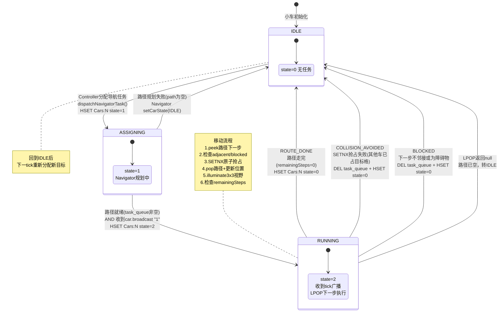

# 变电站巡检仿真系统 UML 图集

基于源码分析生成，所有 Mermaid 代码均可渲染。

---

## 1. 系统类图（Class Diagram）

```mermaid
classDiagram
    direction TB

    %% ── common 模块 ──
    class AppConfig {
        <<final utility>>
        -AppConfig()
        +redisHost() String
        +redisPort() int
        +redisDatabase() int
        +redisPassword() String
        +rabbitHost() String
        +rabbitPort() int
        +rabbitUsername() String
        +rabbitPassword() String
        +rabbitVirtualHost() String
        +tickMillis() long
        +maxCars() int
        +navigatorWorkerCount() int
    }

    class Keys {
        <<final constants>>
        -Keys()
        +MAP_VIEW$ String
        +BLOCK_VIEW$ String
        +MAP_WIDTH$ String
        +MAP_HEIGHT$ String
        +ALGORITHM$ String
        +SAVE$ String
        +NAVIGATOR_STATUS$ String
        +USERS_PREFIX$ String
        +CARS_PREFIX$ String
        +RECORDER_FRAME_PREFIX$ String
        +CONTROLLER_LOCK$ String
        +PLAYBACK_PREFIX$ String
        +carKey(int) String
        +carTaskQueue(int) String
        +recorderFrameKey(int, int) String
    }

    class SystemQueues {
        <<final constants>>
        +EXCHANGE_CONTROLLER$ String
        +EXCHANGE_SAVE$ String
        +EXCHANGE_CAR_BROADCAST$ String
        +EXCHANGE_NAVIGATOR$ String
        +QUEUE_CONTROLLER_START$ String
        +QUEUE_NAVIGATOR_START$ String
        +QUEUE_SAVE_START$ String
        +carQueue(int) String
        +navigatorQueue(int) String
        +navigatorRoutingKey(int) String
    }

    class Blackboard {
        <<final utility>>
        -Blackboard()
        +mapWidth(Jedis) int
        +mapHeight(Jedis) int
        +mapArea(Jedis) int
        +existingCarIds(Jedis) List~Integer~
        +hasCar(Jedis, int) boolean
        +getCarPoint(Jedis, int) Point
        +setCarPoint(Jedis, int, Point, Direction)
        +getCarState(Jedis, int) CarState
        +setCarState(Jedis, int, CarState)
        +isBlocked(Jedis, int, Point) boolean
        +isExplored(Jedis, int, Point) boolean
        +illuminate3x3(Jedis, int, int, Point)
        +exploredRatio(Jedis) double
        +isFullyExplored(Jedis) boolean
        +hasUnreachableFreeCells(Jedis) boolean
        +resetExplorationRun(Jedis)
        +mapViewSnapshot(Jedis) byte[]
        +restoreMapView(Jedis, byte[])
    }

    class CarState {
        <<enumeration>>
        IDLE(0)
        ASSIGNING(1)
        RUNNING(2)
        BLOCKED(3)
        +code() int
        +fromCode(String) CarState$
    }

    class Direction {
        <<enumeration>>
        U
        D
        L
        R
        +between(Point, Point) Direction$
    }

    class Point {
        <<final value>>
        -int x
        -int y
        +getX() int
        +getY() int
        +index(int) int
        +manhattan(Point) int
        +toQueueValue() String
        +parseQueueValue(String) Point$
    }

    class NavigatorTask {
        -String carId
        -int startx
        -int starty
        +NavigatorTask()
        +NavigatorTask(String, int, int)
        +getCarId() String
        +setCarId(String)
        +getStartx() int
        +setStartx(int)
        +getStarty() int
        +setStarty(int)
        +carNumber() int
    }

    class RouteAlgorithm {
        <<enumeration>>
        ASTAR("0")
        BIDIRECTIONAL_ASTAR("1")
        DIJKSTRA("2")
        +code() String
        +fromRedis(String) RouteAlgorithm$
    }

    class JsonSupport {
        <<final utility>>
        -JsonSupport()
        +toJson(Object) String
        +fromJson(String, Class~T~) T
    }

    class RedisProvider {
        <<final singleton>>
        -RedisProvider()
        -JedisPool POOL
        +get() Jedis
        +close()
    }

    class RabbitProvider {
        <<final singleton>>
        -RabbitProvider()
        -Connection connection
        +connection() Connection
        +channel() Channel
        +declareTopology(Channel)
        +close()
    }

    %% ── controller 模块 ──
    class ControllerMain {
        +main(String[])
    }

    class ControllerAgent {
        -AtomicBoolean active
        -AtomicLong tickCount
        -Thread tickThread
        +startWork()
        +stopWork()
        +close()
        -tickLoop()
        -tick()
        -dispatchNavigatorTask(Jedis, Channel, int)
        -firstAvailableNavigator(Jedis) int
        -complete(Channel)
    }

    %% ── navigator 模块 ──
    class NavigatorMain {
        +main(String[])
    }

    class NavigationWorker {
        -int id
        -NavigationService service
        +NavigationWorker(int)
        +run()
    }
    note for NavigationWorker "实现 Runnable\n监听 navigator.no{N} 队列"

    class NavigationService {
        -TargetSelector targetSelector
        +process(Jedis, NavigatorTask)
        -loadMap(Jedis, int, int) GridMap
        -markOtherCarsAsBlocked(Jedis, GridMap, int)
        -createFinder(RouteAlgorithm) PathFinder
    }

    class PathFinder {
        <<interface>>
        +findPath(Point, Point, GridMap) List~Point~
    }

    class AStarPathFinder {
        +findPath(Point, Point, GridMap) List~Point~
    }
    AStarPathFinder ..|> PathFinder : 实现

    class BidirectionalAStarPathFinder {
        +findPath(Point, Point, GridMap) List~Point~
        -step(...) Point
        -merge(...) List~Point~
    }
    BidirectionalAStarPathFinder ..|> PathFinder : 实现

    class DijkstraPathFinder {
        +findPath(Point, Point, GridMap) List~Point~
    }
    DijkstraPathFinder ..|> PathFinder : 实现

    class GridMap {
        -int width
        -int height
        -boolean[] blocked
        -boolean[] explored
        +GridMap(int, int, boolean[], boolean[])
        +width() int
        +height() int
        +inBounds(Point) boolean
        +isBlocked(Point) boolean
        +setBlocked(Point, boolean)
        +isExplored(Point) boolean
        +moveCost(Point) int
        +neighbors(Point) List~Point~
    }

    class TargetSelector {
        +chooseTarget(Point, GridMap) Point
    }

    class PathUtils {
        <<final utility>>
        -PathUtils()
        +reconstruct(Map~Point,Point~, Point, Point) List~Point~$
    }

    %% ── car 模块 ──
    class CarMain {
        +main(String[])
    }

    class CarManager {
        -Map~Integer,Thread~ cars
        -boolean running
        +run()
        +stop()
    }
    note for CarManager "实现 Runnable\n每秒扫描 Cars:* 自动发现"

    class CarAgent {
        -int id
        +CarAgent(int)
        +run()
        -handleTick()
        -isAdjacent(Point, Point) boolean
    }
    note for CarAgent "实现 Runnable\n监听 car.no{N} 队列"

    class Lighting {
        <<final utility>>
        -Lighting()
        +area3x3(int, int, Point) List~Point~$
    }

    %% ── recorder 模块 ──
    class RecorderMain {
        +main(String[])
    }

    class RecorderService {
        -AtomicBoolean recording
        -AtomicBoolean playback
        -Thread recordThread
        -Thread playbackThread
        +startRecording()
        +stopRecording()
        +startPlayback()
        +stopPlayback()
        -recordLoop(int)
        -playbackLoop()
        -capture(Jedis) FrameSnapshot
        -restore(Jedis, int, int) boolean
    }

    class FrameSnapshot {
        -int width
        -int height
        -String mapViewBase64
        -String blockViewBase64
        -List~CarSnapshot~ cars
        +getWidth() int
        +getHeight() int
        +getMapViewBase64() String
        +getBlockViewBase64() String
        +getCars() List~CarSnapshot~
    }

    class CarSnapshot {
        -String key
        -Map~String,String~ fields
        +CarSnapshot()
        +CarSnapshot(String, Map~String,String~)
        +getKey() String
        +getFields() Map~String,String~
    }

    %% ── 关系线 ──

    %% Controller 依赖
    ControllerMain ..> ControllerAgent : 创建并使用
    ControllerAgent ..> Blackboard : 调用静态方法
    ControllerAgent ..> Keys : 引用常量
    ControllerAgent ..> SystemQueues : 引用常量
    ControllerAgent ..> CarState : 使用
    ControllerAgent ..> NavigatorTask : 创建
    ControllerAgent ..> Point : 使用
    ControllerAgent ..> AppConfig : 读取配置
    ControllerAgent ..> RedisProvider : 获取Jedis
    ControllerAgent ..> RabbitProvider : 获取Channel
    ControllerAgent ..> JsonSupport : JSON序列化

    %% Controller 依赖 Redis/RabbitMQ Provider
    ControllerMain ..> RabbitProvider : 声明拓扑+消费
    ControllerMain ..> SystemQueues : 队列名
    ControllerMain ..> RedisProvider : 分布式锁
    ControllerMain ..> Keys : CONTROLLER_LOCK

    %% Navigator 依赖
    NavigatorMain ..> NavigationWorker : 创建线程
    NavigatorMain ..> AppConfig : navigatorWorkerCount
    NavigationWorker *-- NavigationService : 组合
    NavigationWorker ..> RedisProvider : 获取Jedis
    NavigationWorker ..> RabbitProvider : 获取Channel
    NavigationService *-- TargetSelector : 组合
    NavigationService ..> PathFinder : 使用 <<接口>>
    NavigationService ..> GridMap : 创建
    NavigationService ..> Blackboard : 读写黑板
    NavigationService ..> RouteAlgorithm : 使用
    NavigationService ..> Keys : 引用常量
    TargetSelector ..> GridMap : 遍历邻居
    PathUtils ..> Point : 使用
    AStarPathFinder ..> PathUtils : 调用reconstruct
    BidirectionalAStarPathFinder ..> PathUtils : 调用merge
    DijkstraPathFinder ..> PathUtils : 调用reconstruct
    AStarPathFinder ..> GridMap : neighbors/moveCost
    BidirectionalAStarPathFinder ..> GridMap : neighbors/moveCost
    DijkstraPathFinder ..> GridMap : neighbors/moveCost
    AStarPathFinder ..> Point : 使用
    BidirectionalAStarPathFinder ..> Point : 使用
    DijkstraPathFinder ..> Point : 使用

    %% Car 依赖
    CarMain ..> CarManager : 创建并运行
    CarManager o-- CarAgent : 创建线程管理
    CarAgent ..> Blackboard : 读写状态
    CarAgent ..> CarState : 使用
    CarAgent ..> Direction : 使用
    CarAgent ..> Point : 当前位置
    CarAgent ..> Keys : 构建key
    CarAgent ..> SystemQueues : 队列名
    CarAgent ..> RedisProvider : 获取Jedis
    CarAgent ..> RabbitProvider : 获取Channel
    CarManager ..> AppConfig : maxCars
    CarManager ..> Blackboard : hasCar
    CarManager ..> RedisProvider : 获取Jedis
    Lighting ..> Point : 计算3x3
    Blackboard ..> Lighting : (illuminate3x3内联实现)

    %% Recorder 依赖
    RecorderMain ..> RecorderService : 创建并使用
    RecorderMain ..> RabbitProvider : 声明拓扑+消费
    RecorderMain ..> SystemQueues : QUEUE_SAVE_START
    RecorderService *-- FrameSnapshot : 创建/恢复
    FrameSnapshot *-- CarSnapshot : 包含
    RecorderService ..> Blackboard : existingCarIds/mapWidth
    RecorderService ..> Keys : 构建key
    RecorderService ..> RedisProvider : 获取Jedis
    RecorderService ..> JsonSupport : JSON序列化

    %% 通用依赖链
    AppConfig <.. RedisProvider : host/port/password
    AppConfig <.. RabbitProvider : host/port/credentials
    AppConfig <.. ControllerAgent : tickMillis/maxCars
    AppConfig <.. CarManager : maxCars
    AppConfig <.. NavigatorMain : navigatorWorkerCount
    AppConfig <.. NavigationWorker : (间接)

    %% common 内部关系
    Point ..> Direction : between()使用
    NavigatorTask ..> Point : startx/starty
    NavigatorTask ..> Keys : carKey/carNumber
    Blackboard ..> Point : 位置计算
    Blackboard ..> CarState : 状态读写
    Blackboard ..> Direction : setCarPoint
    Blackboard ..> Keys : 所有key引用
    RouteAlgorithm ..> Keys : ALGORITHM
```



---

## 2. 组件通信顺序图（Sequence Diagram）

```mermaid
sequenceDiagram
    actor User
    participant View as View<br/>(Swing前端)
    participant MQ as RabbitMQ<br/>(消息总线)
    participant Redis as Redis<br/>(黑板)
    participant Ctrl as Controller
    participant Nav as Navigator
    participant Car as Car
    participant Rec as Recorder

    Note over User,Rec: ===== 启动阶段 =====

    User->>View: 点击"开始巡检"
    View->>Redis: SETBIT blockview (障碍物数据)
    View->>Redis: HSET Cars:1..N (小车初始位置)
    View->>MQ: basicPublish("1") → save fanout
    MQ-->>Rec: 收到"1" → 开始录制
    Rec->>Redis: HINCRBY Save file_num
    Rec->>Redis: HSET Save order_file_num/start_view/last_view
    View->>MQ: basicPublish("1") → controller fanout
    MQ-->>Ctrl: 收到"1" → 启动tick循环

    Note over User,Rec: ===== 单个Tick周期（重复执行） =====

    rect rgb(240, 248, 255)
        Note right of Ctrl: Tick N 开始

        %% 步骤3: 扫描小车
        Ctrl->>Redis: SCAN Cars:*
        Redis-->>Ctrl: [1, 2, ..., N]

        %% 步骤4: 检查状态
        loop 遍历每辆小车
            Ctrl->>Redis: HGET Cars:N state
            Redis-->>Ctrl: "0" (IDLE)

            alt 状态=IDLE 且 任务队列为空
                Ctrl->>Redis: HGET navigator_status nav_1:working
                Redis-->>Ctrl: "false"
                Ctrl->>Redis: HGET navigator_status nav_2:working
                Redis-->>Ctrl: "false"

                %% 步骤5: 分发导航任务
                Ctrl->>MQ: basicPublish(NavigatorTask JSON)<br/>→ navigator.messagesent<br/>routingKey=.no1
                Ctrl->>Redis: HSET Cars:N state "1" (ASSIGNING)
            end
        end

        %% 步骤6-7: Navigator 处理
        MQ-->>Nav: 收到 NavigatorTask JSON
        Nav->>Redis: HSET navigator_status nav_1:working "true"
        Nav->>Redis: GET MapView (批量位图字节)
        Nav->>Redis: GET blockview (批量位图字节)
        Redis-->>Nav: byte[] 位图数据
        Nav->>Nav: 构建GridMap → BFS选择最近未探索目标
        Nav->>Nav: 执行A*/双向A*/Dijkstra路径规划
        Nav->>Redis: DEL {N}_task_queue (清旧路径)
        Nav->>Redis: RPUSH {N}_task_queue ["x1,y1","x2,y2",...]
        Nav->>Redis: HSET Cars:N endx / endy
        Nav->>Redis: HSET navigator_status nav_1:working "false"
        note right of Nav: 路径已写入小车任务队列

        %% 步骤8: 广播tick
        Ctrl->>MQ: basicPublish("1") → car.broadcast (Fanout)
        MQ-->>Car: 收到"1" (每个小车一个独立队列)

        %% 步骤9-12: Car 移动
        Car->>Redis: HGET Cars:N state
        Redis-->>Car: "2" (RUNNING)

        alt 状态=RUNNING
            %% 步骤9
            Car->>Redis: LPOP {N}_task_queue
            Redis-->>Car: "x,y"

            alt 路径已空
                Car->>Redis: HSET Cars:N state "0" (IDLE)
                note right of Car: ROUTE_DONE
            else 有下一步
                Car->>Redis: HGET Cars:N x y

                %% 步骤10: 原子抢占
                Car->>Redis: SETNX car_reserve:x:y N (TTL 5s)
                Redis-->>Car: 1 (抢占成功)

                alt 抢占失败
                    Car->>Redis: DEL {N}_task_queue
                    Car->>Redis: HSET Cars:N state "0" (IDLE)
                    note right of Car: COLLISION_AVOIDED
                else 抢占成功
                    %% 步骤11
                    Car->>Redis: HSET Cars:N x y direction (新位置)
                    Car->>Redis: DEL car_reserve:x:y
                    %% 步骤12: 点亮3×3视野
                    Car->>Redis: SETBIT MapView (3×3 含视线阻挡检测)

                    alt 路径剩余=0
                        Car->>Redis: HSET Cars:N state "0" (IDLE)
                        note right of Car: ROUTE_DONE → IDLE
                    else 路径未走完
                        Car->>Redis: HSET Cars:N state "2" (RUNNING)
                    end
                end
            end
        end

        %% 步骤13: Recorder 录制帧
        Rec->>Redis: GET MapView / GET blockview
        Rec->>Redis: HGETALL Cars:1..N
        Redis-->>Rec: 当前完整状态
        Rec->>Rec: capture() → FrameSnapshot → JSON
        Rec->>Redis: HSET Record:{fileNo}:{frame} snapshot "{JSON}"
        Rec->>Redis: HSET Save last_view "{frame}"
    end

    Note over Ctrl,Rec: Ctrl sleep(tickInterval - elapsed) → 下一Tick

    %% 探索完成
    rect rgb(255, 240, 240)
        Ctrl->>Redis: isFullyExplored() → true
        Ctrl->>Redis: SET exploration_result "complete"
        Ctrl->>MQ: basicPublish("0") → save fanout
        MQ-->>Rec: 收到"0" → 停止录制
        Ctrl->>Ctrl: active=false → tick循环结束
    end

    Note over User,Rec: ===== 查看回放 =====

    User->>View: 选择录像 → 开始回放
    View->>MQ: basicPublish("2") → controller fanout
    MQ-->>Rec: 收到"2" → 开始回放
    loop 逐帧回放
        Rec->>Redis: HGET Record:{fileNo}:{frame} snapshot
        Rec->>Redis: SET playback:map_width / playback:MapView / playback:blockview
        Rec->>Redis: HMSET playback:Cars:1..N
        Rec->>Redis: HSET Save order_view "{frame}"
    end
    View->>Redis: GET playback:MapView / HGETALL playback:Cars:*
    Redis-->>View: 回放帧数据
    View->>View: 渲染回放画面
```



---

## 3. 数据流图（Data Flow Diagram）

```mermaid
flowchart LR
    subgraph 外部实体
        User[用户]
        RedisExt[("Redis<br/>黑板数据")]
        MQExt[("RabbitMQ<br/>消息总线")]
    end

    subgraph 处理过程
        P1[Controller<br/>节拍调度]
        P2[Navigator<br/>路径规划]
        P3[Car<br/>移动执行]
        P4[Recorder<br/>录制/回放]
        P5[View<br/>渲染/配置]
    end

    subgraph 数据存储_Redis[Redis 数据存储]
        D1[(MapView<br/>探索位图)]
        D2[(blockview<br/>障碍物位图)]
        D3[(Cars:1..N<br/>小车Hash)]
        D4[({id}_task_queue<br/>路径队列)]
        D5[(navigator_status<br/>导航器状态Hash)]
        D6[(Save<br/>录制元数据)]
        D7[(Record:N:F<br/>帧快照)]
        D8[(controller:lock<br/>分布式锁)]
        D9[(car_reserve:X:Y<br/>目标格抢占锁)]
        D10[(Algorithm<br/>算法选择)]
        D11[(exploration_result<br/>探索结果)]
        D12[(playback:MapView<br/>回放命名空间)]
    end

    %% 用户 → 前端
    User -->|"配置地图/小车/障碍物<br/>点击开始巡检"| P5

    %% View → 数据流
    P5 -->|"SETBIT blockview<br/>HSET Cars:N x y<br/>Publish '1'"| MQExt
    P5 -->|"读写地图配置<br/>读取小车状态<br/>读取回放帧"| RedisExt

    %% Controller 数据流
    MQExt -->|"'1'→开始 '0'→停止"| P1
    P1 -->|"SCAN Cars:*<br/>HGET Cars:N state<br/>SETBIT (分布式锁)<br/>SET exploration_result"| RedisExt
    P1 -->|"Publish NavigatorTask JSON<br/>Publish '1'→car.broadcast<br/>Publish '0'→save fanout"| MQExt

    %% Navigator 数据流
    MQExt -->|"NavigatorTask JSON"| P2
    P2 -->|"GET MapView byte[]<br/>GET blockview byte[]<br/>SCAN Cars:*<br/>DEL+RPUSH {id}_task_queue<br/>HSET Cars:N endx/endy<br/>HSET navigator_status"| RedisExt

    %% Car 数据流
    MQExt -->|"'1'→car.broadcast"| P3
    P3 -->|"HGET Cars:N state/x/y<br/>LPOP {id}_task_queue<br/>SETNX car_reserve:X:Y<br/>HSET Cars:N x/y/direction/state<br/>DEL reserve锁<br/>SETBIT MapView (3×3)"| RedisExt

    %% Recorder 数据流
    MQExt -->|"'1'→开始录制<br/>'0'→停止<br/>'2'→开始回放"| P4
    P4 -->|"GET MapView/blockview<br/>HGETALL Cars:*<br/>HSET Record:N:F snapshot<br/>HSET Save last_view/order_view<br/>SET playback:MapView (回放写入)"| RedisExt

    %% View 读取
    RedisExt -->|"GET MapView/blockview<br/>HGETALL Cars:N<br/>GET exploration_result<br/>GET playback:* (回放)"| P5
    P5 -->|"渲染地图/小车/回放画面"| User

    %% 数据存储关系
    P1 -.- D1
    P1 -.- D3
    P2 -.- D1
    P2 -.- D2
    P2 -.- D3
    P2 -.- D4
    P3 -.- D1
    P3 -.- D3
    P3 -.- D4
    P3 -.- D9
    P4 -.- D1
    P4 -.- D2
    P4 -.- D3
    P4 -.- D6
    P4 -.- D7
    P4 -.- D12
    P1 -.- D8
    P1 -.- D11
```

---

## 4. 小车状态图（State Diagram）



---

## 5. 实体关系图（ER Diagram / Redis 数据模型）

```mermaid
erDiagram
    USERS {
        string username PK "Hash Key: Users:admin"
        string password "密码（明文）"
        string role "admin/configurator/analyst"
    }

    CARS {
        int id PK "Hash Key: Cars:1 ~ Cars:N"
        int x "当前行坐标"
        int y "当前列坐标"
        int endx "目标行坐标"
        int endy "目标列坐标"
        string direction "朝向: U/D/L/R"
        string state "0=IDLE 1=ASSIGNING 2=RUNNING 3=BLOCKED"
    }

    TASK_QUEUE {
        string queueKey PK "List Key: 1_task_queue ~ N_task_queue"
        string pathPoint "元素: x,y字符串"
    }

    NAVIGATOR_STATUS {
        string navId PK "Hash Key: navigator_status"
        string working "字段: nav_1:working ~ nav_N:working, true/false"
    }

    MAP_VIEW {
        string key PK "Bitmap Key: MapView"
        byte data "位图字节数组, 1bit/格, 1=已探索"
    }

    BLOCK_VIEW {
        string key PK "Bitmap Key: blockview"
        byte data "位图字节数组, 1bit/格, 1=障碍物"
    }

    SAVE {
        string key PK "Hash Key: Save"
        int file_num "总录制文件数"
        int order_file_num "当前操作文件编号"
        int order_view "当前回放帧号"
        int start_view "起始帧=0"
        int last_view "最后一帧编号"
        string triple_speed "回放速度: 1.0/2.0/0.5"
        string created_at_N "时间戳(epoch ms)"
    }

    RECORD_FRAME {
        string key PK "Hash Key: Record:{fileNo}:{frame}"
        string snapshot "FrameSnapshot JSON"
    }

    CONTROLLER_LOCK {
        string key PK "String Key: controller:lock"
        string instanceId "UUID实例标识"
        int ttl "TTL: 30s, 每10s续约"
    }

    CAR_RESERVE {
        string key PK "String Key: car_reserve:{x}:{y}"
        int carId "抢占小车的ID"
        int ttl "TTL: 5s"
    }

    ALGORITHM {
        string key PK "String Key: Algorithm"
        string value "0=A* / 1=双向A* / 2=Dijkstra"
    }

    EXPLORATION_RESULT {
        string key PK "String Key: exploration_result"
        string value "complete 或 partial"
    }

    PLAYBACK_NAMESPACE {
        string prefix "playback: 命名空间前缀"
        string mapWidth "playback:map_width"
        string mapView "playback:MapView"
        string blockView "playback:blockview"
        string cars "playback:Cars:1 ~ playback:Cars:N"
    }

    MAP_CONFIG {
        string key PK "String Key: map_width / map_height"
        int value "地图尺寸(默认20)"
    }

    %% 关系说明
    CARS ||--o{ TASK_QUEUE : "cars:{id} → {id}_task_queue"
    CARS }o--|| MAP_VIEW : "通过x,y坐标索引定位到bit位"
    RECORD_FRAME ||--o{ SAVE : "Record:{fileNo}:{frame}<br/>→ Save.file_num/last_view"
    MAP_VIEW }o--|| PLAYBACK_NAMESPACE : "回放时复制到playback:前缀"
    CARS }o--|| PLAYBACK_NAMESPACE : "回放时复制到playback:前缀"
```



---

## 6. 控制流图（Control Flow Diagram）

```mermaid
flowchart TD
    START([Tick N 开始]) --> SCAN_CARS[Redis SCAN Cars:*<br/>获取所有小车ID列表]

    SCAN_CARS --> CHECK_EMPTY{小车列表<br/>是否为空?}

    CHECK_EMPTY -->|是| SKIP[记录日志: no cars<br/>跳过本tick]
    SKIP --> SLEEP

    CHECK_EMPTY -->|否| CHECK_COMPLETE{isFullyExplored?<br/>BFS可达性检查}

    CHECK_COMPLETE -->|已完成| DO_COMPLETE[complete():<br/>1. SET exploration_result<br/>2. active=false<br/>3. Publish '0'→save fanout]
    DO_COMPLETE --> STOP([Controller停止])

    CHECK_COMPLETE -->|未完成| CALC_RATIO[exploredRatio():<br/>批量读取位图字节<br/>计算已探索空闲格比例]

    CALC_RATIO --> LOOP_CARS[遍历每辆小车]

    LOOP_CARS --> CHECK_STATE{状态=IDLE<br/>且队列为空?}

    CHECK_STATE -->|否| NEXT_CAR{还有更多<br/>小车?}
    CHECK_STATE -->|是| FIND_NAV[firstAvailableNavigator():<br/>HGET navigator_status<br/>找第一个空闲worker]

    FIND_NAV --> NAV_FOUND{找到空闲<br/>Navigator?}

    NAV_FOUND -->|否| NEXT_CAR
    NAV_FOUND -->|是| DISPATCH[dispatchNavigatorTask():<br/>1. 创建 NavigatorTask{carId, x, y}<br/>2. Publish JSON→navigator.messagesent<br/>3. HSET Cars:N state=ASSIGNING]

    DISPATCH --> NEXT_CAR

    NEXT_CAR -->|是| LOOP_CARS
    NEXT_CAR -->|否| BROADCAST[Publish '1' → car.broadcast<br/>Fanout Exchange<br/>触发所有CarAgent.handleTick]

    BROADCAST --> LOG_TICK[记录Tick日志:<br/>车数/探索率/idle数/分配数/耗时]

    LOG_TICK --> SLEEP[sleep(tickInterval - elapsed)<br/>tickInterval默认500ms<br/>elapsed为本tick实际耗时]

    SLEEP --> NEXT_TICK([Tick N+1 开始])
    NEXT_TICK --> SCAN_CARS

    style START fill:#e1f5fe
    style STOP fill:#ffebee
    style DO_COMPLETE fill:#ffebee
    style NEXT_TICK fill:#e1f5fe
    style DISPATCH fill:#e8f5e9
    style BROADCAST fill:#fff3e0
```

---

## 7. 部署图（Deployment Diagram）

```mermaid
flowchart TB
    subgraph 主机A["主机 A — 服务器 (Linux/Windows)"]
        direction TB
        subgraph 基础设施["中间件 (端口对外开放)"]
            Redis[("Redis 5.x+<br/>Port: 6379<br/>DB: 9<br/>黑板数据")]
            RabbitMQ[("RabbitMQ 3.x+<br/>Port: 5672<br/>vHost: /<br/>消息总线")]
        end

        subgraph 后端进程["后端 4 进程 (JDK 11+)"]
            Controller[Controller<br/>fat JAR<br/>tickLoop调度]
            Navigator[Navigator<br/>fat JAR<br/>多个worker线程]
            Car[Car<br/>fat JAR<br/>CarManager+CarAgents]
            Recorder[Recorder<br/>fat JAR<br/>录制/回放循环]
        end

        subgraph 前端进程["前端 GUI (JDK 19+)"]
            View[View<br/>Swing GUI<br/>-- 仅部署于服务器 --]
        end
    end

    subgraph 主机B["主机 B — 客户端"]
        ViewB[View<br/>Swing GUI<br/>JDK 19+]
    end

    subgraph 主机C["主机 C — 客户端"]
        ViewC[View<br/>Swing GUI<br/>JDK 19+]
    end

    subgraph 主机D["主机 D — 客户端"]
        ViewD[View<br/>Swing GUI<br/>JDK 19+]
    end

    %% 通信连线
    Controller <-->|"Redis Protocol<br/>Jedis连接池<br/>SCAN/GET/SET/HGET/HSET/SETBIT/SETNX"| Redis
    Navigator <-->|"Redis Protocol<br/>Jedis连接池<br/>GET(位图)/RPUSH/HSET/HGETALL/SCAN"| Redis
    Car <-->|"Redis Protocol<br/>Jedis连接池<br/>LPOP/HSET/HGET/SETNX/SETBIT"| Redis
    Recorder <-->|"Redis Protocol<br/>Jedis连接池<br/>GET/HGETALL/HSET/SCAN/DEL"| Redis

    Controller <-->|"AMQP 0-9-1<br/>Publish/Consume<br/>controller.start队列<br/>navigator.messagesent Exchange<br/>car.broadcast Fanout<br/>save Fanout"| RabbitMQ
    Navigator <-->|"AMQP 0-9-1<br/>Consume<br/>navigator.no1~noN 队列"| RabbitMQ
    Car <-->|"AMQP 0-9-1<br/>Consume<br/>car.no1~noN 队列"| RabbitMQ
    Recorder <-->|"AMQP 0-9-1<br/>Consume<br/>save.start 队列"| RabbitMQ
    View <-->|"AMQP 0-9-1<br/>Publish<br/>controller.start / save.start"| RabbitMQ

    View <-->|"Redis Protocol<br/>读取黑板数据<br/>用户管理/地图渲染"| Redis

    ViewB <-->|"Redis Protocol<br/>:6379 远程"| Redis
    ViewB <-->|"AMQP 0-9-1<br/>:5672 远程"| RabbitMQ

    ViewC <-->|"Redis Protocol<br/>:6379 远程"| Redis
    ViewC <-->|"AMQP 0-9-1<br/>:5672 远程"| RabbitMQ

    ViewD <-->|"Redis Protocol<br/>:6379 远程"| Redis
    ViewD <-->|"AMQP 0-9-1<br/>:5672 远程"| RabbitMQ

    %% 环境标注
    note1["
    **主机A运行时环境:**
    - Redis 5.x+ (端口 6379)
    - RabbitMQ 3.x+ (端口 5672, 15672管理界面)
    - JDK 11+ (后端4进程)
    - JDK 19+ (前端Swing GUI)
    - Maven 3.8+ (构建用)
    "]

    note2["
    **主机B/C/D运行时环境:**
    - JDK 19+ (前端Swing GUI)
    - 无需Redis/RabbitMQ本地安装
    - 通过环境变量指向主机A:
      REDIS_HOST / RABBITMQ_HOST
    "]

    主机A -.- note1
    主机B -.- note2
```


