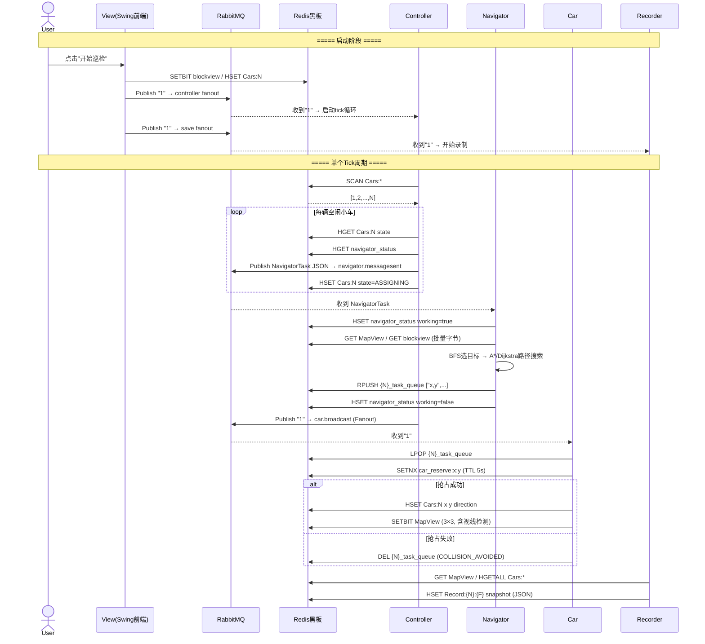
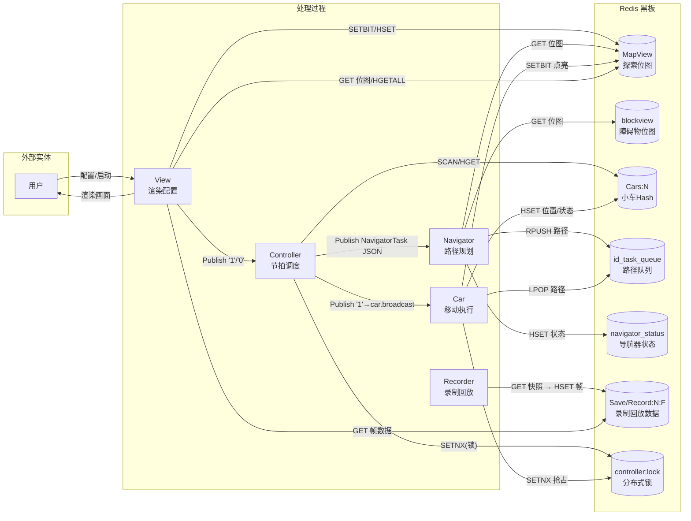
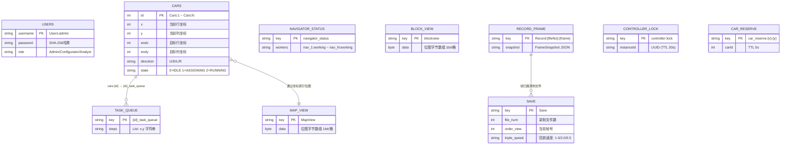
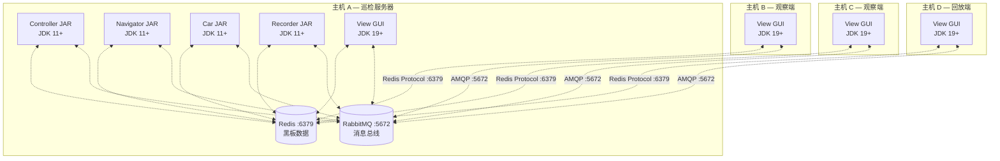

# 分布式变电站多车巡检系统使用说明书

> **文档版本**：v1.0  
> **日期**：2026-06-18  
> **适用课程**：软件工程课程设计  
> **项目根目录**：`E:\Desktop\homework`

---

## 目录

1. [系统概述](## 1-系统概述)
2. [课设要求满足情况总览](## 2-课设要求满足情况总览)
3. [系统运行方式](## 3-系统运行方式)
4. [系统功能使用说明](## 4-系统功能使用说明)
5. [功能分布设计的理由](## 5-功能分布设计的理由)
6. [构件清单与功能分配表](## 6-构件清单与功能分配表)
7. [构件详细设计](## 7-构件详细设计)
8. [连接件详细设计](## 8-连接件详细设计)
9. [黑板组件详细设计](## 9-黑板组件详细设计)
10. [核心接口与特色设计](## 10-核心接口与特色设计)

---

## 1. 系统概述

### 1.1 项目背景

变电站巡检仿真系统模拟变电站环境下的多机器人协作巡检过程。变电站被建模为二维网格地图，多台巡检机器人（小车）需要协作探索整个地图区域，走过所有可达格点并点亮周围 3×3 格子区域。系统基于**黑板架构（Blackboard Architecture）**设计——Redis 作为共享数据空间（黑板），RabbitMQ 作为消息总线，Controller 是唯一的节拍调度器，Navigator、Car、Recorder 为独立的知识源。

### 1.2 核心功能

- 二维网格地图建模（1×1 到 100×100 可配置）
- 随机/手动放置障碍物和小车
- 多车协作巡逻，Controller 节拍驱动统一调度
- 三种路径规划算法（A\*、双向 A\*、Dijkstra），运行时热切换
- 碰撞避免（Redis 原子抢占锁 + 视线阻挡检测）
- BFS 可达性检查（自动识别障碍物包围的不可达区域）
- 探索过程录制与回放（支持调速、暂停、进度拖拽）
- 独立组件部署——每个模块编译为独立可执行 fat JAR
- 系统运行状态实时监控

### 1.3 技术选型

| 技术栈 | 选型 | 说明 |
|--------|------|------|
| 编程语言 | Java 11（后端）/ Java 19（前端） | 主开发语言 |
| 构建工具 | Maven 多模块 | 每个知识源为独立可构建模块 |
| 黑板存储 | Redis 5.x (Jedis 3.2.0) | Bitmap/Hash/List 数据结构，支持 SETNX 分布式锁 |
| 消息中间件 | RabbitMQ 3.x (amqp-client 5.12.0) | Direct Exchange 点对点 + Fanout Exchange 广播 |
| 桌面前端 | Java Swing | 配置/回放/管理界面 |
| 序列化 | Jackson 2.15.2 | JSON 序列化 |
| 日志框架 | SLF4J + Logback 1.2.13 | 结构化全链路日志 |

### 1.4 前端连接配置（View 端环境变量）

前端 View 默认连接 `localhost`，以下环境变量可在启动 View 前设置，使其连接到**远程主机**上运行的 Redis 和 RabbitMQ：

| 环境变量 | 默认值 | 说明 |
|---------|--------|------|
| `REDIS_HOST` | `localhost` | Redis 黑板所在主机 IP |
| `REDIS_PORT` | `6379` | Redis 端口 |
| `REDIS_DATABASE` | `9` | Redis DB 编号 |
| `REDIS_PASSWORD` | (空) | Redis 密码（无密码则留空） |
| `RABBITMQ_HOST` | `localhost` | RabbitMQ 消息总线所在主机 IP |
| `RABBITMQ_PORT` | `5672` | RabbitMQ 端口 |
| `RABBITMQ_USERNAME` | `guest` | RabbitMQ 用户名 |
| `RABBITMQ_PASSWORD` | `guest` | RabbitMQ 密码 |
| `RABBITMQ_VHOST` | `/` | RabbitMQ 虚拟主机 |

后端（InspectionBackend）通过 `application.properties` 和同名大写环境变量配置，后端的配置项见 [附录 B](#附录-b配置文件-applicationproperties)。

---

## 2. 课设要求满足情况总览

| # | 课设要求 | 状态 | 验证方法 | 细节说明 |
|---|---------|------|----------|----------|
| 1 | **每个构件编译为独立计算组件** | ✅ 满足 | `mvn clean package` 后检查各模块 `target/` 下的 fat JAR | 通过 `maven-shade-plugin` 将每个模块及其所有依赖打包为单一 JAR，Manifest 写入 `Main-Class`。共 6 个：`controller.jar`, `navigator.jar`, `car.jar`, `recorder.jar`, `launcher.jar`, `tools.jar`，每个约 4.2MB，含 Jedis/amqp-client/Jackson/Logback 全部依赖 |
| 2 | **可通过控制台/桌面/网络独立启动** | ✅ 满足 | 多个终端分别执行 `java -jar xxx.jar` | 每个 fat JAR 均有独立 `main()` 入口。Launcher 通过 `ProcessBuilder` 启动各模块为独立 JVM 进程。View 为 Swing 桌面程序 |
| 3 | **用户可独立启动、添加新车** | ✅ 满足 | 前端"随机生成"或点击放置；`redis-cli HSET Cars:N` 动态添加 | CarManager 每 1 秒扫描 Redis `Cars:*` 键，动态发现新车并自动启动对应 `CarAgent` 线程。小车数上限为地图格数 |
| 4 | **导航器可启动 1~N 个** | ✅ 满足 | 修改 `NAVIGATOR_WORKER_COUNT` 环境变量或 application.properties | NavigatorMain 启动时根据配置创建 N 个 worker 线程，每个监听独立队列 `navigator.no1~noN`，Controller 轮询空闲 worker 分配任务 |
| 5 | **显示界面可独立部署多个** | ✅ 满足 | 同时启动多个 View 实例 | View 直接读写 Redis 获取状态，多个实例之间无耦合，各自独立连接 Redis/RabbitMQ，可同时运行 |
| 6 | **控制器独立运行且单实例** | ✅ 满足 | 启动第二个 Controller 将自动退出 | Redis `SETNX controller:lock` 分布式锁（TTL 30s + 每 10s Lua 脚本续约），shutdown hook 释放锁 |
| 7 | **各组件共享数据** | ✅ 满足 | 观察 Redis 中 `MapView`/`blockview`/`Cars:*` 在各模块间同步 | Redis 黑板 + RabbitMQ 消息总线。所有组件通过 Controller 统一调度节奏 |
| 8 | **各组件高度独立** | ✅ 满足 | 启动/停止单个模块不影响其他 | 各模块独立 JVM 进程，仅通过 Redis/RabbitMQ 通信，无代码级耦合 |
| 9 | **各组件易于升级** | ✅ 满足 | 替换单个 JAR 并重启该进程 | 独立 fat JAR + 独立进程，接口向后兼容时即可热升级 |
| 10 | **保持独立性前提下提高效率** | ✅ 满足 | 观察 tick 耗时（典型 < 300ms） | 位图批量读取（O(N²)→O(1) Redis 调用）、路径批量 RPUSH、8 worker 导航池 |
| 11 | **易于调试** | ✅ 满足 | 查看 `logs/backend.log` / `frontend.log` | 全链路 SLF4J+Logback 日志，Controller 节拍/Car 微秒级耗时分解/Navigator 规划详情/View 渲染周期 |
| 12 | **界面组件查看运行状态** | ✅ 满足 | 配置界面底部"系统运行状态"面板 | StatusPanel 每 2s 从 Redis 读取：Controller 运行状态、Navigator 忙闲分布、小车在线数、Recorder 状态、探索百分比 |

---

## 3. 系统运行方式

### 3.1 环境依赖

| 组件 | 版本 | 默认连接 |
|------|------|----------|
| JDK | 11+（后端）/ 19+（前端） | - |
| Maven | 3.8+ | - |
| Redis | 5.x+ | `localhost:6379`，DB 9，无密码 |
| RabbitMQ | 3.x+ | `localhost:5672`，`guest/guest`，vhost `/` |

### 3.2 启动脚本总览

根目录提供了以下启动脚本：

| 脚本 | 用途 | 适用场景 |
|------|------|---------|
| `start.bat` | 交互式菜单入口 | 双击即可选择启动方式 |
| `start.ps1` | 完整一键启动 | 单主机全量构建+初始化+启动后端+前端 |
| `start-backend.ps1` | 仅启动后端 | 巡检服务器运行后端，其他主机 View 连接观察 |
| `start-view.ps1 -Host <IP>` | 仅启动前端 View | 其他主机连接远程巡检服务器 |
| `start-standalone.ps1` | 分别启动各组件 | 演示组件独立性、故障恢复 |

### 3.3 单主机模式（一键启动）

双击根目录 **`start.bat`**，选择 `[1] 全量启动`，或在终端执行：

```powershell
powershell -NoProfile -ExecutionPolicy Bypass -File start.ps1
```

脚本流程：① 清理残留 Java 进程 → ② `mvn clean package` 构建后端 6 个 fat JAR → ③ `mvn clean compile` 编译前端 → ④ `java -jar tools.jar init` 初始化种子用户 → ⑤ `java -jar tools.jar clean-runtime` 清理运行时数据 → ⑥ `java -jar launcher.jar` 以独立进程启动 Controller/Navigator/Car/Recorder → ⑦ 启动前端 Swing 界面

登录凭据：`config / config123`（配置员）。

> **保留录制数据**：执行 `powershell -File start.ps1 -SkipClean` 可跳过 clean-runtime 步骤，保留上次录制记录。

### 3.4 多主机模式（网络部署）

本系统支持**一台主机运行巡检后端（Redis/RabbitMQ/Controller/Navigator/Car/Recorder），多台主机通过 View 前端远程连接观察**。这是课设第 5 项要求的完整实现。

**前提条件**：

巡检主机（以下简称"主机 A"）上的 Redis 和 RabbitMQ 需要配置为允许远程连接：

**Redis**（编辑 `redis.windows.conf` 或 `redis.conf`）：
```
bind 0.0.0.0
protected-mode no
```
然后重启 Redis。

**RabbitMQ**（管理员 PowerShell 执行）：
```powershell
rabbitmqctl add_user remote remote123
rabbitmqctl set_permissions -p / remote ".*" ".*" ".*"
rabbitmqctl set_user_tags remote administrator
```

**各主机操作**：

| 主机 | 角色 | 操作 |
|------|------|------|
| **主机 A**（巡检服务器） | 运行全部后端 + View | `powershell -File start.ps1`（或 `start.bat` 选 `[1]`） |
| **主机 B/C**（观察端） | 仅启动 View，连接主机 A | `powershell -File start-view.ps1 -Host 192.168.1.10 -RabbitUser remote -RabbitPass remote123` |
| **主机 D**（回放端） | 仅启动 View，巡检结束后回放 | 同上，登录 `analyst/analyst123` |

> 主机 B/C/D 上**无需安装 Redis 和 RabbitMQ**，无需构建后端——仅需 JDK 和 Maven 编译前端即可。

**环境变量手动设置**（不使用 start-view.ps1 时）：

```powershell
$env:REDIS_HOST = "192.168.1.10"        # 主机 A 的 IP
$env:RABBITMQ_HOST = "192.168.1.10"
$env:RABBITMQ_USERNAME = "remote"
$env:RABBITMQ_PASSWORD = "remote123"
# 然后启动 View
cd View\CREAZYTHURSDAY\com.Manny
mvn clean compile
mvn exec:java -Dexec.mainClass=Login.Main.Main
```

### 3.5 手动构建与启动

```bash
# 构建
cd InspectionBackend && mvn clean package -DskipTests
cd View/CREAZYTHURSDAY/com.Manny && mvn clean compile

# 初始化
cd InspectionBackend
java -jar tools/target/tools.jar init
java -jar tools/target/tools.jar clean-runtime

# 启动（方式一：Launcher 一键）
java -jar launcher/target/launcher.jar

# 启动（方式二：分别独立启动）
java -jar controller/target/controller.jar &
java -jar navigator/target/navigator.jar &
java -jar car/target/car.jar &
java -jar recorder/target/recorder.jar &

# 启动前端
cd View/CREAZYTHURSDAY/com.Manny
mvn exec:java -Dexec.mainClass=Login.Main.Main
```

### 3.6 关闭系统

- 关闭 View 窗口 → 自动向后端发送停止命令
- 后端各进程在 View 退出后由 Launcher 优雅终止
- 或手动 `Ctrl+C` 终止各终端中的 Java 进程
- 使用分别启动方式时，在各自终端 Ctrl+C 停止

---

## 4. 系统功能使用说明

### 4.1 默认账号

| 角色 | 用户名 | 密码 | 权限 |
|------|--------|------|------|
| 管理员 | `admin` | `admin123` | 用户管理 |
| 配置员 | `config` | `config123` | 地图/小车/障碍物配置、启动巡检 |
| 分析员 | `analyst` | `analyst123` | 回放历史记录 |

### 4.2 配置员操作流程

1. 登录 `config / config123`
2. **地图配置**：选择默认 20×20 或自定义边长（1-100）
3. **放置小车**：点击"随机生成"输入数量，或开启"点击放置"在网格上手动放置
4. **放置障碍物**：同上，自动避开小车占用格
5. **选择算法**：A\*（默认）/ 双向 A\* / Dijkstra
6. **点击"开始巡检"**：地图数据写入 Redis，Controller 收到启动命令开始节拍循环
7. **观察**：小车自动移动，地图逐步点亮，右侧状态面板实时显示各组件状态和探索进度
8. **探索完成**：弹窗提示"完全探索"或"部分不可达"，小车自动停止
9. **停止**：手动停止巡检
10. **重置**：清空地图、小车、障碍物、计时器，恢复默认状态

### 4.3 分析员操作流程

1. 登录 `analyst / analyst123`
2. 左侧列表选择回放记录（显示格式化时间）
3. 选中后立即显示初始帧
4. 点击"开始回放"观看探索过程
5. 使用暂停/继续、速度切换（1×/2×/3×）、进度滑块跳转
6. 点击"重置"清除画面，选择其他录制

### 4.4 管理员操作流程

1. 登录 `admin / admin123`
2. 用户管理：增删改查系统用户（用户名、密码、角色）

---

## 5. 功能分布设计的理由

### 5.1 为何选择黑板架构

黑板架构的核心思想是**多个独立知识源通过共享数据空间（黑板）协作解决问题**，非常适合本系统的需求特征：

1. **多车协作天然需要共享状态**：地图探索状态（哪些格子已点亮）、小车位置、障碍物分布是全局共享信息，黑板（Redis）提供统一的数据视图
2. **知识源职责独立**：路径规划（Navigator）、小车移动（Car）、录制回放（Recorder）是需要不同专业知识的独立模块，各自独立开发、独立部署
3. **调度与执行解耦**：Controller 作为调度器控制整体节奏，知识源只响应调度命令——新增知识源（如障碍物检测器）只需监听新队列，不影响现有组件
4. **实验平台特性**：课设要求在现有系统基础上不断改进——黑板架构天然支持增量开发，新组件只需读写 Redis 键即可接入

### 5.2 为何使用 Redis + RabbitMQ 而非直接 RPC

| 对比维度 | Redis + RabbitMQ（当前方案） | RPC/HTTP API |
|----------|------------------------------|--------------|
| 组件独立性 | ✅ 组件间无直接调用，完全松耦合 | ❌ 需知道对方地址和接口定义 |
| 独立部署 | ✅ 每个组件独立启动，地址透明 | ❌ 需服务发现或硬编码 URL |
| 数据共享 | ✅ Redis 自然成为共享数据空间 | ❌ 需要额外的共享存储 |
| 消息异步性 | ✅ RabbitMQ 支持异步、持久化、重试 | ⚠️ 需要额外的消息队列 |
| 调试可见性 | ✅ `redis-cli` 直接查看黑板状态 | ❌ 需追踪各服务间的调用链 |
| 学习成本 | ⚠️ 需掌握 Redis + RabbitMQ | ✅ HTTP 大家熟悉 |
| 适用场景 | 数据驱动协作系统 | 请求-响应式微服务 |

本系统是典型的**数据驱动协作场景**——小车需要看到地图状态（数据）而非调用其他服务（RPC），黑板架构更自然。

### 5.3 为何将 Navigator 和 Car 分离

1. **职责分离**：路径规划是 CPU 密集型计算任务（A\*/BFS 搜索），小车移动是 I/O 密集型（Redis 读写 + MQ 消费）。分离后可独立优化资源分配
2. **并行能力**：Navigator 启动 8 个 worker 并发处理多车导航任务，Car 每辆车独立线程处理移动——两者可同时工作，提高整体吞吐
3. **独立升级**：增加新路径算法（Dijkstra 等）只需升级 Navigator 模块，Car 模块无需任何修改
4. **故障隔离**：Navigator 崩溃不影响已移动的小车；Car 崩溃不影响其他小车

### 5.4 为何使用 Controller 单节拍统一调度

1. **全局一致性**：所有小车在同一节拍内完成一步移动，保证状态快照的一致性
2. **碰撞避免**：统一调度确保同一时刻只有一车尝试移动到特定格子（原子 `SET key NX EX 5` 一步完成抢占+TTL，覆盖整个节拍）
3. **探索完成判定**：每个节拍结束时检查探索率，保证判定的确定性
4. **录制完整性**：每个节拍录制一帧，回放时帧与节拍一一对应

---

## 6. 构件清单与功能分配表

### 6.1 构件总览

| 编号 | 构件名称 | 类型 | 编译产物 | 可独立启动 | 实例数限制 |
|------|---------|------|----------|-----------|-----------|
| C-01 | common | 共享库 | `common-1.0-SNAPSHOT.jar` | N/A（被引用） | 无限制 |
| C-02 | Controller | 调度器（知识源调度者） | `controller.jar` (fat) | ✅ | 1（分布式锁保护） |
| C-03 | Navigator | 知识源（路径规划） | `navigator.jar` (fat) | ✅ | 1~N（建议 1 个进程，内部 8 worker） |
| C-04 | Car | 知识源（小车移动） | `car.jar` (fat) | ✅ | 1 个进程（内部管理 1~400 个小车线程） |
| C-05 | Recorder | 知识源（录制回放） | `recorder.jar` (fat) | ✅ | 1 |
| C-06 | Launcher | 启动器 | `launcher.jar` (fat) | ✅ | 1 |
| C-07 | Tools | 初始化工具 | `tools.jar` (fat) | ✅ | 按需临时运行 |
| C-08 | View (Swing) | 显示/配置终端 | `com.Manny-1.0-SNAPSHOT.jar` | ✅ | 1~N |

### 6.2 功能分配表

| 系统功能 | Controller | Navigator | Car | Recorder | View | Tools |
|----------|:---:|:---:|:---:|:---:|:---:|:---:|
| 地图配置（尺寸/障碍物） | — | — | — | — | ✅ 写入 | ✅ 清理 |
| 小车配置（数量/位置） | — | — | — | — | ✅ 写入 | ✅ 清理 |
| 用户管理（CRUD） | — | — | — | — | ✅ | ✅ 种子写入 |
| 节拍循环调度 | ✅ | — | — | — | — | — |
| 空闲小车扫描 | ✅ | — | — | — | — | — |
| 导航任务分发（轮询空闲 worker） | ✅ | — | — | — | — | — |
| A\* / 双向A\* / Dijkstra 路径搜索 | — | ✅ | — | — | — | — |
| 路径写入任务队列 | — | ✅ | — | — | — | — |
| 节拍移动命令消费 | — | — | ✅ | — | — | — |
| 位置更新 / 步数统计 | — | — | ✅ | — | — | — |
| 3×3 视野点亮（含视线检测） | — | — | ✅ | — | — | — |
| 碰撞避免（SET NX EX 抢占 + 检查） | — | — | ✅ | — | — | — |
| BFS 可达性检查 | — | — | ✅ | ✅ | ✅ | — |
| 探索完成判定 | ✅ | — | — | — | ✅ | — |
| 探索帧录制 | — | — | — | ✅ | — | — |
| 回放（播放/暂停/调速/跳帧） | — | — | — | ✅ | ✅ | — |
| 地图实时渲染（200ms 刷新） | — | — | — | — | ✅ | — |
| 系统状态监控面板（2s 刷新） | — | — | — | — | ✅ | — |
| 计时器（分:秒:毫秒） | — | — | — | — | ✅ | — |
| RabbitMQ 拓扑声明（幂等） | ✅ | ✅ | ✅ | ✅ | ✅ | ✅ |

---

## 7. 构件详细设计

### 7.1 Controller——调度控制器

#### 承担的系统功能

系统唯一调度器，按固定节拍（tick）驱动整个探索流程。监听 `controller.start` 队列的启停命令（"1"=启动，"0"=停止），执行以下节拍循环：

1. 扫描 Redis 中所有 `Cars:*` 键，获取在线小车列表
2. 检查探索完成（`isFullyExplored` → 完全探索则发停止消息并退出）
3. 遍历每辆空闲小车（state=IDLE 且 task_queue 为空），选择空闲的 Navigator worker，发送导航任务
4. 向 `car.broadcast` Fanout 交换机广播移动命令（`"1"`）
5. 记录日志（tick 号、小车数、探索率、空闲/分配数、耗时）

#### 服务能力

| 指标 | 数值 | 说明 |
|------|------|------|
| 单次 tick 耗时 | 50~300ms | 取决于小车数量和 Navigator 响应 |
| 默认 tick 间隔 | 500ms | 可通过 `CONTROLLER_TICK_MILLIS` 配置 |
| 最大并发管理小车数 | 400（地图格数） | 通过 `CONTROLLER_MAX_CARS` 配置 |
| 导航 worker 调度 | 轮询（Round-Robin） | 读取 `navigator_status` hash，找第一个空闲 worker |

#### 输入/输出接口

**输入（RabbitMQ 消费）**：
- 队列：`controller.start`（绑定到 `controller` Fanout Exchange）
- 消息格式：纯文本 `"1"`（启动）或 `"0"`（停止）
- 编码：UTF-8

**输出（RabbitMQ 发布）**：
- `navigator.messagesent` Direct Exchange → routing key `.no{N}` → `navigator.no{N}` 队列
  - 消息体：JSON `{"carKey":"Cars:N","carId":N,"sourceX":x,"sourceY":y}`
- `car.broadcast` Fanout Exchange → 所有 `car.no{N}` 队列
  - 消息体：`"1"`
- `save` Fanout Exchange → `save.start` 队列
  - 消息体：`"0"`（探索完成时）

**黑板读写**：
- 读：`Cars:*`（SCAN）、`MapView`、`blockview`、`navigator_status`、`map_width`、`map_height`、`*_task_queue`（LLEN）
- 写：`Cars:{id}`（state 字段）、`exploration_result`

#### 通信协议

| 通道 | 协议 | 地址 | 格式 |
|------|------|------|------|
| 命令接收 | AMQP 0-9-1 | `controller` Fanout Exchange → `controller.start` Queue | 纯文本字符串 |
| 导航任务发送 | AMQP 0-9-1 | `navigator.messagesent` Direct Exchange | JSON |
| 移动广播 | AMQP 0-9-1 | `car.broadcast` Fanout Exchange | 纯文本字符串 |
| 停止录制 | AMQP 0-9-1 | `save` Fanout Exchange | 纯文本字符串 |
| 黑板读写 | Redis Protocol | `localhost:6379` DB 9 | Redis 命令 |

#### 约束条件

- **必须在 Navigator、Car、Recorder 之后启动**（否则 tick 中无法调度）
- **必须有 Redis 中至少一辆小车数据**（否则 tick 直接跳过）
- **必须单实例运行**（由 Redis `controller:lock` 分布式锁保护）
- **必须在 RabbitMQ 拓扑声明完成后才能正常接收消息**（Launcher 预先声明，Controller 自身也幂等声明）

---

### 7.2 Navigator——路径规划器

#### 承担的系统功能

接收 Controller 分发的导航任务，根据黑板当前地图状态（障碍物分布、已探索区域）和配置的算法（A\*/双向A\*/Dijkstra），为小车规划从当前位置到最近未探索格子的路径，将路径序列写入小车任务队列。

**路径规划策略**：
1. 贪心选择曼哈顿距离最近的未探索且可达的格子作为目标
2. 若剩余 >1 个未探索格，仅分配距离 ≥1 的目标（最后一个无限制）
3. BFS 检测目标是否可达（考虑障碍物阻挡）
4. 按选定算法执行路径搜索

#### 服务能力

| 指标 | 数值 | 说明 |
|------|------|------|
| Worker 数量 | 默认 8，通过 `NAVIGATOR_WORKER_COUNT` 配置 | 每个 worker 独占线程，监听独立队列 |
| 单次路径规划耗时 | < 5ms (20×20 A\*)，< 50ms (100×100) | 含 Redis 读取 + BFS 可达性 + 路径搜索 |
| 并发处理能力 | N 辆车的任务同时处理（N=worker 数） | 并行调度 |
| 支持算法 | 0=A\* (八方向), 1=双向A\*, 2=Dijkstra | 由 Redis 键 `Algorithm` 确定 |

#### 输入/输出接口

**输入（RabbitMQ 消费）**：
- 队列：`navigator.no1` ~ `navigator.no8`（绑定到 `navigator.messagesent` Direct Exchange）
- 路由键：`.no1` ~ `.no8`
- 消息格式：JSON `{"carKey":"Cars:N","carId":N,"sourceX":x,"sourceY":y}`

**输出**：
- Redis List `{id}_task_queue`：RPUSH 路径点序列 `"x,y"` 字符串
- Redis Hash `navigator_status`：标记 worker 忙/闲
- Redis List `Viewqueue:{carId}`：写入导航耗时数据供前端展示

#### 通信协议

| 通道 | 协议 | 地址 | 格式 |
|------|------|------|------|
| 任务接收 | AMQP 0-9-1 | `navigator.messagesent` Direct Exchange | JSON |
| 路径写入 | Redis Protocol | `{id}_task_queue` List | 字符串 `"x,y"` |
| 状态标记 | Redis Protocol | `navigator_status` Hash | `"true"`/`"false"` |

#### 约束条件

- **必须在 Controller 之前或同时启动**（否则 Controller 无法分配导航任务）
- **依赖 Redis `blockview` 和 `MapView` 位图数据正确**（否则路径规划失效）
- **Worker 数固定于启动时**，不支持运行时动态增减（可通过重启 Navigator 进程重新指定 worker 数）

---

### 7.3 Car——小车知识源

#### 承担的系统功能

管理所有小车实例的完整生命周期：
1. `CarManager` 每秒扫描 Redis 中 `Cars:*` 键，动态发现新增/删除的小车
2. 为每辆小车创建独立 `CarAgent` 线程，监听 `car.no{id}` 队列
3. 收到节拍广播 `"1"` 后执行一步移动（handleTick）
4. 移动流程：peek 路径 → 检查障碍 → 原子 `SET key NX EX 5` 目标格抢占 → pop 路径 → 更新位置 → 点亮 3×3（含视线阻挡检测）→ 递增步数 → 状态变迁
5. 路径走完、受阻、碰撞时重置状态

#### 服务能力

| 指标 | 数值 | 说明 |
|------|------|------|
| 最大管理小车数 | 400（地图格数上限） | 通过 `CONTROLLER_MAX_CARS` 配置 |
| 单步移动耗时 | 5~15ms | peek→检查→原子SET NX EX抢占→pop→更新→点亮（含 Redis I/O） |
| 小车发现延迟 | ≤1s | CarManager 扫描间隔 |
| 视野范围 | 3×3（9 格） | 中心为小车当前位置 |

#### 输入/输出接口

**输入（RabbitMQ 消费）**：
- 队列：`car.no1` ~ `car.no400`（绑定到 `car.broadcast` Fanout Exchange）
- 消息格式：`"1"`

**输出**：
- Redis Hash `Cars:{id}`：更新 x, y, direction, state
- Redis Bitmap `MapView`：SETBIT 点亮视野
- Redis String `car_reserve:{x}:{y}`：原子 `SET key NX EX 5` 目标格抢占锁（TTL 5s）

#### 小车状态机

```
IDLE → ASSIGNING (Controller 分配任务)
     → (收到 tick) → MOVING → IDLE (路径走完 ROUTE_DONE)
                            → IDLE (受阻 COLLISION_AVOIDED 或路径清空)
```

#### 通信协议

| 通道 | 协议 | 地址 | 格式 |
|------|------|------|------|
| 节拍接收 | AMQP 0-9-1 | `car.no{id}` Queue (Fanout 广播) | 纯文本 `"1"` |
| 位置更新 | Redis Protocol | `Cars:{id}` Hash | HSET |
| 视野点亮 | Redis Protocol | `MapView` Bitmap | SETBIT |
| 抢占锁 | Redis Protocol | `car_reserve:{x}:{y}` String | SET NX EX |

#### 约束条件

- **必须在 Redis 中有对应 `Cars:{id}` 数据或 `{id}_task_queue` 才能正常工作**（否则 tick 被跳过）
- **小车线程数受 JVM 限制**，100 辆车时约需 100 个线程

---

### 7.4 Recorder——录制回放器

#### 承担的系统功能

1. **录制模式**：收到 `"1"` 命令后，每个 tick 结束将 Redis 中的完整快照保存为录制帧
2. **回放模式**：收到 `"2"` 命令后，按帧序列逐步恢复到 Redis 供前端播放
3. 支持 1×/2×/3× 三档回放速度
4. 支持从指定帧号开始回放（进度拖拽）

#### 服务能力

| 指标 | 数值 | 说明 |
|------|------|------|
| 录制帧频 | 每 tick 一帧 | 即每 500ms |
| 回放速度 | 1×/2×/3× | 通过 `Save` hash 的 `triple_speed` 控制 |
| 最大录制文件数 | 无硬限制 | 取决于 Redis 内存 |

#### 输入/输出接口

**输入（RabbitMQ 消费）**：
- 队列：`save.start`（绑定到 `save` Fanout Exchange）
- 消息格式：`"1"`（录制）/ `"0"`（停止）/ `"2"`（回放）

**输出（Redis 写）**：
- `Save` Hash：file_num, order_view, last_view, triple_speed
- `Record:{fileNo}:{frame}` Hash：snapshot JSON（含 MapView、blockview、Cars 数据、地图尺寸）

#### 通信协议

| 通道 | 协议 | 地址 | 格式 |
|------|------|------|------|
| 命令接收 | AMQP 0-9-1 | `save.start` Queue | 纯文本 `"1"`/`"0"`/`"2"` |
| 帧数据读写 | Redis Protocol | `Record:{N}:{F}` Hash | JSON |

#### 约束条件

- **录制帧快照大小与地图尺寸成正比**（20×20 约 1KB/帧）
- **回放时会将快照数据写回 Redis**，会覆盖当前运行时数据

---

### 7.5 View——显示/配置终端

#### 承担的系统功能

1. **登录模块**（Login）：用户认证（SHA-256 密码哈希验证），按角色路由
2. **配置员界面**（Configurator）：
   - `MapModel`：地图配置、小车 CRUD、障碍物 CRUD、算法选择
   - `MapView`：200ms 刷新渲染地图、小车位置、探索视野
   - `NavigationBar`：共享导航栏（退出二次确认）
   - `StatusPanel`：2s 刷新系统运行状态（Controller/Navigator/Car/Recorder/探索率）
3. **分析员界面**（Analyst）：回放列表、播放控制、进度条
4. **管理员界面**（Admin）：用户 CRUD

#### 服务能力

| 指标 | 数值 | 说明 |
|------|------|------|
| 地图渲染频率 | 200ms（5fps） | javax.swing.Timer 驱动 |
| 缓存更新 | 每次渲染前批量拉取 Redis 字节数组 | 避免逐格 GETBIT |
| 状态监控刷新 | 2s | StatusPanel Timer |
| 最大渲染地图 | 100×100 | 受 Swing 绘制性能限制 |

#### 输入/输出接口

**输入（Redis 读）**：
- `MapView` bytes → boolean[][] 探索缓存
- `blockview` bytes → boolean[][] 障碍缓存
- `Cars:*` (SCAN + HGETALL) → 小车位置/朝向缓存
- `map_width` / `map_height` → 地图尺寸
- `Save` / `Record:*:*` → 回放数据
- `Users:*` → 用户数据
- `controller:lock` / `navigator_status` → 系统状态

**输出**：
- RabbitMQ `controller` Fanout：`"1"` / `"0"`
- RabbitMQ `save` Fanout：`"1"` / `"0"` / `"2"`
- Redis `Cars:{id}` / `blockview` / `map_width` / `map_height` / `Algorithm`

#### 通信协议

| 通道 | 协议 | 地址 | 格式 |
|------|------|------|------|
| 控制命令发送 | AMQP 0-9-1 | `controller` / `save` Fanout Exchange | 纯文本 |
| 黑板读写 | Redis Protocol | `localhost:6379` DB 9 | Redis 命令 |

#### 约束条件

- **运行前需要 Redis 和 RabbitMQ 就绪**（否则启动时连接失败弹窗提示）
- **配置员必须先配置地图并放置小车才能启动巡检**

---

### 7.6 Launcher——统一启动器

#### 承担的系统功能

以独立进程方式启动 Controller、Navigator、Car、Recorder 四个组件。先声明 RabbitMQ 拓扑，再使用 `ProcessBuilder` 启动各模块的 fat JAR。

#### 服务能力

| 指标 | 数值 | 说明 |
|------|------|------|
| 启动间隔 | 500ms | 避免瞬时资源争抢 |
| JAR 路径解析 | 命令行参数 → APP_HOME 环境变量 → 自身 JAR 位置推算 → user.dir | 四级回退 |
| 子进程管理 | shutdown hook 优雅终止 | JVM 关闭时 destroy() 所有子进程 |

#### 输入/输出接口

- 输入：命令行参数（可选，指定 InspectionBackend 根目录）
- 输出：4 个独立 Java 子进程（stdout/stderr inheritIO）

#### 约束条件

- **各模块 fat JAR 必须已构建**（`mvn clean package` 完成）
- **工作目录必须正确**（否则找不到 JAR 文件）

---

### 7.7 Tools——初始化工具

#### 承担的系统功能

- `init`：声明 RabbitMQ 拓扑 + 写入种子用户
- `seed-users`：写入 admin/config/analyst 三个默认账号
- `declare-queues`：仅声明 RabbitMQ 队列和交换机
- `clean-runtime`：清理 Redis 中所有运行时数据（小车状态、路径队列、录制帧、地图数据等）

#### 约束条件

- **init 需在首次启动前或 Redis 数据丢失后执行**
- **clean-runtime 应在新探索开始前执行**，确保干净初始状态

---

## 8. 连接件详细设计

### 8.1 连接件总览

系统有两大连接件：**Redis 黑板**（数据共享）和 **RabbitMQ 消息总线**（消息传递）。

### 8.2 Redis 黑板连接件

#### 角色任务

集中式共享数据空间，存储全局状态。所有组件读写 Redis 键来共享数据。

#### 通信方式

- **协议**：Redis Serialization Protocol (RESP)
- **客户端**：Jedis 3.2.0（连接池，maxTotal=50）
- **连接地址**：`localhost:6379`，database 9
- **数据格式**：String、Bitmap（字节数组 GET/SET + SETBIT/GETBIT 本地解码）、Hash（HGETALL/HSET/HMSET）、List（LPUSH/RPUSH/RPOP/LLEN）

#### 通信频次

| 组件 | 操作 | 频率 |
|------|------|------|
| Controller | SCAN Cars, HGETALL, GET MapView/blockview, LLEN task_queue | 每 tick（500ms） |
| Navigator Worker | GET MapView/blockview, HGET Cars, RPUSH task_queue, HSET navigator_status | 按需（每次导航任务） |
| CarAgent | RPOP task_queue, GET MapView blockview, HSET Cars, HSET car_reserve | 每 tick（500ms） |
| Recorder | GET 全量快照, HSET frame | 每 tick（录制） |
| View MapView | GET MapView/blockview bytes, SCAN Cars, HGETALL | 每 200ms |
| View StatusPanel | EXISTS controller:lock, HGETALL navigator_status, SCAN Cars, GET MapView | 每 2s |

#### 通信速率

- **批量读取优化**：MapView 和 blockview 位图使用 `jedis.get(key.getBytes())` 批量拉取整数字节数组，本地按位解码。对于 20×20 地图（400 bit = 50 bytes），1 次 Redis GET 替代 400 次 GETBIT，速率提升约 400 倍。
- **小车信息读取**：使用 `SCAN` 命令（`match Cars:*`）一次获取所有小车键名，再逐个 HGETALL。对于 5 辆小车，约 1 次 SCAN + 5 次 HGETALL = 6 次 Redis 调用（替代逐辆 GETBIT 检查）。

#### 并发控制

| 机制 | 实现 | 用途 |
|------|------|------|
| SET NX EX 原子抢占 | `SET car_reserve:{x}:{y} <carId> NX EX 5` | 小车移动目标格抢占 |
| Lua 脚本续约 | `if GET(KEYS[1]) == ARGV[1] then EXPIRE(KEYS[1], ARGV[2]) end` | Controller 锁续约 |
| Lua 脚本释放 | `if GET(KEYS[1]) == ARGV[1] then DEL(KEYS[1]) end` | Controller 锁释放 |

#### 并发个数

- Jedis 连接池：maxTotal=50（View），默认 8（后端各模块）
- 无显式并发控制键：多个组件并发读同一键无冲突（Redis 单线程处理）
- 写冲突场景：`car_reserve` SET NX EX 天然避免；Controller 与 Car 对 `Cars:{id}` state 字段写操作在时序上不重叠（Controller 先写后发 tick，Car 收到 tick 后才写）

---

### 8.3 RabbitMQ 消息总线连接件

#### 角色任务

组件间异步消息传递，解耦消息生产者与消费者。Controller 通过消息总线向知识源分发命令，知识源通过消息总线接收命令。

#### 通信方式

- **协议**：AMQP 0-9-1
- **客户端**：RabbitMQ amqp-client 5.12.0
- **连接地址**：`localhost:5672`，vhost `/`，`guest/guest`

#### 队列/交换机设计

| 名称 | 类型 | 路由方式 | 生产者 | 消费者 | 持久化 |
|------|------|----------|--------|--------|--------|
| `controller` | Fanout Exchange | 广播到所有绑定队列 | View (StartProducer) | Controller, Navigator | 是 |
| `controller.start` | Classic Queue | 绑定到 `controller` | — | Controller | 是 |
| `navigator.start` | Classic Queue | 绑定到 `controller` | — | Navigator | 是 |
| `save` | Fanout Exchange | 广播到所有绑定队列 | View, Controller | Recorder | 是 |
| `save.start` | Classic Queue | 绑定到 `save` | — | Recorder | 是 |
| `car.broadcast` | Fanout Exchange | 广播到所有绑定队列 | Controller | 所有 CarAgent | 是 |
| `car.no1` ~ `car.no{N}` | Classic Queue | 绑定到 `car.broadcast` | — | 对应 CarAgent | 是 |
| `navigator.messagesent` | Direct Exchange | 按 routing key 路由 | Controller | Navigator Worker | 是 |
| `navigator.no1` ~ `navigator.no{N}` | Classic Queue | 绑定到 `navigator.messagesent`，routing key=`.no{N}` | — | 对应 NavigationWorker | 是 |

**选型理由**：
- **Fanout Exchange**：一对多广播场景（Controller → 所有小车、启停命令 → 所有关注者）
- **Direct Exchange**：点对点分发场景（Controller → 特定 Navigator worker），按 routing key 精确路由，实现负载均衡

#### 通信频次

| 消息 | 生产者 | 消费者 | 频率 |
|------|--------|--------|------|
| START (`"1"`) | View StartProducer | Controller, Navigator, Recorder | 手动触发（点击"开始巡检"） |
| STOP (`"0"`) | View StartProducer, Controller | Controller, Navigator, Recorder | 手动触发 或 探索完成自动 |
| PLAYBACK (`"2"`) | View StartProducer | Recorder | 手动触发（分析员操作） |
| NavigatorTask (JSON) | Controller | Navigator Worker | 每 tick × 空闲小车数 |
| TICK_MOVE (`"1"`) | Controller | 所有 CarAgent | 每 tick 一次 |
| 拓扑声明 | 所有模块启动时 | RabbitMQ Server | 模块启动时（幂等） |

#### 通信速率

- 消息大小：NavigatorTask JSON 约 80-150 bytes，纯文本命令 1-2 bytes
- 消息延迟：< 1ms（本地回环）
- 每秒消息量（典型 5 车 20×20 场景）：约 10-15 条/秒（1 tick 广播 + N 条导航任务）

#### 并发个数

- `car.no{N}` 队列数：等于 `CONTROLLER_MAX_CARS`（默认 5，最大 400）
- `navigator.no{N}` 队列数：等于 `NAVIGATOR_WORKER_COUNT`（默认 8）
- 消费者并发：每个队列 1 个消费者（Classic Queue 确保消息不被重复消费）
- 连接数：每个模块独立 Connection（后端 4 模块 + View = 5 个 Connection）

---

## 9. 黑板组件详细设计

### 9.1 数据字典

| Redis Key | 数据类型 | 字段/格式 | 说明 | 生产者（写） | 消费者（读） |
|-----------|----------|-----------|------|-------------|-------------|
| `map_width` | String | 整数 | 地图宽度（格数） | View, Tools | 所有模块 |
| `map_height` | String | 整数 | 地图高度（格数） | View, Tools | 所有模块 |
| `MapView` | Bitmap (byte[]) | bit=1 已探索，offset = y×width+x | 探索视野 | Car（SETBIT 点亮）, Tools（DEL 清理） | Controller, Navigator, View, Recorder |
| `blockview` | Bitmap (byte[]) | bit=1 有障碍物 | 障碍物布局 | View（手动/随机放置）, Tools（DEL 清理） | Controller, Navigator, Car, View, Recorder |
| `Cars:{id}` | Hash | `x`(int), `y`(int), `direction`(1/2/3/4), `state`(IDLE/ASSIGNING), `endx`(int), `endy`(int) | 小车状态 | View（初始化）, Controller（状态更新）, Car（位置/状态更新）, Tools（清理） | Controller, View, Recorder |
| `{id}_task_queue` | List | 元素为 `"x,y"` 字符串 | 小车路径队列 | Navigator（RPUSH）, Controller（DEL 清空）, Tools（清理） | Car（RPOP 消费）, Controller（LLEN 检查） |
| `navigator_status` | Hash | `nav_{N}:working` → `"true"`/`"false"` | Navigator worker 忙闲标记 | Navigator Worker | Controller（轮询空闲） |
| `Save` | Hash | `file_num`, `order_view`, `last_view`, `triple_speed`, `created_at_{N}` | 录制元数据 | Recorder, View（回放控制） | Recorder, View（分析员） |
| `Record:{fileNo}:{frame}` | Hash | `snapshot`(JSON) | 录制帧快照 | Recorder（录制时写） | View（回放时读） |
| `car_reserve:{x}:{y}` | String | 任意值 | 移动目标格抢占锁（TTL 5s） | Car（SET NX EX） | Car（EXISTS 检查） |
| `controller:lock` | String | instance UUID | Controller 分布式单实例锁（TTL 30s） | Controller（SETNX） | Controller（续约 + 释放） |
| `exploration_result` | String | `"complete"` / `"partial"` | 探索结果标记 | Controller | View |
| `Algorithm` | String | `"0"` / `"1"` / `"2"` | 路径算法选择 | View | Navigator |
| `Users:{username}` | Hash | `password`(SHA-256), `role`(Admin/Configurator/Analyst) | 用户信息 | Tools, View（管理员） | View（登录验证） |
| `Viewqueue:{carId}` | List | 耗时数据 | 导航耗时记录 | Navigator | View（展示） |

### 9.2 读写约束

| 约束项 | 内容 |
|--------|------|
| **写写冲突避免** | Controller 与 Car 对 `Cars:{id}` state 字段的写在时序上不重叠——Controller 在发送 tick 前写状态，Car 在收到 tick 后写状态 |
| **原子操作** | `car_reserve:{x}:{y}` 使用 `SET key NX EX` 保证目标格抢占的原子性 |
| **先读后写** | Navigator 读取 `MapView` 和 `blockview` 后规划路径，写入 `{id}_task_queue`。读-计算-写过程中地图可能被其他小车改变（但一个 tick 内变化极小，可容忍） |
| **位图编码一致性** | MapView/blockview 的位偏移公式：`offset = y × width + x`，字节内位序：`7 - (offset % 8)`（高位在前）。所有读写方必须使用相同编解码 |
| **键命名规范** | 小车信息键 `Cars:{id}`，路径队列键 `{id}_task_queue`，预留键 `car_reserve:{x}:{y}`，录制帧键 `Record:{fileNo}:{frame}` |
| **TTL 管理** | `car_reserve` 设置 5s TTL 防止死锁；`controller:lock` 设置 30s TTL 防止 Controller 崩溃后锁永久占用 |

### 9.3 读写方法（Blackboard 封装类）

`edu.homework.inspection.common.Blackboard` 类封装所有 Redis 读写操作：

```java
// 地图
int mapWidth(Jedis jedis)
int mapHeight(Jedis jedis)

// 小车
List<Integer> existingCarIds(Jedis jedis)       // SCAN Cars:*
boolean hasCar(Jedis jedis, int id)              // EXISTS Cars:{id}
CarState getCarState(Jedis jedis, int id)       // HGET Cars:{id} state
Point getCarPoint(Jedis jedis, int id)          // HGET Cars:{id} x y
void setCarState(Jedis jedis, int id, CarState) // HSET Cars:{id} state
void setCarPoint(Jedis jedis, int id, int x, int y)

// 探索状态
boolean isFullyExplored(Jedis jedis)            // 扫描 MapView bitmap
double exploredRatio(Jedis jedis)               // 计算探索百分比
void resetExplorationRun(Jedis jedis)           // DEL MapView blockview
boolean hasUnreachableFreeCells(Jedis jedis)    // BFS 可达性检查

// 路径队列
List<String> getTaskQueue(Jedis jedis, int id)  // LRANGE
void addTaskToQueue(Jedis jedis, int id, List)  // RPUSH 批量
```

---

## 10. 核心接口与特色设计

### 10.1 PathFinder 接口（路径算法抽象）

```java
// 文件：InspectionBackend/navigator/src/main/java/.../PathFinder.java
public interface PathFinder {
    List<String> findPath(Jedis jedis, int startX, int startY,
                          int mapWidth, int mapHeight);
}
```

三种实现：
- `PatrolAlgo`：A\* 八方向启发式搜索（默认）
- `PatrolAlgo2`：双向 A\* 搜索
- `PatrolAlgo3`：Dijkstra 全局最短路径

**设计亮点**：策略模式 + 运行时热切换。Navigator 通过 `Algorithm` 配置键动态选择实现，无需重启。

### 10.2 位图批量编码（性能核心优化）

```java
// View MapView.java 中的批量读取
byte[] mapViewBytes = jedis.get("MapView".getBytes());  // 1 次 GET
// 本地按字节解码 400 bit
for (int i = 0; i < size; i++) {
    for (int j = 0; j < size; j++) {
        long index = (long) i * size + j;
        int byteIdx = (int) (index / 8);
        int bitIdx = 7 - (int) (index % 8);
        boolean explored = (mapViewBytes[byteIdx] >> bitIdx & 1) != 0;
    }
}
```

**设计亮点**：复杂度从 O(N²) 次 Redis 网络调用降至 O(1) 次 GET + O(N²) 本地计算。对于 50×50 地图，2500 次网络 RTT → 1 次网络 RTT，提升约 3 个数量级。

### 10.3 碰撞避免两阶段防护

```
阶段 1: SET car_reserve:{targetX}:{targetY} <carId> NX EX 5
        → 失败：目标格被其他车锁定 → COLLISION_AVOIDED，清空路径，原地等待

阶段 2: 检查其他车的位置 Hash (Cars:{otherId})
        → 目标格已被占据 → COLLISION_AVOIDED，清空路径，原地等待
```

**设计亮点**：两级防护互补——原子 `SET NX EX` 一步完成抢占+TTL，防止同 tick 内两车竞争同一格子（超时自动释放），占用检查防止竞态窗口（抢占成功后被其他车先到）。原 SETNX+EXPIRE 两步操作中的竞态窗口（SETNX 成功后 EXPIRE 前进程崩溃导致锁永不释放）被彻底消除。

### 10.4 视线阻挡检测

```
点亮对角格子 (x+1, y+1) 前检查：
  if blockCache[x+1][y] == true && blockCache[x][y+1] == true:
      跳过 (x+1, y+1) —— 被墙角阻挡
```

**设计亮点**：仅当两侧正交邻格均为障碍物时才判定为不可见，模拟真实视线遮挡。一面墙可看，墙角不可看。

### 10.5 BFS 可达性感知

```
1. BFS 从所有小车当前位置出发
2. 标记所有可达的非障碍格子
3. isFallExplored(): 可达格子是否全部已探索？
4. hasUnreachableFreeCells(): 是否存在可达范围外的非障碍格？
```

**设计亮点**：避免小车在封闭区域内反复尝试无法到达的格子。探索完成时自动区分"完全探索"和"部分不可达"两种情况。

### 10.6 Controller 分布式单实例锁

```
获取锁: SET controller:lock <instanceId> NX EX 30
续约:   Lua: if GET(lock) == instanceId then EXPIRE(lock, 30) end (每 10s)
释放:   Lua: if GET(lock) == instanceId then DEL(lock) end (shutdown hook)
```

**设计亮点**：
- `SET NX EX` 一步完成抢占+TTL，保证原子性
- 30s TTL 防止崩溃后死锁（最多 30s 后自动释放）
- Lua 脚本续约保证"仅当前持有者才能续约"（防止误续约）
- Shutdown hook 保证正常退出时释放锁

### 10.7 独立进程部署架构

```
Launcher (ProcessBuilder)
├── Process 1: java -jar controller.jar
├── Process 2: java -jar navigator.jar
├── Process 3: java -jar car.jar
└── Process 4: java -jar recorder.jar

每个进程:
- 独立 JVM 堆内存
- 独立类加载器
- 通过 ProcessBuilder.inheritIO() 共享终端输出
- 通过 shutdown hook 优雅终止
```

**设计亮点**：组件独立性达到最高级别——不同 JVM 进程，可以独立启动/停止/升级/替换。同时与一键启动（Launcher）兼容，方便日常使用。

### 10.8 CarManager 动态发现

```java
while (running) {
    Thread.sleep(1000L);
    for (int i = 1; i <= maxCars; i++) {
        if (hasCar(jedis, i) && !cars.containsKey(i)) {
            Thread thread = new Thread(new CarAgent(i));
            cars.put(i, thread);
            thread.start();
        }
    }
}
```

**设计亮点**：小车热插拔——运行时在 Redis 中创建 `Cars:N` 键即可自动加入探索，无需重启任何进程。

---

## 附录 A：RabbitMQ 拓扑声明源码参考

```java
// RabbitProvider.declareTopology(Channel channel)
channel.exchangeDeclare("controller", "fanout", true, false, null);
channel.exchangeDeclare("save", "fanout", true, false, null);
channel.exchangeDeclare("car.broadcast", "fanout", true, false, null);
channel.exchangeDeclare("navigator.messagesent", "direct", true, false, null);

channel.queueDeclare("controller.start", true, false, false, null);
channel.queueDeclare("save.start", true, false, false, null);
channel.queueBind("controller.start", "controller", "");
channel.queueBind("save.start", "save", "");

for (int i = 1; i <= maxCars; i++) {
    channel.queueDeclare("car.no" + i, true, false, false, null);
    channel.queueBind("car.no" + i, "car.broadcast", "");
}

for (int i = 1; i <= navigatorCount; i++) {
    channel.queueDeclare("navigator.no" + i, true, false, false, null);
    channel.queueBind("navigator.no" + i, "navigator.messagesent", ".no" + i);
}
```

---

## 附录 B：配置文件 application.properties

```properties
redis.host=localhost
redis.port=6379
redis.database=9
redis.password=

rabbitmq.host=localhost
rabbitmq.port=5672
rabbitmq.username=guest
rabbitmq.password=guest
rabbitmq.virtualHost=/

controller.tickMillis=500
controller.maxCars=5
navigator.workerCount=8
```

所有参数可通过大写环境变量覆盖，例如 `REDIS_HOST=192.168.1.100`。

---

## 附录 C：UML 图集

> 以下 Mermaid 图可在 VS Code（安装 Mermaid 插件）、GitHub 或 [Mermaid Live Editor](https://mermaid.live) 中渲染查看。

### C.1 系统类图

```mermaid
classDiagram
    direction TB

    %% ── common 模块 ──
    class AppConfig {
        <<final utility>>
        +redisHost() String
        +redisPort() int
        +redisDatabase() int
        +rabbitHost() String
        +rabbitPort() int
        +tickMillis() long
        +maxCars() int
        +navigatorWorkerCount() int
    }

    class Keys {
        <<final constants>>
        +MAP_VIEW$ String
        +BLOCK_VIEW$ String
        +CARS_PREFIX$ String
        +NAVIGATOR_STATUS$ String
        +CONTROLLER_LOCK$ String
        +SAVE$ String
        +ALGORITHM$ String
    }

    class Blackboard {
        <<final utility>>
        +mapWidth(Jedis) int
        +mapHeight(Jedis) int
        +existingCarIds(Jedis) List
        +getCarState(Jedis, int) CarState
        +setCarPoint(Jedis, int, Point, Direction)
        +illuminate3x3(Jedis, int, int, Point)
        +isFullyExplored(Jedis) boolean
        +exploredRatio(Jedis) double
        +resetExplorationRun(Jedis)
    }

    class CarState {
        <<enumeration>>
        IDLE
        ASSIGNING
        RUNNING
        BLOCKED
    }

    class Direction {
        <<enumeration>>
        U
        D
        L
        R
    }

    class Point {
        <<value>>
        -int x
        -int y
        +index(int) int
        +manhattan(Point) int
    }

    class NavigatorTask {
        -String carId
        -int startx
        -int starty
    }

    class RouteAlgorithm {
        <<enumeration>>
        ASTAR("0")
        BIDIRECTIONAL_ASTAR("1")
        DIJKSTRA("2")
    }

    %% ── controller 模块 ──
    class ControllerMain {
        +main(String[])
    }

    class ControllerAgent {
        -AtomicBoolean active
        +startWork()
        +stopWork()
        -tickLoop()
        -tick()
        -dispatchNavigatorTask()
        -firstAvailableNavigator()
    }

    %% ── navigator 模块 ──
    class NavigatorMain {
        +main(String[])
    }

    class NavigationWorker {
        -int id
        +run()
    }

    class NavigationService {
        +process(Jedis, NavigatorTask)
        -createFinder(RouteAlgorithm) PathFinder
    }

    class PathFinder {
        <<interface>>
        +findPath(Point, Point, GridMap) List
    }

    class AStarPathFinder {
        +findPath(Point, Point, GridMap) List
    }

    class BidirectionalAStarPathFinder {
        +findPath(Point, Point, GridMap) List
    }

    class DijkstraPathFinder {
        +findPath(Point, Point, GridMap) List
    }

    class GridMap {
        -boolean[] blocked
        -boolean[] explored
        +neighbors(Point) List
        +moveCost(Point) int
    }

    class TargetSelector {
        +chooseTarget(Point, GridMap) Point
    }

    %% ── car 模块 ──
    class CarMain {
        +main(String[])
    }

    class CarManager {
        -Map cars
        +run()
    }

    class CarAgent {
        -int id
        +run()
        -handleTick()
    }

    %% ── recorder 模块 ──
    class RecorderMain {
        +main(String[])
    }

    class RecorderService {
        -AtomicBoolean recording
        +startRecording()
        +startPlayback()
        -recordLoop()
        -playbackLoop()
        -capture(Jedis) FrameSnapshot
    }

    class FrameSnapshot {
        -int width
        -int height
        -String mapViewBase64
        -List~CarSnapshot~ cars
    }

    class CarSnapshot {
        -String key
        -Map fields
    }

    %% ── 关系 ──
    ControllerAgent ..> Blackboard : 调用
    ControllerAgent ..> NavigatorTask : 创建
    ControllerAgent ..> AppConfig : 读取配置
    NavigationWorker *-- NavigationService : 组合
    NavigationService ..> PathFinder : 使用
    NavigationService *-- TargetSelector : 组合
    AStarPathFinder ..|> PathFinder : 实现
    BidirectionalAStarPathFinder ..|> PathFinder : 实现
    DijkstraPathFinder ..|> PathFinder : 实现
    CarManager o-- CarAgent : 管理线程
    CarAgent ..> Blackboard : 读写
    CarAgent ..> CarState : 使用
    RecorderService *-- FrameSnapshot : 创建
    FrameSnapshot *-- CarSnapshot : 包含
    AppConfig <.. ControllerAgent : tickMillis
    AppConfig <.. CarManager : maxCars
    AppConfig <.. NavigatorMain : workerCount
```



### C.2 组件通信顺序图（单次 Tick 周期）



### C.3 数据流图



### C.4 小车状态图

```mermaid
stateDiagram-v2
    [*] --> IDLE : 小车初始化

    state IDLE {
        [*] --> 等待分配 : state=0 无任务
    }

    state ASSIGNING {
        [*] --> 等待路径 : state=1 Navigator规划中
    }

    state RUNNING {
        [*] --> 沿路径移动 : state=2 收到tick执行移动
    }

    IDLE --> ASSIGNING : Controller分配任务<br/>dispatchNavigatorTask()

    ASSIGNING --> RUNNING : 路径就绪 AND 收到tick广播

    RUNNING --> IDLE : ROUTE_DONE<br/>路径走完(remainingSteps=0)

    RUNNING --> IDLE : COLLISION_AVOIDED<br/>SETNX抢占失败

    RUNNING --> IDLE : BLOCKED<br/>下一步为障碍物

    ASSIGNING --> IDLE : 路径规划失败

    note right of RUNNING : "移动步骤:<br/>1.peek路径<br/>2.检查adjacent/blocked<br/>3.SETNX抢占<br/>4.pop+更新位置<br/>5.illuminate3x3<br/>6.检查remainingSteps"
```

### C.5 Redis 数据实体关系图



### C.6 Controller 控制流图

```mermaid
flowchart TD
    START([Tick N 开始]) --> SCAN[Redis SCAN Cars:*]
    SCAN --> EMPTY{小车为空?}
    EMPTY -->|是| SKIP[跳过本tick]
    SKIP --> SLEEP
    EMPTY -->|否| COMPLETE{isFullyExplored?}
    COMPLETE -->|是| DONE[complete():<br/>SET exploration_result<br/>Publish '0'→save]
    DONE --> STOP([Controller停止])
    COMPLETE -->|否| LOOP[遍历每辆小车]
    LOOP --> IDLE{IDLE且队列空?}
    IDLE -->|否| NEXT{还有车?}
    IDLE -->|是| FIND[找空闲Navigator worker]
    FIND --> FOUND{找到?}
    FOUND -->|是| DISPATCH[发送NavigatorTask JSON<br/>HSET state=ASSIGNING]
    FOUND -->|否| NEXT
    DISPATCH --> NEXT
    NEXT -->|是| LOOP
    NEXT -->|否| BROADCAST[Publish '1'→car.broadcast]
    BROADCAST --> LOG[记录Tick日志]
    LOG --> SLEEP[sleep(tickInterval-elapsed)]
    SLEEP --> NEXT_TICK([Tick N+1 开始])
    NEXT_TICK --> SCAN
```

### C.7 多主机部署图



---

*文档结束*
